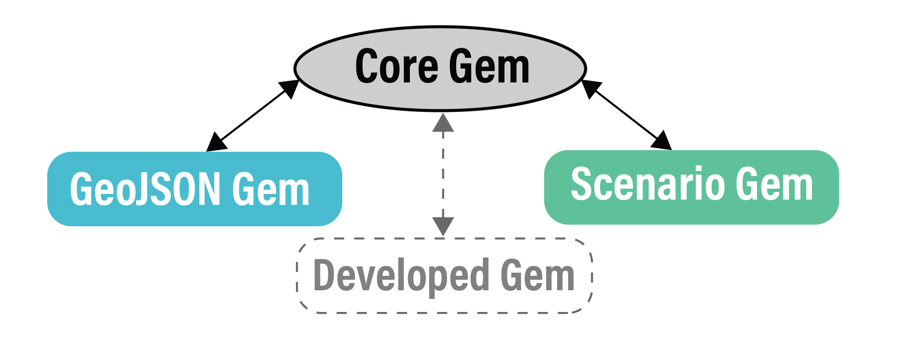

# Welcome to URBANopt

URBANopt (Urban Renewable Building And Neighborhood optimization) is an EnergyPlus and OpenStudio-based simulation platform aimed at district- and campus-scale thermal and electrical analysis.

The URBANopt project website can be found [here](https://www.nrel.gov/buildings/urbanopt.html).  
A high-level introduction to the intent and purpose of URBANopt can be found [here](https://www.energy.gov/eere/buildings/urbanopt).  
The design overview for URBANopt is [here](doc_files/design_doc.md).

**_URBANopt is not a standalone program for end users._** URBANopt Software Development Kit (SDK) is a package of modules that can be used to build a user-friendly tool. Developers can use existing URBANopt modules, customize URBANopt modules, and create new modules to implement the desired workflows for their tools. Other users of the SDK could include researchers looking to create customized workflows to perform a specific environmental design task.

URBANopt initially focuses on enabling three types of use cases:

- Design of low energy campuses and districts
- Design and optimization of grid-interactive efficient buildings (GEBs) at a district-scale in conjunction with distributed energy resources (DERs) and electric distribution systems
- Detailed design of next-generation district thermal systems

The URBANopt SDK can aid in the design of districts where the interactions between individual buildings, district energy systems, distributed energy resources, and electrical system designs are considered. Including these interactions allows URBANopt to address important questions in low energy, grid aware, future thinking urban districts such as:

- Tradeoffs between building height and photovoltaic (PV) production
- Investments in building efficiency vs. renewable generation
- Coordination of multiple buildings to optimize grid metrics
- Performance gains of shared thermal district systems vs conventional single building systems

For example, load diversity between commercial and residential buildings may allow for system time sharing or even complementary heat transfer between buildings using a district thermal energy system (see Figure 2 from the [URBANopt project website](https://www.nrel.gov/buildings/urbanopt.html) for an example).

## Table of Contents

- [Welcome](#welcome-to-urbanopt)
- [Introduction](#introduction)
- [Mac installation](#mac-installation)
- [Windows installation](#windows-installation)
- [Linux installation](#linux-installation)
- [Basic usage](#basic-usage)
  - [Set up](#set-up)
  - [Run example project](#run-example-project)
  - [Overview of rake tasks](#rake-tasks)
- [Adding your own measures](#adding-your-own-measures)
- [Modifying mapper classes](#modifying-mapper-classes)
- [Adding a custom post processor](#adding-a-custom-post-processor)
- [Advanced documentation & source code](#advanced-usage)

## [Definitions](#table-of-contents)

Feature : Building, district system, transformer  
Scenario : Multiple features (buildings) in a given efficiency level

## [Introduction](#table-of-contents)

URBANopt currently includes 3 main modules: `urbanopt-core-gem`, `urbanopt-scenario-gem`, and `urbanopt-geojson-gem`. [Detailed documentation](#advanced-usage) are available for each module.



The **Core** gem defines a FeatureFile class. The feature file can be in any format (CityGML, GeoJSON, etc.) and describes properties of each `feature`, such as location, floor area, number of stories, building type, cooling source, etc. This Core gem in the SDK architecture allows the development of new modules that are independent of other modules.

The **GeoJSON** gem is an OpenStudio Extension gem that translates a GeoJSON feature file into Openstudio model inputs. The GeoJSON gem reads each feature (currently _**buildings are the only supported feature**_) from the feature file (such as this [example feature file](https://github.com/urbanopt/urbanopt-example-geojson-project/blob/develop/industry_denver.geojson)), converts geospatial coordinates to cartesian coordinates, performs auto-zoning to establish perimeter and core zones as needed, and extrudes geometry from 2D footprints to 3D surfaces. These properties from each feature are translated to *.osm model inputs leveraging methods in the OpenStudio Model Articulation Gem and OpenStudio Standards Gem. _Methods to translate district systems and transformers into model inputs will be added in a future release._

The **Scenario** gem does the heavy lifting in URBANopt.  It takes the `scenario` you want to examine (such as [this example scenario](https://github.com/urbanopt/urbanopt-example-geojson-project/blob/develop/baseline_scenario.csv)), [runs](#rake-tasks) the FeatureFile (translated by the GeoJSON gem) through OpenStudio building energy simulation, and reports results for each feature. These reported results are defined by the [default_feature_report](#Feature-Reports) measure.  A `run` directory gets created in your example project directory with folders for each scenario and each `feature_id` within each scenario. Feature level results will be stored in a `default_feature_report` folder within the run directory for each feature. [Post-processing](#rake-tasks) may then be executed to aggregate all feature reports of a scenario into a scenario level report (e.g. aggregate energy use, aggregated building program information) that is written at the top level of each scenario folder, inside the `run` folder.

## [Mac installation](#table-of-contents)

Install [Ruby 2.2.4](https://github.com/rbenv/rbenv#installation)  
(URBANopt will update to Ruby 2.5 when OpenStudio 3.0 is released)  
Install Bundler version 1.17:

```terminal
gem install bundler -v 1.17
```

- If you have a secure firewall that prevents **bundler** from installing properly, create a `.gemrc` file in your home directory that contains:

```yml
:backtrace: false
:bulk_threshold: 1000
:sources:
- http://rubygems.org
:update_sources: true
:verbose: true
```

- Now install **bundler**:

```terminal
gem install bundler -v 1.17
```

Install [OpenStudio 2.8.1](https://github.com/NREL/OpenStudio/releases/tag/v2.8.1)  
Add path to Ruby in the new OpenStudio folder by pasting into your `.bash_profile` or similar file: `export RUBYLIB=/Applications/OpenStudio-2.8.1/Ruby`

## [Windows installation](#table-of-contents)

Install [Ruby 2.2.4 (x64)](https://dl.bintray.com/oneclick/rubyinstaller/rubyinstaller-2.2.4-x64.exe)  
(URBANopt will update to Ruby 2.5 when OpenStudio 3.0 is released)  
Install Devkit using the [mingw64](https://dl.bintray.com/oneclick/rubyinstaller/DevKit-mingw64-64-4.7.2-20130224-1432-sfx.exe) installer  
Include path to Ruby by adding to your environment variables path: `C:\Ruby22-x64\bin`  
Create a new environment variable `HOME` and set the variable value to: `C:\Users\<user_name>`  
Install Bundler version 1.17:

```terminal
gem install bundler -v 1.17
```

- If you have a secure firewall that prevents **bundler** from installing properly, type into the command line:
  - `gem sources -c`
  - `gem sources -a http://rubygems.org/`
- You will need to accept the reduced security of `http` compared to `https`
- If installing bundler **still** doesn't work, create a `.gemrc` file in your home directory:

```terminal
type nul > C:\Users\<user_name>\.gemrc
```

- Edit the new `.gemrc` file to contain:

```yml
:backtrace: false
:bulk_threshold: 1000
:sources:
- http://rubygems.org
:update_sources: true
:verbose: true
```

- Now install **bundler**:

```terminal
gem install bundler -v 1.17
```

Install [OpenStudio 2.8.1](https://github.com/NREL/OpenStudio/releases/tag/v2.8.1)  
Create file `C:\ruby-2.2.4-x64-mingw32\lib\ruby\site_ruby\openstudio.rb` and edit it to contain:

```ruby
require 'C:\openstudio-2.8.1\Ruby\openstudio.rb'
```

Verify your OpenStudio and Ruby configuration:

```terminal
ruby -e "require 'openstudio'" -e "puts OpenStudio::Model::Model.new"
```

Expected output:

```terminal
OS:Version,
 {<long-uuid>},                          !- Handle
 2.8.1;                                  !- Version Identifier`
 ```

## [Linux installation](#table-of-contents)

**_Linux installation/operation has not been tested exhaustively. Please submit an issue if you find something that doesn't work_**

Install [OpenStudio 2.8.1](https://github.com/NREL/OpenStudio/releases/tag/v2.8.1)  
Manually install [libpng12](https://www.linuxuprising.com/2018/05/fix-libpng12-0-missing-in-ubuntu-1804.html)  
If you get gdbm libs errors like this:

```terminal
/usr/local/openstudio-2.8.1/bin/openstudio: error while loading shared libraries: libgdbm.so.3: cannot open shared object file: No such file or directory
```

or this:

```terminal
/usr/local/openstudio-2.8.1/bin/openstudio: error while loading shared libraries: libgdbm_compat.so.3: cannot open shared object file: No such file or directory
```

You need to create symlinks to the appropriate version (`libgdbm.so.5` and `libgdbm_compat.so.4`)

## [Basic Usage](#table-of-contents)

### [**Set up**](#table-of-contents)

Install [Git](https://git-scm.com/) if not already installed  
NREL [provides a list](https://github.com/NREL/OpenStudio/wiki/Using-OpenStudio-with-Git-and-GitHub) of optional git GUI's, and some help using git with OpenStudio  
Fork the URBANopt example project: <https://github.com/urbanopt/urbanopt-example-geojson-project>  
Clone your fork down to your local machine  

**If using Windows:**  
Need to allow long path names in git:

```terminal
git config --global core.longpaths true
```

### [**Run example project**](#table-of-contents)

Move to the top level directory of the example you just cloned. Run the following commands to execute the Rake tasks defined in the Rakefile of the current working directory.

1. `bundle install` to ensure all dependencies in your Gemfile are available
1. `bundle update` to update your gems to the latest available versions
1. `bundle exec rake <rake task>` to execute Rake tasks

### [**Rake tasks**](#table-of-contents)

Rake tasks are created to run and post process each of the defined scenarios. For each scenario a ScenarioCSV object is instantiated. Below is an example of defining a baseline_scenario using te following inputs:

- `name` : name of the scenario
- `run_dir`: the director to run and save results
- `feature_file_path`: The  path for the `geojson` file (for example: `industry_denver.geojson`)
- `csv_file`: `csv` file (for example: `baseline_scenario.csv`)
- `mappers_files_dir`: the file path for the `baseline.osw`**TODO-change name of baseline.osw** file and the mapper classes.

````ruby
def baseline_scenario
  name = 'Baseline Scenario'
  run_dir = File.join(File.dirname(__FILE__), 'run/baseline_scenario/')
  feature_file_path = File.join(File.dirname(__FILE__), 'industry_denver.geojson')
  csv_file = File.join(File.dirname(__FILE__), 'baseline_scenario.csv')
  mapper_files_dir = File.join(File.dirname(__FILE__), 'mappers/')
  num_header_rows = 1

  feature_file = URBANopt::GeoJSON::GeoFile.from_file(feature_file_path)
  scenario = URBANopt::Scenario::ScenarioCSV.new(name, root_dir, run_dir, feature_file, mapper_files_dir, csv_file, num_header_rows)
  return scenario
end
````

To list all available tasks in the Rakefile:

```terminal
bundle exec rake -T
```

Details about individual tasks:

#### *run_all*

The `run_all` Rake task creates and runs a `ScenarioRunnerOSW` for each scenario i.e. the
*Baseline*, *HighEfficiency* and *Mixed scenario*, passing the scenario method as an argument.

- `run_baseline`, `run_high_efficiency` and `run_mixed` rake tasks can be used for running individual scenarios.

#### *post_process_all*

The default "post-process" of a scenario aggregates the [Feature reports](#Feature-reports) into results across the whole scenario. This rake task creates and runs `ScenarioDefaultPostProcessor` for each scenario and saves the results.

- `post_process_baseline`, `post_process_high_efficiency`, `post_process_mixed` rake tasks are pre-built and can be used for those individual scenarios.

#### *update_all*

This rake task combines the `run_all` and `post_process_all` tasks.

#### *default*

This runs the `update_all` rake task.

#### *clear_all*

This rake task clears the scenario results from any previous runs.

- `clear_baseline`, `clear_high_efficiency`, `clear_mixed` rake tasks can be used for individual scenarios.

## [**Adding your own measures**](#table-of-contents)

The `mappers` folder contains `baseline.osw` which serves as a simulation input for URBANopt. It is a workflow of OpenStudio and URBANopt measures and dictates the sequence of running these measures. Measures are added to create building models and test different energy conservation measures for different scenarios.

- `set_run_period`: An OpenStudio Measure used to define the number of timesteps per hour and specify the begin and end date for running the simulation.

- `ChangeBuildingLocation`: An OpenStudio Measure used to load the EPW file and specify to the EPW weather file.

- [`create_bar_from_building_type_ratios`](https://github.com/NREL/openstudio-model-articulation-gem/tree/develop/lib/measures/create_bar_from_building_type_ratios): An OpenStudio Model Articulation Measure used to create a core and perimeter bar sliced by space type. It takes in one or more building types as user arguments to create space type collections.

- [`create_typical_building_from_model 1`](https://github.com/NREL/openstudio-model-articulation-gem/tree/develop/lib/measures/create_typical_building_from_model): An OpenStudio Model Articulation Measure that creates a custom prototype building with user-defined geometry and assigns constructions, schedules, internal loads, HVAC and other loads such as exterior lights and service water heating based on the space and sub space types. The `add_hvac` is set to `false` by default.

- [`blended_space_type_from_model`](https://github.com/NREL/openstudio-model-articulation-gem/tree/develop/lib/measures/blended_space_type_from_model): An OpenStudio Model Articulation Measure that used is used to create a single space type that represents the loads and schedules of a collection of space types. It removes all previous space type assignments and hard assigns internal loads from spaces included in the building floor area. A blended space type will be created from the original internal loads and assigned at the building level.

- [`urban_geometry_creation`](https://github.com/urbanopt/urbanopt-geojson-gem/tree/develop/lib/measures/urban_geometry_creation):
  An URBANopt GeoJSON measure that is used to create geometry along with spaces for a particular building,
  accounting for surrounding buildings as shading.

- [`create_typical_building_from_model 2`](https://github.com/NREL/openstudio-model-articulation-gem/tree/develop/lib/measures/create_typical_building_from_model): Added in the workflow after urban geometry creation and the `add_hvac` argument is now set to `true`, to add HVAC system for the blended space types. The rest of the arguments for adding constructions, space type, loads, etc. are set to `false`.

- `ReduceElectricEquipmentLoadsByPercentage`: An OpenStudio Measure that is used to reduce the equipment load by a certain amount. The measure is skipped for the baseline scenario. For the high efficiency scenario, the skip measure argument is set to false and the measure is implemented.

- `ReduceLightingLoadsByPercentage`: An OpenStudio Measure that is used to reduce the lighting load by a certain amount. The measure is skipped for the baseline scenario. For the high efficiency scenario, the skip measure argument is set to false and the measure is implemented.

- [`default_feature_reports`](https://github.com/urbanopt/urbanopt-scenario-gem/tree/develop/lib/measures/default_feature_reports): An URBANopt Scenario Measure that creates a `default_feature_reports.json` used by URBANopt Scenario Default Post Processor.

Additional measures can be added to the workflow by adding the measure name and directory name along with the measure arguments.

## [**Modifying mapper classes**](#table-of-contents)

The Simulation Mapper Class derives from the [SimulationMapperBase](https://github.com/urbanopt/urbanopt-scenario-gem/blob/develop/lib/urbanopt/scenario/simulation_mapper_base.rb) class. It maps the features in the feature file to arguments required as simulation inputs in the `baseline.osw`.

Recall that a feature refers to a single object in a district energy analysis, such as a building, district system, or transformer. The feature file includes all data for all the features and is written by a third party user interface; for our example we use the GeoJSON format. Currently, the Simulation Mapper only supports mapping the [*Building*](https://github.com/urbanopt/urbanopt-geojson-gem/blob/develop/lib/urbanopt/geojson/building.rb) feature_type. It has the capability to support the mapping of the following building types from the  [building_properties](https://github.com/urbanopt/urbanopt-geojson-gem/blob/develop/lib/urbanopt/geojson/schema/building_properties.json) schema in the GeoJSON Gem:

- Multifamily (5 or more units)
- Multifamily (2 to 4 units)
- Single-Family
- Office
- Outpatient health care
- Inpatient health care
- Lodging
- Food service
- Strip shopping mall
- Retail other than mall
- Education
- Nursing
- Mixed use

The URBANopt GeoJSON Example Project includes a default Simulation Mapper Class to translate an URBANopt GeoJSON Feature to an OpenStudio Model. The `HighEfficiency` mapper class inherits from the `BaselineMapper` class and can override measures that were skipped in the `BaselineMapper`.

When the Scenario is run, a new Simulation Mapper instance is created and the `create_osw` method is implemented for each Feature assigned to the Simulation Mapper Class in the Scenario CSV.

The default Simulation Mapper Class can be used directly, extended or modified, or a completely different Simulation Mapper Class can be created.

On adding additional measures to the `baseline.osw` file, the Simulation Mapper Class would need to be modified by adding necessary features from the feature files and mapping them to measure arguments.

The *`OpenStudio::Extension.set_measure_argument`* method sets the feature from the feature file as simulation input, passing the measure and argument name and the corresponding feature property from the feature file as arguments.

For example:

```ruby
OpenStudio::Extension.set_measure_argument(osw, 'urban_geometry_creation', 'feature_id', feature_id)
```

Where `'urban_geometry_creation'` is the measure name, `'feature_id'` is the argument name and `feature_id` is the feature property from the feature file.

To add custom measures, or measures that lie outside of the ruby gems specified in the Gemfile, `@@osw[:measure_paths] << File.join(File.dirname(__FILE__), '../new_measure_folder/')` can be added in the Mapper Class, specifying the file path of the new measures. This adds the `measure_path` in the `baseline.osw`.

To create a new mapper class:

- The new mapper class ruby file should be created in the Mappers folder, since the `mapper_files_dir` in the `Rakefile` is directed here. The default Simulation Mapper Class can be used as template, and the `osw_path` would need to be updated as per the name of the new `osw` file.
- A new scenario CSV should be created in the root folder, and the mapper class name should be updated with the name of the new mapper class,  within the mapper class column. The existing scenario csv's can be used as reference.
- OpenStudio Measures can be added to the new `osw` file by adding the measure directory and measure arguments, and adding the features from the feature file and mapping them to the corresponding arguments in the Mapper Class.
- A new method can be created in the `Rakefile` to call the Mapper Class. The `mapper_files_dir` and `csv_file paths` should correspond to the newly created Mapper Class and csv file paths respectively.
- To implement the mapper class, a new Rake tasks can be created that creates `ScenarioRunnerOSW` and runs it passing the new method as the argument.

The Scenario PostProcessor aggregates results from each Feature simulation. They require specific OpenStudio Reporting Measures be run for each Feature to generate required simulation reports (e.g. timeseries CSV data for specific outputs, specific metrics). Creating a new reporting measure to generate the Feature reports is described [here](#Feature-Reports). These individual simulation results should be aligned with the final desired aggregated results. For example, if users decide to customize the reporting measure to report 15min timestep results, additional methods should be developed to allow the post processors to aggregate data at this timestep.

Currently, the default Scenario Post Processors and its corresponding OpenStudio Reporting Measures are implemented in the **Scenario Gem**.  Additional Scenario Post Processors and OpenStudio Reporting Measures can be implemented in other OpenStudio Extension Gems. Users can use this gem as a guide to developing their own Post Processors or just customize this Gem to report and post-process new results of their interest. The current Scenario Processor which is used in this example project rake file is the `default_post_processor`, which is an object of ScenarioDefaultPostProcessor class.

```ruby
default_post_processor = URBANopt::Scenario::ScenarioDefaultPostProcessor.new(baseline_scenario)
scenario_result = default_post_processor.run
scenario_result.save
```

This `defaults_post_processor` aggregate feature reports into scenario level results by leveraging methods of the [default_reports](https://github.com/urbanopt/urbanopt-scenario-gem/blob/develop/lib/urbanopt/scenario/default_reports.rb) file. This file includes classes that are developed in the default_reports [folder](https://github.com/urbanopt/urbanopt-scenario-gem/tree/develop/lib/urbanopt/scenario/default_reports). Each of these classes corresponds to a component in the deffault_reports [schema](https://github.com/urbanopt/urbanopt-scenario-gem/blob/develop/lib/urbanopt/scenario/default_reports/schema/scenario_schema.json). This schema describes all the main components of the default reports (reporting_period, program, constructon_cost, etc.) and their attributes. Figure 3<!--add figure-->, decribes the architecture of the Postprocessor, illustrating the higherarchy of the classes and main methods which are leveraged by this PostProcessor to aggregate feature reports into a scneario report. However, advanced users should also refer to [Scenario documentation](#Advanced-Usage) which include the schema and Rdocs describing all methods and classes used to aggregate the properties of a feature report. Users can edit these methods or add new methods that extend or customize the PostProcessor functionality(e.g. reporting and aggregating new properties of interest).

### Feature Reports

The Scenario Post Processor requires feature reports to aggregate results from feature simulations. A reporting measure is used to query and report specific output data from an Openstudio simulation of each feature. The current default reporting measure is the [default_feature_reports](https://github.com/urbanopt/urbanopt-scenario-gem/tree/develop/lib/measures/default_feature_reports). This measure writes a `default_feature_reports.json` file containing information on all features in the simulation. It also writes a `default_feature_reports.csv` containing timeseries data for all the features.

Users can create their own OpenStudio reporting measure to generate customized simulation reports. For example, users can request results for different reporting frequencies or query and report additional outputs that are important for their own projects; e.g. reporting specific construction costs.  Users should refer to the current reporting measure and this [reporting measure writing guide](http://nrel.github.io/OpenStudio-user-documentation/reference/measure_writing_guide/#reporting-measures) to customize the current `measure.rb` file in [default_feature_reports](https://github.com/urbanopt/urbanopt-scenario-gem/tree/develop/lib/measures/default_feature_reports) or create a new reporting measure.

In this default reporting measure, a feature report object is instantiated. Then information is retrieved from the Openstudio model and stored in this `feature_report`:

````ruby
feature_report = URBANopt::Scenario::DefaultReports::FeatureReport.new
feature_report.id = feature_id
feature_report.feature_type = feature_type
feature_report.timesteps_per_hour = model.getTimestep.numberOfTimestepsPerHour
````

Methods to query results from the output EnergyPlus sql file are also created and used to retrieve results and add them to the corresponding properties in the `feature_report`. In the below example the sql_query method and convert_units method are used to query total_site_energy, convert its units to kBtu and then assign it to the total_site_energy attribute in the feature report:

```ruby
# sql_query method
def sql_query(runner, sql, report_name, query)
  val = nil
  result = sql.execAndReturnFirstDouble("SELECT Value FROM TabularDataWithStrings WHERE ReportName='#{report_name}' AND #{query}")
  if result.empty?
    runner.registerWarning("Query failed for #{report_name} and #{query}")
  else
    begin
      val = result.get
    rescue StandardError
      val = nil
      runner.registerWarning('Query result.get failed')
    end
  end
  val
end

# unit conversion method to apply unit conversion
def convert_units(value, from_units, to_units)
  value_converted = OpenStudio.convert(value, from_units, to_units)
  if value_converted.is_initialized
    value = value_converted.get
  else
    @runner.registerError("Was not able to convert #{value} from #{from_units} to #{to_units}.")
    value = nil
  end
  return value
end

# query total_site_energy from EnergyPlus sql file and add it to the feature reports
total_site_energy = sql_query(runner, sql_file, 'AnnualBuildingUtilityPerformanceSummary', "TableName='Site and Source Energy' AND RowName='Total Site Energy' AND ColumnName='Total Energy'")
feature_report.reporting_periods[0].total_site_energy = convert_units(total_site_energy, 'GJ', 'kBtu')
```

After assigning all the required results to their feature report attributes, the feature_report is converted to a hash using the `to_hash` method and saved as `default_feature_reports.json` file. This JSON file is saved in a deafult_feature_reort folder within the run directory for a feature.

```ruby
# Converts to a Hash equivalent for JSON serialization
feature_report_hash = feature_report.to_hash

# save the 'default_feature_reports.json' file
File.open('default_feature_reports.json', 'w') do |f|
  f.puts JSON.pretty_generate(feature_report_hash)
  # make sure data is written to the disk one way or the other
  begin
    f.fsync
  rescue StandardError
    f.flush
  end
end
```

User can then add any new reporting measure to the OpenStudio `.osw` file, as described [here](#Adding-your-own-measures), and re-run the simulation.
The current measure added to the baseline.osw is the `default_feature_reports`:

```json
{
      "measure_dir_name": "default_feature_reports",
      "arguments": {
        "feature_id": null,
        "feature_name": null,
        "feature_type": null
      }
}
```

The `DefaultPostProcessor` reads these feature reports and aggregates them to create a `ScenarioReport`.

### Example: post-processing an added feature report attribute

Lets now try a short example where a new attribute "number of ocuppants" is to be added to the feature_report and to the post_processor.

Below are the steps for this process:

- clone the scenario-gem repository to your local machine
- open the [schema](https://github.com/urbanopt/urbanopt-scenario-gem/blob/develop/lib/urbanopt/scenario/default_reports/schema/scenario_schema.json) file and append the new property "number of occupants" to the properties inside the program component.

```JSON
"Program": {
  "type": "object",
  "properties": {
    "number_of_occupants": {
    "type": "number"
    }
  }
}
```

- go to the [program](https://github.com/urbanopt/urbanopt-scenario-gem/blob/develop/lib/urbanopt/scenario/default_reports/program.rb) class in the [default_reports](https://github.com/urbanopt/urbanopt-scenario-gem/tree/develop/lib/urbanopt/scenario/default_reports) and add the following:

1. Add `number_of_occupants` to the attribute accesor.

```ruby
  attr_accessor :site_area,......., :number_of_occupants
```

2. Initialize an instance variable `number_of_occupants` by adding it to the initialize method.

```ruby
  def initialize(hash = {})
  ......
    @number_of_occupants = hash[:number_of_occupants]
  ......
  end
```

3. Add a default value for `number_of_occupants` in the defaults method:

```ruby
  def defaults
    hash = {}
    ......
    hash[:number_of_occupants] = nil
    return hash
  end
```

4. Add `number_of_occupants` to the to_hash method.

```ruby
def to_hash
  result = {}
  ......
  result[:number_of_occupants] = @number_of_occupants if @number_of_occupants
  return result
end
```

5. Finally, add `number_of_occupant` to the add_program method that is used by the post processor to aggregate the program attributes values.

```ruby
def add_program(other)
  @number_of_occupants = add_values(@number_of_occupants, other.number_of_occupants)
end
```

- Now let's go to the reporting measure and request the number of occupants from the OpenStudio model and store it in the feature_report. `number of occupants` should be implemented in the `run` method, after the intialization of feature_report:

``` ruby
def run(runner, user_arguments)
  super(runner, user_arguments)
  ....
  # number of occupants. Note: 'building' is an object retrieved from openstudio model
  num_occupants = building.numberOfPeople
  feature_report.program.number_of_occupants = num_occupants
```

- Run the new example project using the modified scenario gem reposiory.<!--TODO explain this process (how to do this by editing the gem file) in the first section. Refer to the first section explaination here >

## [Advanced Usage](#table-of-contents)

To customize or develop URBANopt, please use the following documentation and source code to aid you:

- [GeoJSON documentation](https://urbanopt.github.io/urbanopt-geojson-gem/)
- [Scenario documentation](https://urbanopt.github.io/urbanopt-scenario-gem/)

<!-- lets add a paragraph here to describe what can users find in the documentations  for example "RDOCS"  each method is explained and clickable ...schema is ther as well ..etc -->

The repositories that developers can clone are found here:

- [GeoJSON Github](https://github.com/urbanopt/urbanopt-geojson-gem)
- [Scenario Github](https://github.com/urbanopt/urbanopt-scenario-gem)
- [Core Github](https://github.com/urbanopt/urbanopt-core-gem)
