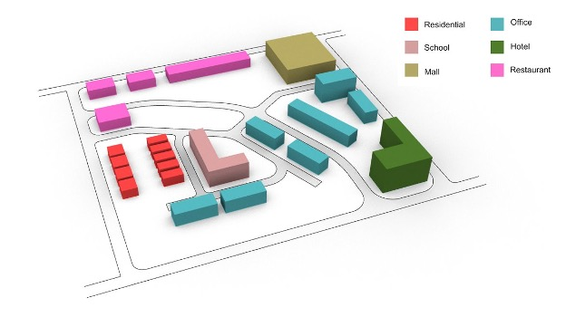

# URBANopt Class Project

## General Overview

### Specific Objectives

The modeling tasks and activities of this class project aim toward the following learning objectives:

### Objective #1: Temporal Demand Diversity

Students will be able to recognize the benefits that can be achieved from orchestrating different community demand schedules. (Coincident schedules scenario vs. diverse schedules scenario)

### Objective #2: Energy Efficiency Measures

Students will be able to implement their chosen energy efficiency measures and correlate those measures with community energy savings

### Objective #3: Distributed Energy Resources

Students will use REopt to optimize the size and the operation of chosen DERs and will be able to recognize the difference between individual building and whole community optimization methods.

### Objective #4: Energy Demand Flexibility Measures

Students will experiment with active control measures to further optimize the energy use in the community by shifting loads.

### Suggested Timeline

*Week 1*: Student Activity #0 Installation and Basics

*Weeks 2-3*: Student Activity #1 Temporal Demand Diversity

*Weeks 4-5*: Student Activity #2 Energy Efficiency Measures

*Week 6*: Student Activity #3 Distributed Energy Resources

*Weeks 7-8*: Student Activity #4 Demand Flexibility Measures

### Description of Project

This class project was created for the purpose of educating students on the concepts of district-scale energy modeling using the URBANopt™ and REopt™ software tools. The project is based on a hypothetical community consisting of 23 buildings of varying types of both commercial and residential buildings. The design of this hypothetical class project has no relation to the designs and site requirements of any actual specific development project.

### Summary of Measures

#### Envelope Measures

* Add Window Overhangs (AddOverhangsByProjectionFactor): Adds overhanging shades to windows at a specified projection factor to control passive heating effects.
* Increase Insulation for Walls (IncreaseInsulationRValueForExteriorWalls): Increases the R-value of the insulation used in the exterior walls by a specified R-value.
* Increase Insulation for Roof (IncreaseInsulationRValueForRoofs): Increases the R-value of the insulation used in the roofs by a specified R-value.
* Reduce Space Infiltration (ReduceSpaceInfiltrationByPercentage): Reduces the amount of air infiltration rates between the interior and exterior of the building by a specified percentage.

#### Equipment Measures

* Enable Demand Controlled Ventilation (EnableDemandControlledVentilation): Allows model to automatically control the ventilation schedule to maintain proper indoor air quality.
* Enable Economizer Control (EnableEconomizerControl): Adds an economizer to control usage of outdoor air to condition spaces.
* Improve Fan Belt Efficiency (ImproveFanBeltEfficiency): Reduces the losses due to fan belt inefficiencies in HVAC equipment.
* Improve Motor Efficiency (ImproveMotorEfficiency): Reduces the losses due to motor inefficiencies in HVAC equipment.
* Reduce Electrical Equipment Loads (ReduceElectricEquipmentLoadsByPercentage): Reduces the power per area or power per person value of a model by a specified percentage.
* Reduce Lighting Loads (ReduceLightingLoadsByPercentage): Replaces lighting with a newer, more efficient lighting technology that reduces the lighting loads on a building by a specified percentage.

#### Demand Flexibility Measures

* Add EMS to Control EV Charging (AddEMSToControlEVCharging): Adds an energy management system to control the charging of electrical vehicles on site. This can be used to align the EV charging times more closely with the PV generation periods.
* Add Heat Pump Water Heater (AddHpwh): Adds or replaces the current water heater system with an electric heat pump water heater. Heating times can be specified as flexible windows by the user to shift load.
* Add Packaged Ice Storage System (AddPackagedIceStorage): Adds an ice storage cooling system with a size and control operation method designated by the user.
* Pre-Cool or Pre-Heat (ShiftScheduleByType): Shifts the timing of all cooling and/or heating schedules by a user-defined number of hours.
