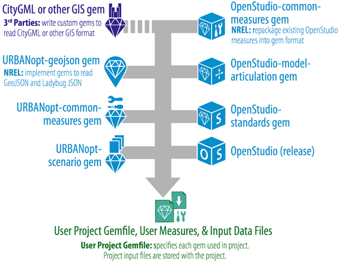

Additional measures can be added to the [base workflow OSW](base_workflow.md) file as follows:

* Add the measure directory along with the measure arguments to the base workflow OSW. For example, 

	```terminal
    {
      "measure_dir_name":
      "IncreaseInsulationRValueForExteriorWalls",
      "arguments": {
        "__SKIP__": true,
        "r_value": 10
      }
    }
	```
    Note that the order of the measures as they appear in the base workflow OSW, dictates how they
    are run in the project.

*  If you'd like to skip measures from the base workflow OSW in the [Baseline
   Mapper](https://github.com/urbanopt/urbanopt-example-geojson-project/blob/master/mappers/Baseline.rb),
   default the `__SKIP__` argument to `true` in the measure, othervise default to `false`. If you
   would like to add this measure in a different mapper, you can set `__SKIP__` to false in the
   mapper as follows:

	```terminal
    OpenStudio::Extension.set_measure_argument(osw,'IncreaseInsulationRValueForExteriorWalls', '__SKIP__',false)
	```

*  While adding measures from the URBANopt core gems (in blue), no other change
   is needed.

   
   *Figure 1: Software Architecture for an Example URBANopt Project*

*  In case the measure resides in a gem other than the URBANopt core gems, the gem must be included
   in the project
   [Gemfile](https://github.com/urbanopt/urbanopt-example-geojson-project/blob/master/Gemfile). 

*  If the measure is new, or just not in a gem, add the following line (which specifies the file path of the new measure) to the Mapper Class: 
 

    ```terminal
    osw[:measure_paths] << File.join(File.dirname(__FILE__), '../new_measure_folder/')
    ```

    This adds the measure_path to the base workflow OSW.

*  In case of some measures, the Simulation Mapper Class may need to modified add any necessary Feature
  properties from the [FeatureFile](https://github.com/urbanopt/urbanopt-example-geojson-project/blob/master/example_project.json) and mapping them to the measure arguments.

   For example for the `urban_geometry_creation` measure in the base workflow OSW : 

   ```terminal
     {
      "measure_dir_name": "urban_geometry_creation",
      "arguments": {
        "__SKIP__": true,
        "geojson_file": "example_project.json",
        "feature_id": "5",
        "surrounding_buildings": "None"
        }
     }

   ```

   The *`OpenStudio::Extension.set_measure_argument`* method is added in the Simulation Mapper Class
   that sets the Feature property  `feature_id` from the FeatureFile and maps it to the `'feature_id'` argument in
   the measure shown as following : 

   ```terminal
   OpenStudio::Extension.set_measure_argument(osw, 'urban_geometry_creation', 'feature_id', feature_id)
   ```