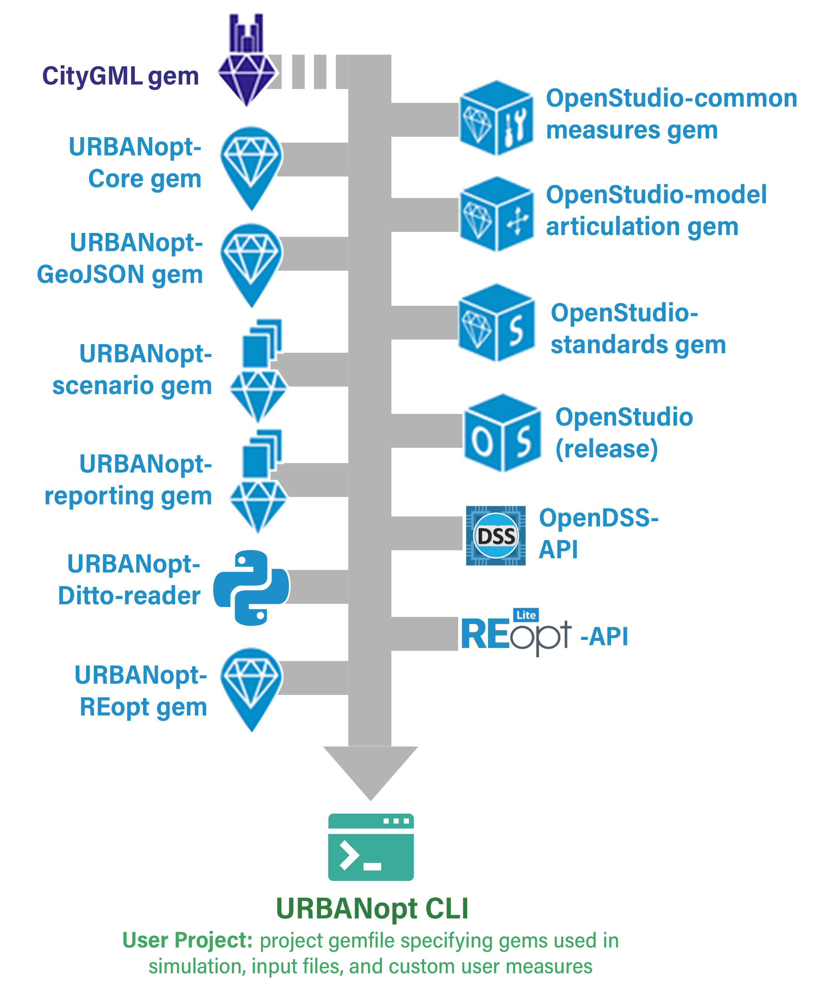

Additional measures can be added to the [base workflow OSW](base_workflow.md) file as follows:

* Add the measure directory along with the measure arguments to the base workflow OSW. For example, 

	```terminal
    {
      "measure_dir_name":
      "IncreaseInsulationRValueForExteriorWalls",
      "arguments": {
        "__SKIP__": true,
        "r_value": 10
      }
    }
	```
    Note that the order of the measures as they appear in the base workflow OSW, dictates how they
    are run in the project.  OpenStudio measures should be listed first, followed by EnergyPlus measures, and then Reporting measures.

*  If you'd like to skip measures found in the base workflow OSW in the [Baseline
   Mapper](https://github.com/urbanopt/urbanopt-example-geojson-project/blob/master/mappers/Baseline.rb),
   default the `__SKIP__` argument to `true` in the measure, othervise default to `false`. If you
   would like to add this measure in a different mapper, you can set `__SKIP__` to false in the
   mapper as follows:

	```terminal
    OpenStudio::Extension.set_measure_argument(osw,'IncreaseInsulationRValueForExteriorWalls', '__SKIP__',false)
	```

*  When adding measures located in any of the URBANopt™ core gems (in blue), no other change
   is needed.

   
   
   *Figure 1: Software Architecture for an Example URBANopt Project*

*  When the measure resides in a gem other than the URBANopt core gems, the gem must be included
   in the project
   [Gemfile](https://github.com/urbanopt/urbanopt-example-geojson-project/blob/master/Gemfile). 
   Note that you may need to delete the Gemfile.lock file and .bundle directory from your project folder in order to regenerate the bundle to include the new gem.

*  If the measure is new, or just not in a gem, add the following line (which specifies the file path of the new measure) to the Mapper Class: 
 

    ```terminal
    osw[:measure_paths] << File.join(File.dirname(__FILE__), '../new_measure_folder/')
    ```

    This adds the measure_path to the base workflow OSW.

*  It may be necessary to modify default measure arguments by mapping specific Feature properties from the [FeatureFile](https://github.com/urbanopt/urbanopt-example-geojson-project/blob/master/example_project.json) to the arguments in the Simulation Mapper Class.

   For example, the `urban_geometry_creation` measure in the base workflow OSW: 

   ```terminal
     {
      "measure_dir_name": "urban_geometry_creation",
      "arguments": {
        "__SKIP__": true,
        "geojson_file": "example_project.json",
        "feature_id": "5",
        "surrounding_buildings": "None"
        }
     }

   ```

   The *`OpenStudio::Extension.set_measure_argument`* method is added in the Simulation Mapper Class
   to sets the Feature property  `feature_id` from the FeatureFile and map it to the `'feature_id'` argument in
   the measure as follows: 

   ```terminal
   OpenStudio::Extension.set_measure_argument(osw, 'urban_geometry_creation', 'feature_id', feature_id)
   ```