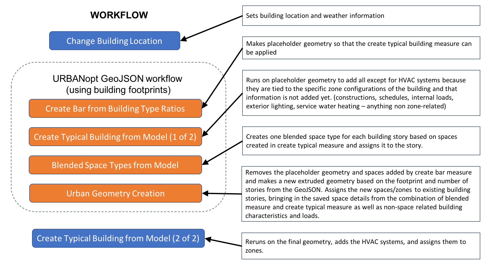

The `mappers` folder contains `base_workflow.osw` which serves as a simulation input for URBANopt&trade;. It is an OpenStudio workflow file that contains URBANopt Measures and dictates the sequence of running these Measures. Measures are added to create building models and apply different energy conservation Measures for different Scenarios.  

The URBANopt GeoJSON Workflow uses building footprints to create building models.  The diagram below contains details on the sequence and purpose of measures used to accomplish this task.

All measures contained in the base workflow are listed below:

- [`set_run_period`](https://github.com/NREL/openstudio-common-measures-gem/tree/master/lib/measures/set_run_period): An OpenStudio Measure used to define the number of timesteps per hour and specify the begin and end date for running the simulation.

- [`ChangeBuildingLocation`](https://github.com/NREL/openstudio-common-measures-gem/tree/master/lib/measures/ChangeBuildingLocation): An OpenStudio Measure used to specify and load the EPW file.

- [`create_bar_from_building_type_ratios`](https://github.com/NREL/openstudio-model-articulation-gem/tree/master/lib/measures/create_bar_from_building_type_ratios): An OpenStudio Model Articulation Measure used to create a core and perimeter bar sliced by space type. It takes in one or more building types as user arguments to create space type collections.

- [`create_typical_building_from_model 1`](https://github.com/NREL/openstudio-model-articulation-gem/tree/master/lib/measures/create_typical_building_from_model): An OpenStudio Model Articulation Measure that creates a custom prototype building with user-defined geometry and assigns constructions, schedules, internal loads, HVAC and other loads such as exterior lights and service water heating based on the space and sub space types. The `add_hvac` is set to `false` by default in this measure because it gets handled later in the process to account for blended space types.

- [`blended_space_type_from_model`](https://github.com/NREL/openstudio-model-articulation-gem/tree/master/lib/measures/blended_space_type_from_model): An OpenStudio Model Articulation Measure that is used to create a single space type that represents the loads and schedules of a collection of space types. It removes all previous space type assignments and hard assigns internal loads from spaces included in the building floor area. A blended space type will be created from the original internal loads and assigned at the building level.

- [`urban_geometry_creation`](https://github.com/urbanopt/urbanopt-geojson-gem/tree/master/lib/measures/urban_geometry_creation): An URBANopt GeoJSON measure that is used to create geometry along with spaces for a particular building, accounting for shading from surrounding buildings.

- [`create_typical_building_from_model 2`](https://github.com/NREL/openstudio-model-articulation-gem/tree/master/lib/measures/create_typical_building_from_model): A second instance of this Measure, which is added in the workflow after urban geometry creation and the `add_hvac` argument is now set to `true`, to add HVAC system for the blended space types. The rest of the arguments for adding constructions, space type, loads, etc. are set to `false`.

- [`IncreaseInsulationRValueforExteriorWalls`](https://github.com/NREL/openstudio-common-measures-gem/tree/master/lib/measures/IncreaseInsulationRValueForExteriorWalls): An OpenStudio measure that is used to increase the R-Value of insulation for exterior walls by a specific value. This measure is skipped in the baseline Scenario and is added for all `MidRiseApartment` OpenStudio building types in the high efficiency Scenario.

- [`ReduceElectricEquipmentLoadsByPercentage`](https://github.com/NREL/openstudio-common-measures-gem/tree/master/lib/measures/ReduceElectricEquipmentLoadsByPercentage): An OpenStudio Measure that is used to reduce the equipment load by a certain amount. The Measure is skipped for the baseline Scenario. For the high efficiency Scenario, the `skip_measure` argument is set to false and the measure is implemented.

- [`ReduceLightingLoadsByPercentage`](https://github.com/NREL/openstudio-common-measures-gem/tree/master/lib/measures/ReduceLightingLoadsByPercentage): An OpenStudio Measure that is used to reduce the lighting load by a certain amount. The measure is skipped for the baseline Scenario. For the high efficiency Scenario, the `skip_measure` argument is set to false and the measure is implemented.

- [`default_feature_reports`](https://github.com/urbanopt/urbanopt-scenario-gem/tree/master/lib/measures/default_feature_reports): An URBANopt Scenario Measure that creates a `default_feature_reports.json` used by URBANopt Scenario Default Post-Processor.