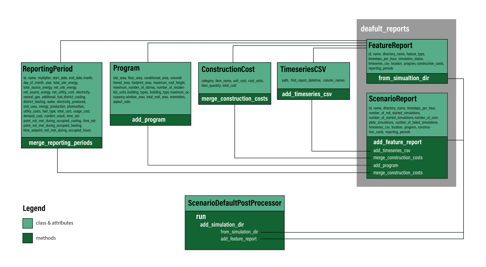

**ScenarioDefaultPostProcessor:**

The Scenario Post-Processor aggregates results from each Feature simulation. This process requires specific OpenStudio Reporting Measure be run for each Feature to generate required simulation reports (e.g. timeseries CSV data for specific outputs, specific metrics). Instructions for creating a new reporting measure to generate the Feature reports can be found in the [Feature report](feature_reports.md) section. These individual simulation results should be aligned with the final desired aggregated results. For example, if users decide to customize the reporting measure to report new results (e.g. number of occupants), additional methods should be developed to allow the Post-Processor to aggregate the results for the added attribues.

Currently, the default Scenario Post-Processor and its corresponding OpenStudio Reporting Measures are implemented in the `Scenario Gem`.  Additional Scenario Post-Processors and OpenStudio Reporting Measures can be implemented in other OpenStudio Extension Gems. Users can use the `Scenario Gem` as a guide for developing their own Post-Processor or they can customize this Gem to report and Post-Process the desired new results. The current Scenario Post-Processor used in the projects run by URBANopt CLI is the `default_post_processor`, which is an object of `ScenarioDefaultPostProcessor` class.

```ruby
default_post_processor = URBANopt::Scenario::ScenarioDefaultPostProcessor.new(baseline_scenario)
scenario_result = default_post_processor.run
scenario_result.save
```

This `default_post_processor` aggregates Feature reports into Scenario-level results by leveraging methods of the [default_reports](https://github.com/urbanopt/urbanopt-scenario-gem/blob/master/lib/urbanopt/scenario/default_reports.rb) file. This file includes classes that are developed in the default_reports [folder](https://github.com/urbanopt/urbanopt-scenario-gem/tree/master/lib/urbanopt/scenario/default_reports). Each of these classes corresponds to a component in the default_reports [schema](https://github.com/urbanopt/urbanopt-scenario-gem/blob/master/lib/urbanopt/scenario/default_reports/schema/scenario_schema.json). This schema describes all the main components of the default reports (reporting_period, program, constructon_cost, etc.) and their attributes. The Figure below describes the architecture of this Post-Processor and illustrates the class hierarchy and main methods which are leveraged by this Post-Processor to aggregate Feature reports into a Scenario report. However, advanced users should also refer to the [Scenario documentation](../advanced_documentation/advanced.md), which includes the schema and Rdocs describing all methods and classes used to aggregate the properties of a Feature report. Users can edit these methods or add new methods that extend or customize the PostProcessor functionality(e.g. reporting and aggregating new properties of interest).




**OpenDSSPostProcessor:**

In parallel to the scenario gem, OpenDSS modules have been developed to run OpenDSS models and compute metrics of the electrical network. OpenDSS runs will generate a results directory named `opendss` within the project scenario run directory. This `opendss` directory will include output reports for each building, line and transformer, as well as other OpenDSS-related results. 

An OpenDSS postprocessor has been developed to integrate selected OpenDSS results into the default URBANopt reports. The postprocessor parses specific results from the `opendss` results directory and adds them to the URBANopt scenario and feature reports. Users can customize or extend this postprocessor to add more OpenDSS results to the scenario and feature reports.

The `OpenDSSPostProcessor` currently include the following methods:

*Adding OpenDSS results to existing CSV reports:*
- `load_opendss_data` : Users can extend this method to select other results of interest from `opendss` results directory and load them.
- `load_feature_report_data` : This method can be used to reload existing feature reports. Users can adapt this method to load any other existing reports.
- `merge_data` : This method is used to merge the loaded opendss data with the existing feature reports that are loaded.
- `save_csv` : This method saves the updated CSV reports.

*Saving transformer results to reports:*
- `save_transformers_reports` : This method was developed to add transformer results to the scenario run directory.

*Generating summary results and adding them to the reports:*
- `add_summary_results` : This method generates important summary results and adds them to the scenario reports (e.g. the total number of hours where an over-voltage issue occurred). Users can extend this method to generate other summary results of interest.

*Running OpenDSS postprocessor:*
- `run` : This method wraps all the developed postprocessing methods. It is used to integrate OpenDSS results back into URBANopt scenario and feature reports.