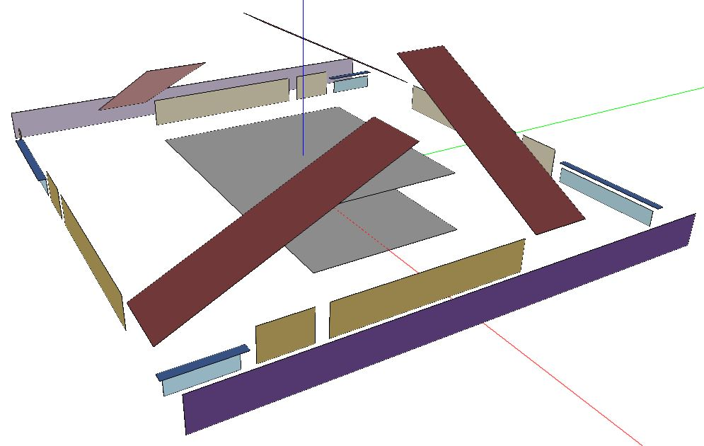

## Context

Residential building models are created using the [OpenStudio-HPXML](https://github.com/NREL/OpenStudio-HPXML) workflow.

For each residential building (see the building types below that are currenly supported), an OpenStudio measure [builds an HPXML file](https://github.com/NREL/OpenStudio-HPXML/tree/build-res-hpxml-v3/BuildResidentialHPXML) based on feature information contained in a geojson file as well as on sets of default assumptions.

A [translator measure](https://github.com/NREL/OpenStudio-HPXML/tree/master/HPXMLtoOpenStudio) is then used to create an OpenStudio model for each HPXML file.

## Supported Building Types

Currently, the "Single-Family Detached" residential building type is supported. A future URBANopt release will include "Single-Family Attached" and "Multifamily" capabilities.

### Single-Family Detached

Residential building surfaces are stored in HPXML without 3D coordinates. An example geometry rendering for a translated HPXML file is given below.



#### GeoJSON Schema

A schema differentiates between sets of required and optional fields for "Single-Family Detached" residential buildings:

* Requires:

  1. floor_area
  2. number_of_stories
  3. footprint_area
  5. number_of_bedrooms
  6. foundation_type: `slab`, `crawlspace - vented`, `crawlspace - unvented`, `basement - unconditioned`, `basement - conditioned`, `ambient`
  7. attic_type: `attic - vented`, `attic - unvented`, `attic - conditioned`, `flat roof`

* Optionals:

  1. system_type: combinations of `electric resistance`, `furnace`, `boiler`, `central air conditioner`, `room air conditioner`, `evaporative cooler`, `air-to-air heat pump`, `mini-split heat pump`, `ground-to-air heat pump`
  2. heating_system_fuel_type: `electricity`, `natural gas`, `fuel oil`, `propane`, `wood`
  3. template (see below)

An example "Single-Family Detached" feature snippet is shown below.

```
{
  "type": "Feature",
  "properties": {
    "id": "6",
    "geometryType": "Rectangle",
    "name": "New Building_6",
    "type": "Building",
    "floor_area": 4978,
    "footprint_area": 2489,
    "footprint_perimeter": 207,
    "building_type": "Single-Family Detached",
    "number_of_stories": 2,
    "number_of_bedrooms": 5,
    "foundation_type": "slab",
    "attic_type": "attic - conditioned",
    "system_type": "Residential - electric resistance and no cooling",
    "heating_system_fuel_type": "natural gas"
  }
```

### *Future*: Single-Family Attached

### *Future*: Multifamily

## Customizable Template

An optional template enumeration may be specified for each feature in the geojson. Enumerations that are applicable to residential buildings:

- `Residential IECC 2006 - Customizable Template Sep 2020`
- `Residential IECC 2009 - Customizable Template Sep 2020`
- `Residential IECC 2012 - Customizable Template Sep 2020`
- `Residential IECC 2015 - Customizable Template Sep 2020`
- `Residential IECC 2018 - Customizable Template Sep 2020`

If no template enumeration is specified, argument values will be defaulted according to the [documentation](https://openstudio-hpxml.readthedocs.io/en/latest/hpxml_to_openstudio.html) for the HPXMLtoOpenStudio translator measure. In general, these defaults are based on ANSI / RESNET / ICC Std. 301 (2006).

Otherwise, argument values will be defaulted according to the following:

* enclosure: IECC Prescriptive Path
* heating system: EnergyStar Certified Homes
* cooling system: EnergyStar Certified Homes
* refrigerator: EnergyStar Certified Homes
* water heater: EnergyStar Certified Homes

All arguments values for the previous categories may be customized. Values may be customized by modifying the set of residential [lookup files](https://github.com/urbanopt/urbanopt-example-geojson-project/tree/build-res-hpxml-v3/example_project/mappers).
