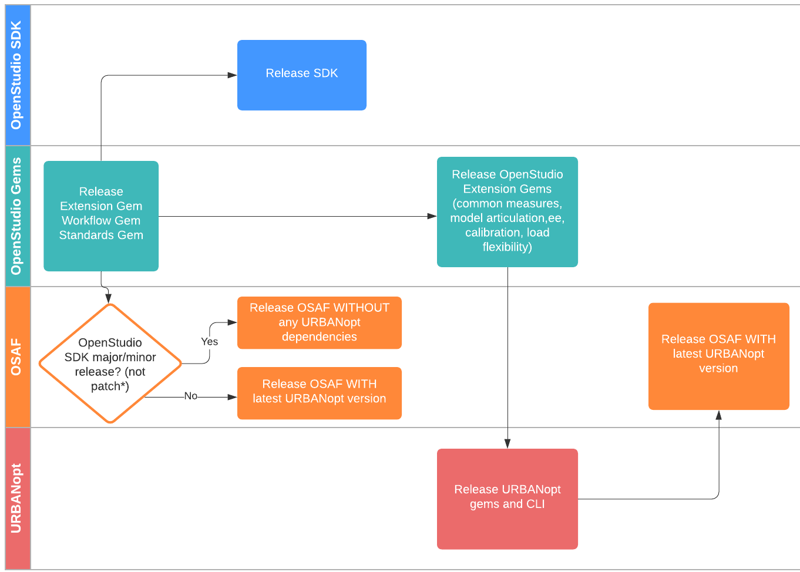

## URBANopt release process

The modular nature of URBANopt<sup>&trade;</sup> allows for freedom in developing and using only the parts relevant to your work. Keep in mind the following dependencies:


We recommend releasing gems **in order from the base to most dependent**. For each gem being improved, follow these steps:

1. Increment version (if needed) in `/lib/*/version.rb`. URBANopt follows a semantic versioning scheme where the version number parts are: MAJOR.MINOR.PATCH.
	- If the changes are non-breaking and it is safe to include them in a current URBANopt release, increment the version number at the PATCH level only, for example: v0.3.1 to v0.3.2. This will ensure that the changes will be automatically pulled in when users install the current version of URBANopt.

	- If the new release includes changes that break the current functionality or if the gem's dependencies are updated at the minor or major version level, increment the version number at the MINOR level, for example: v0.3.1 to v0.4.0.  This will ensure that the changes will not be automatically pulled in when users install the current version of URBANopt.
1. For gems with measures in them, run the following rake tasks and commit the changes:
	```
	rake openstudio:test_with_openstudio
	rake openstudio:update_measures
	```
1. Run `RuboCop` on all PRs before merging to `develop`
    ```
	rake rubocop:auto_correct
	```
1. Remove .DS_Store files if any are in the repo
1. If the gem has rdoc documentation, [regenerate the rdocs](../developer_resources/developer_resources.md#generating-rdoc-documentation)
1. Run the changelog rake task and add the changes to the CHANGELOG file for the range of time between last release and this release. Also make sure that all pull requests have a related Issue to be included in the change log.
	```
	rake openstudio:change_log[start_date,end_date,apikey]
	```
    No spaces around the commas! Paste the `Closed Issues` into the CHANGELOG, matching formatting as appropriate.
1. Ensure that the Gemfile and gemspec files are "clean" and that no dependency is pointing to a github branch before merging to develop and main branches.
1. Merge pull requests to the `develop` branch
1. Create PR to main
    - Ensure all tests pass before merging
1. Locally - from the main branch, run `rake release` to release the gem to RubyGems
1. Update the documentation with detailed usage and helpful examples
1. On GitHub, go to the releases page and update the latest release tag. Name it “Version x.y.z” and copy the CHANGELOG entry into the text box.
    - Link to relevant documentation URLs in release tags
1. Update [Compatibility Matrix](compatibility_matrix.md) as appropriate

### Updates for New Version of OpenStudio
Follow these steps when testing URBANopt for a new version of OpenStudio. These changes should be made on all URBANopt Ruby gems, the example-geojson-project repo, and the CLI:

1. Create long-term support branches for the previous version of OpenStudio off of the develop branch prior to making any updates for the new version.  Branch name should be OS-X.X-LTS, for example: OS-3.4-LTS.

1. Create a testing branch that includes the ruby version update and ruby dependency version updates. Name this branch with the new OpenStudio version: OS-X.X, for example: OS-3.5

1. Update Jenkins testing on GitHub to run the new OpenStudio executable for all PRs made against the new testing branch.  For example, all PRs made against OS-X.X will run the new OpenStudio executable for testing.

1. Once all tests pass, merge PRs into the OpenStudio testing branch.  Update Jenkins a final time to have run the new OpenStudio executable on all branches EXCEPT the long-term support (LTS) branches.  

1. Make a PR from the OS testing branch to develop, ensure that all tests pass, and merge.

1. Continue the release steps as usual after this point.

### OpenStudio - URBANopt Release Process

URBANopt SDK and OpenStudio SDK share some dependencies, namely the *OpenStudio Extension gem*. Additionally, the URBANopt SDK is included as a dependency in the OpenStudio Analysis Framework (OSAF). For these reasons, dependency conflicts can arise when the OpenStudio extension gem has a major release (X.0.0 or 0.X.0). This usually happens for major OpenStudio SDK releases and Ruby version changes.

To avoid these conflicts, major versions of OpenStudio, and more specifically OSAF, will not include the URBANopt SDK. URBANopt SDK's dependencies must first be updated with the newly released OpenStudio Extension gem and tested with the latest OpenStudio SDK version. Once URBANopt SDK is updated and released, a patch release of OSAF will be made that includes the URBANopt SDK.

A few notes:

- Users can use any OpenStudio versions that have a [compatible URBANopt SDK release](compatibility_matrix.md) for all workflows excluding [optimization](../workflows/optimization).
- Users should use OpenStudio versions not ending in 0 (for example, use 3.2.1 instead of 3.2.0) to use URBANopt [optimization workflows](../workflows/optimization).

The diagram below illustrates the OpenStudio and URBANopt release process.


