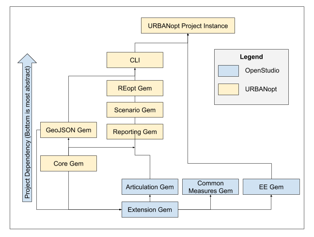

## URBANopt release process

The modular nature of URBANopt allows for freedom in developing and using only the parts relevant to your work. Keep in mind the following dependencies:



We recommend releasing gems **in order from the base to most dependent**. For each gem being improved, follow these steps:

1. Increment version (if needed) in `/lib/*/version.rb`
1. Run `rake rubocop:auto_correct` on all PRs before merging to `develop`
1. Run the `changelog.rb` script and add the changes to the CHANGELOG.md file for the range of time between last release and this release. Only add the Closed Issues. Also make sure that all the pull requests have a related Issue in order to be included in the change log.
	```
	ruby lib/change_log.py –k GITHUB_API_TOKEN –s 2020-01-01 –e 2020-03-31
	```
Paste the results (remove unneeded Accepted Pull Requests) into the CHANGELOG.md. Make sure to cleanup the formatting.
1. Merge pull requests to the `develop` branch
1. Create PR to master
    - Ensure all tests pass before merging
1. Locally - from the master branch, run `rake release` to release the gem to RubyGems
1. Update the documentation with detailed usage and helpful examples
1. On GitHub, go to the releases page and update the latest release tag. Name it “Version x.y.z” and copy the CHANGELOG entry into the text box.
    - Link to relevant documentation URLs in release tags
1. Update [Compatibility Matrix](compatibility_matrix.md) as appropriate
