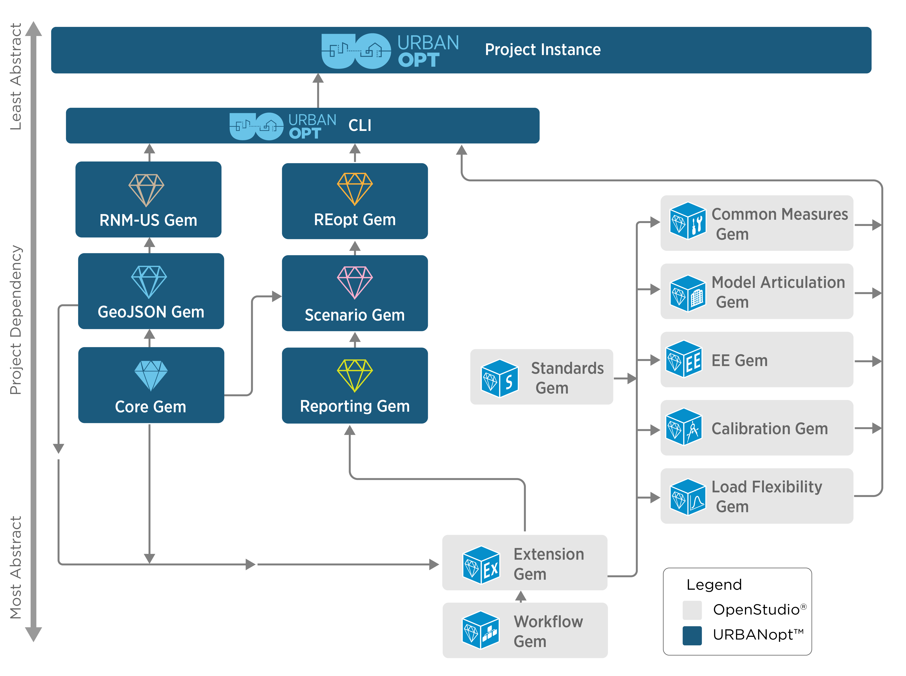

## URBANopt release process

The modular nature of URBANopt allows for freedom in developing and using only the parts relevant to your work. Keep in mind the following dependencies:

We recommend releasing gems **in order from the base to most dependent**. For each gem being improved, follow these steps:

1. Increment version (if needed) in `/lib/*/version.rb`
1. Run `rake rubocop:auto_correct`
1. Run lib/change_log.rb
    - Copy/Paste output to CHANGELOG.md
    - Add detail as appropriate
1. Merge all relevant branches to develop
1. Create PR to master
    - Ensure all tests pass before merging
1. Locally - from the master branch, run `rake release`
1. On GitHub, go to the releases page and update the latest release tag. Name it “Version x.y.z” and copy the CHANGELOG entry into the text box.
    - Link to relevant documentation URLs in release tags. You did [update the documentation](https://github.com/urbanopt/urbanopt.github.io) with detailed usage and helpful examples, right?
1. Update [Compatibility Matrix](compatibility_matrix.md) as appropriate
