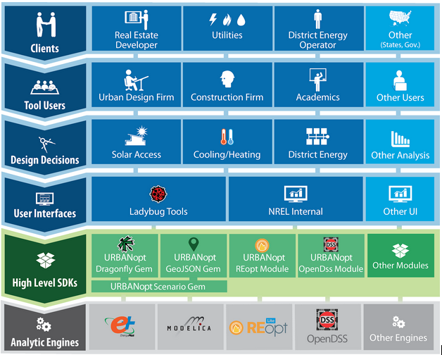

# Design Documentation Overview

This document presents a general overview of the URBANopt design principles, software architecture, and modules. More detailed design documentation is available by following links throughout this overview. These design documents are living documents which will be continuously referenced, updated, and modified throughout the URBANopt project. We encourage the reader to submit comments or suggested changes to the URBANopt team for further discussion.  

URBANopt is focused on the design of districts where the interactions between individual buildings, district energy systems, distributed energy resources, and electrical system designs are considered. Including these interactions allows URBANopt to address important questions in low energy, grid aware, future thinking urban districts such as tradeoffs between building height and PV (photovoltaic) production, investments in building efficiency vs distributed renewable generation, coordination of multiple buildings to optimize grid metrics, and performance gains of shared thermal district systems vs conventional single building systems. Figure 1 shows a potential scenario in which load diversity between commercial and residential buildings may allow for system time sharing or even complementary heat transfer between buildings using a district thermal energy system.

Figure 1: District system opportunities with load diversity

Daytime use of district hvac system that is predominantly commercial

Night time use of district hvac system that is predominantly residential

URBANopt leverages intelligent defaults and templates in OpenStudio Standards to quickly generate reasonable building energy models at conceptual design stages when important design decisions are made. At later stages of design, URBANopt can incorporate detailed single building models developed in tools such as OpenStudio if they are available.  At the city, regional, and national scales, building stock modeling tools, such as ComStock and [ResStock](https://www.nrel.gov/buildings/resstock.html), can be used to model populations of buildings. While building stock models largely ignore interactions between buildings, URBANopt analyses might be used to develop adjustment factors that can be applied to stock modeling tools to account for them. Additional information on URBANopt use cases is available in the [URBANopt Use Cases Document](use_cases.md).

# Ecosystem

Figure 2: District-scale energy analysis ecosystem

A variety of simulation engines, such as EnergyPlus, form the base of the ecosystem as shown in Figure 2.  Analytical software development kits (SDKs), such as URBANopt, provide software and data libraries which simplify use of the detailed simulation engines. Many of these SDKs and engines, including URBANopt and EnergyPlus, are publicly funded and open-source; this improves their credibility as they are unbiased, transparent, and undergo validation testing. Tool vendors in the private sector develop a variety of user interfaces for district-scale energy analysis. These user interfaces make it possible for tool users to interact with the underlying SDKs and engines performing calculations of energy use and other metrics.  Tool users at urban master planning firms, energy consultancies, academic research institutions, and other entities operate user interfaces to perform analyses and make recommendations on a variety of decisions that their clients are facing. Their clients include real estate developers, building owners, utilities, district thermal system operators, cities, and others.

The ecosystem depicted in Figure 2 encourages a healthy partnership between public entities and the private sector.  Public entities are well suited to develop credible, transparent, and unbiased analytical engines, such as EnergyPlus, and high level SDKs, such as URBANopt.  Private sector companies are well suited to develop and support scalable user interfaces which are used by private sector firms to answer design decisions for their clients.  This private/public partnership model is highly scalable as shown in Figure 3.

Figure 3: Scalability of the public/private partnership model

# Software Design Principles

The communities and urban design space is too large for any tool, SDK, or engine to address all of the possible use cases and design decisions of interest.  Rather than building a single monolithic piece of software, the URBANopt project will produce several modules which will operate as part of the larger communities and urban design and modeling ecosystem.  These modules can be shared across the community and combined as needed by tool vendors to save time and effort.  We encourage collaboration with external parties who may want to use URBANopt modules directly, modify URBANopt modules, or build their own modules.  To encourage modular reuse and collaboration, URBANopt software development will adopt the following design principles: 

- URBANopt modules have clear inputs and outputs.  Any module can be replaced by another module with the same inputs and outputs. 
- URBANopt modules are developed in separate, single-purpose repositories with clear ownership, dependencies, licensing, documentation, and testing.
- URBANopt modules may be written in a variety of software languages (Ruby, Python, C++, etc); interoperability between modules via well-documented file formats is preferred to options that restrict programming language choice for each module.
- Users (either end users or third-party applications) design and manage their overall workflow by combining modules and tools. This will provide several meaningful combinations of modules and tools to address a variety of design questions as there is not one “right way” to do things.
- Open-source, transparent, and validated simulation engines, datasets, and frameworks form the analytical foundation.  Third-party tool vendors build interfaces and provide support to end users.

# Software Architecture

In line with the software design principles outlined above, URBANopt projects are assembled from multiple functional modules. Because there is so much variability in district-scale energy analysis, the end user is responsible for combining all of the URBANopt (and other) modules needed to implement the desired workflow for their project.  Multiple example projects will be provided to give users a point of reference when starting out.

Figure 4: Software Architecture for an Example URBANopt Project

The example project shown in Figure 4 combines a set of URBANopt modules to implement a basic district-scale energy analysis workflow.  Each block shown in Figure 4 represents a different module, each developed and managed in separate source code repositories with independent release schedules. The URBANopt GeoJSON Gem module provides functionality to translate GeoJSON Features to OpenStudio Models for simulation with EnergyPlus.  The URBANopt Common Measures Gem module provides a common set of OpenStudio Measures used in district-scale energy analysis.  The URBANopt Scenario Gem module allows the end user to specify, run, and compare multiple district-scale energy scenarios. The OpenStudio Common Measures Gem, OpenStudio Model Articulation Gem, and OpenStudio Standards Gem modules are part of the OpenStudio project.  More details about each of these public modules are available in the Detailed Design Documents section below.

All of the project specific data, including the GeoJSON file with potentially sensitive information about the district of interest, is stored in project repository which may be kept private.  Project or user specific OpenStudio Measures can also be used.  When working on a project, the end user can specify the exact version of each module to use in their project, even overriding the versions of OpenStudio modules included in the OpenStudio release. This allows the project to move quickly or slowly depending on the project’s needs.  Finally, third party modules can be leveraged if needed.  For example, URBANopt will not initially implement a module to read from CityGML.  Figure 4 shows how a CityGML module developed by a third party could be used as an alternative to the URBANopt GeoJSON module if a project desired.  

In general, URBANopt modules will be packaged and distributed as [Ruby Gems](https://guides.rubygems.org/what-is-a-gem/) or [Python Modules](https://docs.python.org/3/tutorial/modules.html).  Functionality that will be used by OpenStudio Measures should be developed in Ruby and packaged as [OpenStudio Extension Gems](https://docs.google.com/document/d/1uMQADJ-6Cf4U-7woDpILXf46h4P26oxwJQZMkULKEfw/edit). URBANopt modules distributed as OpenStudio Extension Gems can be executed using OpenStudio Command Line Interface (CLI) to integrate with Python-driven workflows. URBANopt modules will be developed under the [URBANopt Github organization](https://github.com/urbanopt/) on Github to encourage collaboration with other organizations that might be hesitant to upload code to the NREL Github organization.  Documentation, testing, and continuous integration (CI) will also be developed for these example projects.  Users can leverage these example projects as starting points for their individual projects. However, the example projects need to stay clean for testing and demonstration purposes.

# Software Project Management

Work on the three year URBANopt project will be divided between four teams (with team leader identified in parentheses):

- URBANopt Core SDK (Katherine Fleming)
- URBANopt Ladybug Tools ()
- URBANopt GEB (Ben Polly)
- URBANopt Modelica (Kyle Benne)

Each team is responsible for holding its own scrums and weekly or bi-weekly meetings to discuss project status, tasks, or other issues.  Each team will utilize Github Projects to track tasks specific to each module’s repository.  Each team will create independent releases for each module, releases will be tagged and distributed through the module’s Github repository.

There is a bi-weekly URBANopt coordination meeting where team leads and representatives from each team will meet to share information from their team and coordinate activities across teams. Representatives will give brief overview of subproject status and can review subproject task trackers as needed.  Overall project lead (Ben) will review planned subproject tasks to ensure they are on track for DOE deliverables and well coordinated across subprojects. Github Projects at the URBANopt organization level will be used to track tasks which require coordination across repositories.

[Back to main documentation](../README.md#welcome-to-urbanopt)
