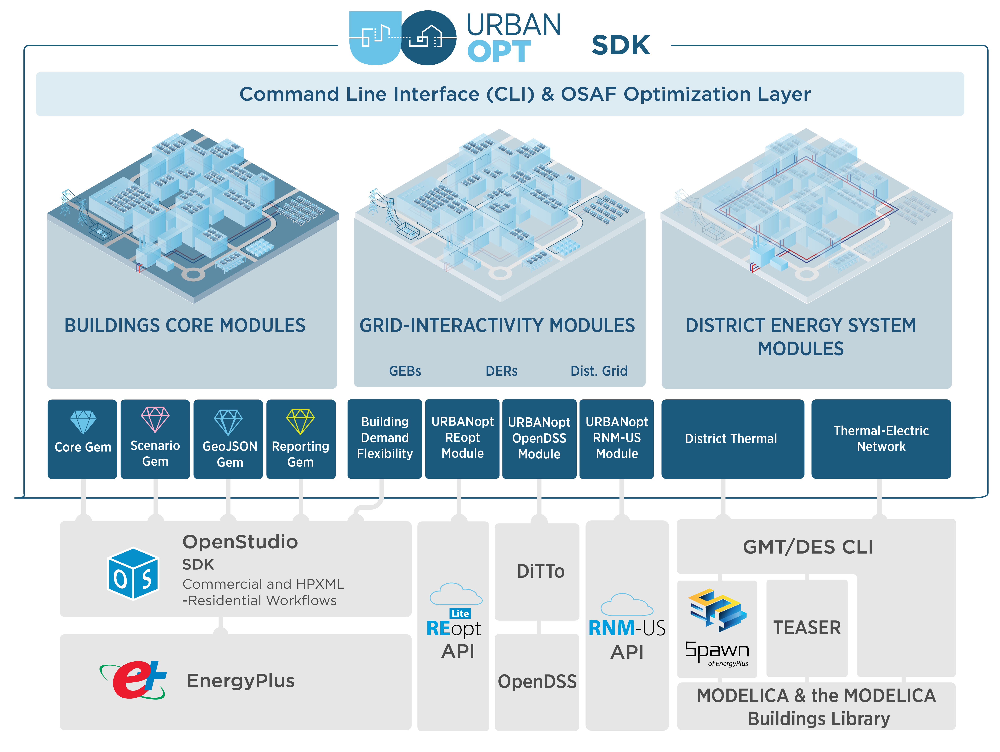

# Design Overview

This document presents a general overview of the URBANopt&trade; design principles, software
architecture, and modules. More detailed design documentation is available by following
links throughout the URBANopt documentation. These design documents are living documents which will be
continuously referenced, updated, and modified throughout the URBANopt project. We
encourage the reader to submit comments or suggested changes to the URBANopt team for
further discussion.  

Ultimately, URBANopt is focused on the design of districts where the interactions between
individual buildings, district energy systems, distributed energy resources, and
electrical system designs are considered. Studying these interactions will allow URBANopt to
address important questions in low energy, grid aware, future thinking urban districts
such as tradeoffs between building height and PV (photovoltaic) production, investments
in building efficiency vs distributed renewable generation, coordination of multiple
buildings to optimize grid metrics, and performance gains of shared thermal district
systems vs conventional single building systems. Figure 1 shows a potential scenario in
which load diversity between commercial and residential buildings may allow for system
time sharing or even complementary heat transfer between buildings using a district
thermal energy system.

Figure 1: District system opportunities with load diversity

Daytime use of district HVAC system that is predominantly commercial.

Night time use of district HVAC system that is predominantly residential.

URBANopt leverages intelligent defaults and templates in OpenStudio Standards to quickly generate reasonable building energy models at conceptual design stages when important design decisions are made. At later stages of design, URBANopt can incorporate detailed single building models developed in tools such as OpenStudio if they are available.  At the city, regional, and national scales, building stock modeling tools, such as ComStock and [ResStock](https://www.nrel.gov/buildings/resstock.html), can be used to model populations of buildings. While building stock models largely ignore interactions between buildings, URBANopt analyses might be used to develop adjustment factors that can be applied to stock modeling tools to account for them.

# Ecosystem

Analytical software development kits (SDKs), such as URBANopt,
provide software and data libraries which simplify use of the detailed simulation
engines. Many of these SDKs and engines, including URBANopt and EnergyPlus, are
open-source and focus on underlying calculation methods and workflows. A variety of tool vendors in the private sector develop user
interfaces for district-scale energy analysis. These user interfaces make it possible for
tool users to interact with the underlying SDKs and engines performing calculations of
energy use and other metrics.  Tool users at urban master planning firms, energy
consultancies, academic research institutions, and other entities operate applications
and user interfaces
to perform analyses and make recommendations on a variety of decisions that their clients
are facing. Their clients include real estate developers, building owners, utilities,
district thermal system operators, cities, and others.

The ecosystem depicted in Figure 2 leverages and encourages partnership between public entities and the private sector.

Figure 2: Ecosystem and public/private partnership model

# Software Design Principles

The communities and urban design space is too large for any tool, SDK, or engine to address all of the possible use cases and design decisions of interest.  Rather than building a single monolithic piece of software, the URBANopt project is made up of several modules that operate as part of the larger communities and urban design and modeling ecosystem.  These modules can be shared across the community and combined as needed by tool vendors to save time and effort.  We encourage collaboration with external parties who may want to use URBANopt modules directly, modify URBANopt modules, or build their own modules.  To encourage modular reuse and collaboration, URBANopt software development has adopted the following design principles: 

- URBANopt modules have clear inputs and outputs.  Any module can be replaced by another module with the same inputs and outputs. 
- URBANopt modules are developed in separate, single-purpose repositories with clear ownership, dependencies, licensing, documentation, and testing.
- URBANopt modules may be written in a variety of software languages (Ruby, Python, C++, etc); interoperability between modules via well-documented file formats is preferred to options that restrict programming language choice for each module.
- Users (either end users or third-party applications) design and manage their overall workflow by combining modules and tools. This will provide several meaningful combinations of modules and tools to address a variety of design questions as there is not one “right way” to do things.
- Open-source, transparent, and validated simulation engines, datasets, and frameworks form the analytical foundation.  Third-party tool vendors build interfaces and provide support to end users.

# Software Architecture

URBANopt interfaces with multiple software technologies to provide the integration outlined in the [use cases](../index.md#use-cases). Figure 3 shows the core URBANopt modules as well as the modules providing grid-interactivity and district energy system capabilities.

Figure 3: URBANopt Modules

In line with the software design principles outlined above, URBANopt projects are assembled from multiple functional modules. A command line interface (CLI) has been developed to aid users in combining the modules needed to implement a desired workflow. Example projects are also available through the CLI for users to test a particular workflow before adapting it to their particular use case.  Because there is so much variability in district-scale energy analysis, the end user may need to customize some of the URBANopt (and other) modules needed to implement the desired workflow for their project. [Customization documentation](../resources/customization/customization.md) is available for users to consult during their particular project development. 

Figure 4: Software Architecture for an Example URBANopt Project

The example project shown in Figure 4 combines a set of URBANopt modules to implement a
basic district-scale energy analysis workflow.  Each block shown in Figure 3 represents a
different module, each developed and managed in separate source code repositories with
independent release schedules. The URBANopt GeoJSON Gem module provides functionality to
translate GeoJSON Features to OpenStudio Models for simulation with EnergyPlus.  The
URBANopt Common Measures (or "Core") Gem module provides a common set of OpenStudio Measures used in
district-scale energy analysis.  The URBANopt Scenario Gem module allows the end user to
specify, run, and compare multiple district-scale energy scenarios. The OpenStudio Common
Measures Gem, OpenStudio Model Articulation Gem, and OpenStudio Standards Gem modules are
part of the OpenStudio project.

All of the project specific data, including the GeoJSON file with potentially non-public information about the district of interest, is stored in project repository which may be kept private.  Project or user specific OpenStudio Measures can also be used.  When working on a project, the end user can specify the exact version of each module to use in their project, even overriding the versions of OpenStudio modules included in the OpenStudio release. This allows the project to move quickly or slowly depending on the project’s needs.  Finally, third party modules can be leveraged if needed.  For example, URBANopt will not initially implement a module to read from CityGML.  Figure 3 shows how a CityGML module developed by a third party could be used as an alternative to the URBANopt GeoJSON module if a project desired.  

In general, URBANopt modules will be packaged and distributed as [Ruby Gems](https://guides.rubygems.org/what-is-a-gem/) or [Python Modules](https://docs.python.org/3/tutorial/modules.html).  Functionality that will be used by OpenStudio Measures should be developed in Ruby and packaged as OpenStudio Extension Gems. URBANopt modules distributed as OpenStudio Extension Gems can be executed using OpenStudio Command Line Interface (CLI) to integrate with Python-driven workflows. URBANopt modules will be developed under the URBANopt GitHub organization to encourage collaboration with other organizations that might be hesitant to upload code to the NREL Github organization.  Documentation, testing, and continuous integration (CI) will also be developed for these example projects.  Users can leverage these example projects as starting points for their individual projects.

[Back to main documentation](../index.md)
