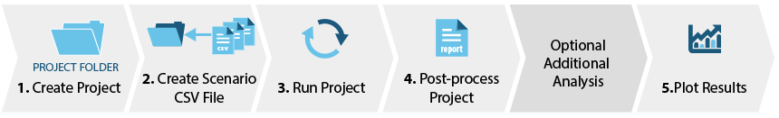

	

		
To run URBANopt&trade;, first follow the <a href="../installation/installation" class="bold">installation instructions</a> to install the URBANopt command line interface (CLI) and all of its dependencies.

		
Once the CLI is installed, help is available by typing <code>uo --help</code> from the command line.  Detailed help for each command can be found with <code>uo [the command name] --help</code>. The main CLI commands are: <code>create</code>, <code>run</code>, <code>process</code>, <code>visualize</code>, <code>opendss</code>, <code>rnm</code>, <code>disco</code>, and <code>delete</code>.

		
Before you start, think about the capabilities and analyses you want to utilize and setup your project accordingly. The best way to start is to use the example project made with the CLI.  Once you are familiar with the commands you can customize your project.

	

	

	<h2 style="padding-bottom:20px;">Important Notes</h2>
	
Keep the project directory path short to avoid errors related to long paths, especially when running on Windows.  For more information on this error, refer to the <a href="../developer_resources/known_issues" class="bold">known issues section</a>.

	
We recommend calling all URBANopt commands from outside of the project you created, using relative or absolute paths to the relevant files.

	
<a href="../resources/definitions" class="btn btn-uo white-text">Definitions</a>

  
<a href="../resources/tutorials/tutorials" class="btn btn-uo white-text">Tutorial Videos</a>

	

<h1>Steps</h1>

The overall URBANopt process is shown in the graphic below.

Read through each section below for more information on each step of the process&mdash;including CLI command examples&mdash;and for details on the different workflows available.

	

		<h2 class="white-text" id="step1">1. Create Project</h2>
		
Set up the project directory structure and example files

	

	

Expand the sections below and choose the option that is right for your project. Most of the options will create both a project directory structure and example project files that will allow you to try out the additional commands.  Visit the <a href="../resources/example" class="bold">example project page</a> to learn more about the example project.  You can also watch a tutorial video on <a href="https://urbanopt-tutorial.s3.amazonaws.com/videos/05_CreateProject.mp4" target="blank" class="bold">Project Creation and GeoJSON File Overview</a>.

<ul class="jk_accordion">
  <li class="acc">
    <input id="accordion1" type="checkbox" />
    <label for="accordion1">Use the default workflow</label>
    

      
Use the command below to create a default project:

      
<pre class="highlight"><code>uo create --project-folder &lt;path/to/PROJECT_DIRECTORY_NAME&gt;</code></pre>
      

      
This creates a project folder containing the example project using the default geometry workflow with <code>urban-geometry-creation-zoning</code> measure, and downloads related weather files and detailed models to the appropriate directories.

      
For more details on the various geometry workflows, refer to the <a href="../workflows/geometry_workflows" class="bold">geometry_workflows page</a>.

    

  </li>
  <li class="acc"><input id="accordion2" type="checkbox" /><label for="accordion2">Use Createbar geometry workflow</label>
  

    
This project uses the <code>create_bar_from_building_type_ratio</code> measure to create building geometry.

    
<pre class="highlight"><code>uo create --create-bar --project-folder  &lt;path/to/PROJECT_DIRECTORY_NAME&gt;</code></pre>
    

    
For more details on the various geometry workflows, refer to the <a href="../workflows/geometry_workflows" class="bold">geometry_workflows page</a>.

  

  </li>
  <li class="acc"><input id="accordion3" type="checkbox" /><label for="accordion3">Use Floorspace geometry workflow</label>
  

    
This creates building geometry from floor plans with stub space types drawn using FloorSpaceJS.

    
<pre class="highlight"><code>uo create --floorspace --project-folder  &lt;path/to/PROJECT_DIRECTORY_NAME&gt;</code></pre>
    

    
For more details on the various geometry workflows, refer to the <a href="../workflows/geometry_workflows" class="bold">geometry_workflows page</a>.

  
</li>
  <li class="acc"><input id="accordion4" type="checkbox" /><label for="accordion4">Include Residential buildings in your project</label>
  

    
As of version 0.4.0, URBANopt supports a workflow that combines commercial building types and residential building types (Single-family Detached only for now, with beta testing code for Single-family Attached and Low-rise Multifamily).

    
To create a project that contains all files required to run this combined workflow, add the <code>--combined</code> option to the create command:

    
<pre class="highlight"><code>  uo create --combined --project-folder &lt;path/to/PROJECT_DIRECTORY_NAME&gt;</code></pre>
    

    
The rest of the CLI commands are the same as for the default workflow. Make sure that you use and inspect the <code>example_project_combined.json</code> FeatureFile in your project directory to see an example of a residential feature specification (feature IDs 14, 15, and 16) and the additional fields required for residential building types.

    
Residential building energy models in URBANopt are created using the OpenStudio-HPXML workflow. Visit the <a href="../workflows/residential_workflows/residential_workflows" class="bold">Residential Workflows page</a> to learn more.

  

  </li>
  <li class="acc"><input id="accordionPVp" type="checkbox" /><label for="accordionPVp">Include PV features in your project</label>
  

    
As of version 0.6.3, URBANopt supports community photovoltaic and ground mount photovoltaic features.

    
To create a PV-enabled project add the <code>--photovoltaic</code> option to the create command:

    
<pre class="highlight"><code> uo create --photovoltaic --project-folder &lt;path/to/PROJECT_DIRECTORY_NAME&gt;</code></pre>
    

    
The rest of the CLI commands are the same as for the default REopt workflow. Inspect the <code>example_project_with_PV.json</code> FeatureFile in your project directory to see examples of community photovoltaic and ground mount photovoltaic features.

    
Visit the <a href="../workflows/photovoltaic" class="bold">Photovoltaic Workflows page</a> to learn more.

  

  </li>
  <li class="acc"><input id="accordionA" type="checkbox" /><label for="accordionA">Include OpenDSS functionality in your project</label>
    

      
In order to use the OpenDSS functionality successfully, the FeatureFile should contain Electrical Connectors and Junctions.  Use the command below to create an example project containing a FeatureFile with electrical network defined within it (<code>example_project_with_electric_network.json</code>). You can also use your own Feature File as long as the electrical infrastructure is defined and connected to the buildings accordingly.

      
<pre class="highlight"><code>  uo create --electric --project-folder &lt;path/to/PROJECT_DIRECTORY_NAME&gt;</code></pre>
      

      
View the <a href="#opendss" class="bold">OpenDSS section</a> under <a href="#analyses" class="bold">Additional Capabilities</a> below for more details on the OpenDSS functionality.

    

  </li>
  <li class="acc"><input id="accordionB" type="checkbox" /><label for="accordionB">Include RNM functionality in your project</label>
    

      
In order to use the RNM functionality successfully, the FeatureFile should contain streets as well as the location of the primary electrical substation.  Use the command below to create an example project containing a FeatureFile with streets defined within it (<code>example_project_with_streets.json</code>). You can also use your own Feature File that includes streets.

      
<pre class="highlight"><code>  uo create --streets --project-folder &lt;path/to/PROJECT_DIRECTORY_NAME&gt;</code></pre>
      

      
View the <a href="#rnm" class="bold">RNM section</a> under <a href="#analyses" class="bold">Additional Capabilities</a> below for more details on the RNM functionality.

    

  </li>
  <li class="acc"><input id="accordionC" type="checkbox" /><label for="accordionC">Include DISCO functionality in your project</label>
    

      
In order to use the DISCO functionality successfully, the FeatureFile should contain Electrical distribution system features. The project directory should also contain a cost database input file and a technical catalog input file to be used by the DISCO analysis. Use the command below to create an example project containing a FeatureFile with electrical network defined within it (<code>example_project_with_electric_network.json</code>) as well as a disco folder including the necessary catalog input files. You can also use your own Feature File that includes an electric network.

      
<pre class="highlight"><code>  uo create --disco --project-folder &lt;path/to/PROJECT_DIRECTORY_NAME&gt;</code></pre>
      

      
View the <a href="#disco" class="bold">DISCO section</a> under <a href="#analyses" class="bold">Additional Capabilities</a> below for more details on the DISCO functionality.

    

  </li>
</ul>

Other Options

<ul class="jk_accordion">
  <li class="acc"><input id="accordion5" type="checkbox" /><label for="accordion5">Create an empty project directory structure</label>
    

    
This option creates a project directory structure without an example FeatureFile or weather files. You can download weather files and add to this folder from the <a href="https://energyplus.net/weather" target="_blank" class="bold">EnergyPlus&trade; Website</a>.

    
<pre class="highlight"><code>uo create --empty --project-folder &lt;path/to/PROJECT_DIRECTORY_NAME&gt;</code></pre>

    

  </li>
  <li class="acc"><input id="accordion6" type="checkbox" /><label for="accordion6">Overwrite an existing project</label>
  

    
By default, the CLI will abort if the project directory being created already exists. To overwrite an existing folder, use the <code>--overwrite</code> option. This deletes anything in the named folder and creates a fresh project directory. This command can be combined with the <code>-e</code> option to overwrite a directory with a new empty URBANopt project directory.

    
<pre class="highlight"><code>uo create --overwrite --project-folder &lt;path/to/PROJECT_DIRECTORY_NAME&gt;</code></pre>
    

  

  </li>
  <li class="acc"><input id="accordion6b" type="checkbox" /><label for="accordion6b">Update an existing project to a more recent version of URBANopt</label>
  

    
The <code>update</code> function can be used to update an existing URBANopt project to the currently installed URBANopt CLI version. This process will overwrite the existing URBANopt files and folders in the new project folder with the updated ones. If you have made modifications to the following files in your existing folder, you will need to reinstate these modifications in the new project folder:

    <ul style="margin-left:50px;">
      <li>Gemfile</li>
      <li>validation_schema.yaml</li>
      <li>runner.conf</li>
      <li>Example Feature File</li>
      <li>mappers folder</li>
      <li>osm_building folder</li>
      <li>weather folder</li>
      <li>visualization folder</li>
      <li>residential folder</li> 
      <li>measures folder</li>
      <li>resources folder</li>
      <li>xml_building folder in case of a residential project</li>
      <li>reopt folder in case of a REopt project</li>
      <li>opendss folder in case of an OpenDSS project</li>
      <li>disco folder in case of a DISCO project</li>
    </ul>
    
To update the project, specify the existing project folder name and location for the updated URBANopt project:

    
<pre class="highlight"><code>uo update --existing-project-folder &lt;name of existing project&gt; --new-project-directory &lt;location/to/new_urbanopt_example_project&gt;</code></pre>
    

  

  </li>
</ul>

  

    <h2 class="white-text" id="step2">2. Set up Scenario</h2>
    
Assign a Scenario Mapper to each feature  
    Configure additional settings

  

  

If you are not using an example project, ensure that your FeatureFile is in the root of the project directory.  If you are using an example project, an example feature file is provided for you.

You can also view the tutorial video on <a href="https://urbanopt-tutorial.s3.amazonaws.com/videos/06_CreateRunScenario.mp4" target="blank" class="bold">Creating and Running Scenarios</a>.
<ul class="jk_accordion">
  <li class="acc"><input id="accordion7" type="checkbox" /><label for="accordion7">Create a Scenario CSV File for each mapper</label>
    

    
The following command will create a ScenarioFile for each mapper contained in the project directory.  The resulting CSV files will map all features in the FeatureFile to the particular scenario mapper. The scenario mappers currently included in URBANopt are listed above. Visit the <a href="../resources/scenarios/scenarios" class="bold">Scenarios page</a> to learn more about each scenario mapper.

    
<pre class="highlight"><code>uo create --scenario-file &lt;path/to/FEATUREFILE.json&gt;</code></pre>

    

  </li>
  <li class="acc"><input id="enable-reopt" type="checkbox" /><label for="enable-reopt">Enable REopt&trade; Functionality</label>
    

      <ol>
        <li>To run a REopt scenario you will need an internet connection so the REopt™ Gem can access the REopt API.</li>
        <li>Obtain an API key from the <a href="https://developer.nrel.gov/" class="bold">NREL Developer Network</a> to use the <strong>REopt API</strong>. Copy and paste your key as an environment variable named <code>GEM_DEVELOPER_KEY</code> on your computer. Step-by-step instructions for creating env variables are found in the <a href="../installation/installation" class="bold">installation docs</a> for your operating system.
          
<pre class="highlight"><code> GEM_DEVELOPER_KEY = '&lt;insert your NREL developer key here'&gt;</code></pre>

        </li>
        <li>
Extend the Scenario CSV File with REopt information. After following the instructions above to create a basic Scenario CSV File for each mapper, use the command below to create a new Scenario CSV File (named REopt_scenario.csv by default) that has an extra column to map assumptions files to features. Use this Scenario CSV File going forward in future steps. The assumptions file listed in the Scenario CSV will be used when performing a REopt feature optimization.  By default, this is set to <code>multiPV_assumptions.json</code>. If you'd like to use a different file, open the Scenario CSV file, edit the assumptions file name and save. Your new assumptions file should be saved in the <code>reopt</code> directory within your project directory.

          
<pre class="highlight"><code>uo create --reopt-scenario-file &lt;path/to/EXISTING_SCENARIO_FILE.csv&gt;</code></pre>

        </li>
        <li>
Configure your REopt assumptions. Two example <strong>REopt</strong> assumptions files are located in the <code>reopt</code> folder within your project directory:  <code>base_assumptions.json</code> and <code>multiPV_assumptions.json</code>. These files follow the format outlined in the <a href="https://github.com/NREL/REopt-API-Analysis/wiki/Job-Inputs" target="_blank" class="bold">REopt API documentation</a> and can be customized to your specific project needs. Through CLI commands, they will be updated with basic information from your Feature and Scenario Reports (i.e. latitude, longitude, electric load profile) and submitted to the <strong>REopt API</strong>.

        
In particular, you will want to make sure that the <code>urdb_label</code> in the assumptions file maps to a suitable utility rate <em>label</em> from the <a href="https://openei.org/apps/IURDB/" target="_blank" class="bold">URDB</a>. The <em>label</em> is the last term of the URL of a utility rate detail page (e.g. the <em>label</em> for the rate at <a href="https://openei.org/apps/IURDB/rate/view/5b0d83af5457a3f276733305" target="_blank" class="bold">https://openei.org/apps/IURDB/rate/view/5b0d83af5457a3f276733305</a> is 5b0d83af5457a3f276733305).

        
Also note that the example <code>reopt/multiPV_assumptions.json</code> file contains an array of PV inputs to allow for the optimization of multiple PV systems at once (e.g. rooftop PV and ground mount PV).

        
<strong>Unless otherwise configured, the <code>multiPV_assumptions.json</code> file will be used inside the REopt-enabled Scenario CSV for feature-level optimizations, and the <code>base_assumptions.json</code> file will be used for scenario-level optimizations. Both of these files can be found in the <code>reopt</code> directory within the project directory.</strong>

        
A complete list of input fields&mdash;including type, description, and acceptable range&mdash;can be retrieved from the REopt API by entering the following URL in your browser:

        
<pre class="highlight"><code>https://developer.nrel.gov/api/reopt/stable/help?API_KEY=&lt;insert your NREL developer key here&gt;</code></pre>

        </li>
      </ol>
      
Visit the <a href="../workflows/reopt/reopt" class="bold">REopt page</a> for more details on using REopt with URBANopt, or watch the <a href="https://urbanopt-tutorial.s3.amazonaws.com/videos/08_REopt-URBANopt.mp4" target="_blank" class="bold">REopt Workflow Tutorial Video</a>.

    

  </li>
</ul>

Other Options

<ul class="jk_accordion">
  <li class="acc"><input id="accordion9" type="checkbox" /><label for="accordion9">Create a scenario CSV File for a single Feature</label>
    

    
If you need to run a single feature through the URBANopt process, you will first need to generate a Scenario CSV File containing only that Feature. To accomplish this, specify the Feature_ID in the arguments as shown here:

    
<pre class="highlight"><code> uo create --scenario-file &lt;path/to/FEATUREFILE.json&gt; --single-feature &lt;FEATURE_ID&gt;</code></pre>

    

  </li>
  <li class="acc"><input id="accordion10" type="checkbox" /><label for="accordion10">Create a mixed Scenario CSV File</label>
    

    
The default process to create a Scenario CSV File for each mapper assigns the same mapper to all Features in the FeatureFile.  If you wish to customize the scenario so that features are mapped to different mappers, the best course of action is to first generate the basic Scenario CSV Files for each mapper and then edit them to assign the various mappers.

    
The following figure represents how Simulation Mapper Classes can be assigned to different Features from the FeatureFile in the Scenario CSV.

    
    

  </li>
  <li class="acc"><input id="accordion11" type="checkbox" /><label for="accordion11">Customize the mappers</label>
    

    
In addition to Scenario mappers included in the URBANopt CLI, you can write your own mapper file for a specific use case. You can also edit the existing mappers in your project directory.  Visit the <a href="../resources/customization/customization" class="bold">Customizations page</a> to learn about how to customize your URBANopt workflow.

    

  </li>
</ul>

  

    <h2 class="white-text" id="step3">3. Run Scenario</h2>
    
Simulate Energy Usage of each FeatureFile mapped in a Scenario CSV File

  

  

Expand the sections below to learn more about running a basic scenario and running a REopt-enabled project. You can also view the tutorial video on <a href="https://urbanopt-tutorial.s3.amazonaws.com/videos/06_CreateRunScenario.mp4" target="blank" class="bold">Creating and Running Scenarios</a>.

<strong>Config File</strong>&mdash;there is a <em>runner.conf</em> file automatically created in the project folder. This file can be used to configure the number of features to process in parallel as well as a few other parameters. Make edits to this file prior to running the project.

<ul class="jk_accordion">
   <li class="acc"><input id="accordion12" type="checkbox" /><label for="accordion12">Run a basic project</label>
    

    
Simulate the energy usage of each feature in a scenario.  Use the following command to specify the appropriate FeatureFile and Scenario CSV File:

      
<pre class="highlight"><code> uo run --feature &lt;path/to/FEATUREFILE.json&gt; --scenario &lt;path/to/SCENARIOFILE.csv&gt;</code></pre>

      
Running a simulation is computationally intensive. Each building simulation must be run on one CPU core at a time. To reduce the time spent on computation you may use multiple cores simultaneously to simulate several buildings in your scenario at once. The default is 2 cores, set in the <em>runner.conf</em> file of each project. You may alter this on the fly by including <code>--num-parallel=[i]</code> in the run command above, where <em>[i]</em> is the number of cores you want to use.

      
You may also set the num-parallel globally by using an environment variable and not have to adjust the runner.conf file or use the above CLI flag in each project or run. To do this, create an environment variable and set it to the number of cores you want to use: <code>UO_NUM_PARALLEL=7</code> or other appropriate number.

    

  </li>
</ul>

  

    <h2 class="white-text" id="step4">4. Post-Process Scenario</h2>
    
Aggregate the results of the simulation across the scenario

  

  

Expand the sections below to choose the option that is right for your project. You can also watch the tutorial video on <a href="https://urbanopt-tutorial.s3.amazonaws.com/videos/07a_PostProcess.mp4" target="_blank" class="bold">Post-Processing Scenarios</a>.

You must run the default post-processing command before running any additional analyses such as OpenDSS and DES, or running the REopt optimization and post-processing the results.

<ul class="jk_accordion">
  <li class="acc"><input id="accordion14" type="checkbox" /><label for="accordion14">Post-process general results (default post-processor)</label>
    

    
To post-process the simulated features into a Scenario report, call the CLI process command using the <code>--default</code> flag:

      
<pre class="highlight"><code>  uo process --default --feature &lt;path/to/FEATUREFILE.json&gt; --scenario &lt;path/to/SCENARIOFILE.csv&gt;</code></pre>

    <h3>Output Files</h3>
    
The post-process command will aggregate data across all the features in a scenario and generate results files in the scenario results folder: 

      <ol>
        <li><strong>JSON </strong>&mdash; a <code>default_scenario_report.json</code> file containing overall results</li>
        <li><strong>CSV Timeseries</strong>&mdash; a <code>default_scenario_report.csv</code> file containing aggregated timeseries data.</li>
      </ol>
    

If the scenario is consequently post-processed with another option flag (i.e. --reopt-scenario, --reopt-feature, or --opendss, see sections below), the new data will be appended to the existing results files.

  

  </li>
</ul>

Other Options

<ul class="jk_accordion">
  <li class="acc"><input id="accordion15" type="checkbox" /><label for="accordion15">Post-process REopt results</label>
    

      
<strong>REopt</strong> optimization happens during the post-processing of each scenario, after the scenario is run. Two types of REopt optimization are available:

      <ol>
        <li><strong>scenario-level</strong>, which optimizes for the aggregate load of the entire district being simulated assuming there is one primary utility meter, and</li>
        <li><strong>feature-level</strong>, which optimizes each building’s load individually assuming each building is individually metered.</li>
      </ol>
      
You may chose to optimize by one or both of these approaches according to your project objectives. 

      

Note&mdash;You will need an internet connection so the REopt™ Gem can access the REopt API.

      
<strong>To optimize at the scenario-level, use the <code>--reopt-scenario</code> flag:</strong>

      
<pre class="highlight"><code>  uo process --reopt-scenario --feature &lt;path/to/FEATUREFILE.json&gt; --scenario &lt;path/to/SCENARIOFILE.csv&gt;</code></pre>

      
The <code>--reopt-scenario-assumptions-file</code> (or <code>-a</code>) option can be used to specify the path to the assumptions file to use for this optimization. If none is specified, the <code>base_assumptions.json</code> file in the <code>reopt</code> folder of the project directory will be used.

      
<strong>To optimize at the feature-level, use the <code>--reopt-feature</code> flag:</strong>

      
<pre class="highlight"><code>  uo process --reopt-feature --feature &lt;path/to/FEATUREFILE.json&gt; --scenario &lt;path/to/REoptEnabledSCENARIOFILE.csv&gt;</code></pre>

      
For this optimization, the assumptions file is specified per feature in the Scenario CSV file, and is defaulted to the <code>multiPV_assumptions.json</code> file in the <code>reopt</code> folder of the project directory.

      
Visit the <a href="../workflows/reopt/reopt_post_processing" class="bold">REopt Workflow page</a> for more details on using REopt, or watch the <a href="https://urbanopt-tutorial.s3.amazonaws.com/videos/08_REopt-URBANopt.mp4" target="_blank" class="bold">REopt Workflow Tutorial Video</a>.

      
<strong>Additional Options:</strong>

      
the process command can be used with the following additional REopt-related options:

      <ol>
        <li><strong>--reopt-resilience</strong>: adding this option will include resilience reporting in the REopt optimization</li>
        <li><strong>--reopt-keep-existing</strong>: the REopt API rate limit (300 API calls per hour) may be reached when processing projects with a large number of features.  If that is the case, use this option to continue processing the remaining features after the hour has elapsed.</li>
      </ol>
      
You can run the help command to see the full list of options:

      
<pre class="highlight"><code>  uo process --help</code></pre>

      <h3>Output Files</h3>
      
The REopt optimizations will generate results files in the scenario results folder: 

      <ol>
        <li><strong>JSON </strong>&mdash; a <code>scenario_optimization.json</code> file containing overall scenario optimization results, and/or a <code>feature_optimization.json</code> file containing aggregated feature optimization results.</li>
        <li><strong>CSV Timeseries</strong>&mdash; a <code>scenario_optimization.csv</code> file containing REopt aggregated timeseries results for the scenario optimization (<code>REopt:ElectricityProduced:Total(kw)</code>, for example) and/or a <code>feature_optimization.csv</code> containing REopt aggregated timeseries results for the feature optimization.</li>
        <li><strong>Detailed REopt results</strong>&mdash; can be found in the <code>scenario_report_reopt_scenario_reopt_run.json</code> inside the scenario results' inner <code> reopt</code> folder.  Additionally, individual <code>feature_optimization.json</code> and <code>feature_optimization.csv</code> files can be found in each feature's <code>reopt</code> directory inside the feature's results directory.</li>
      </ol>
      
The figure below illustrates the results directory structure.

       

    

  </li>
  <li class="acc"><input id="accordion16" type="checkbox" /><label for="accordion16">Post-process OpenDSS results</label>
    

      
To post-process OpenDSS results back into the main Scenario JSON and CSV results files, use the <code>--opendss</code> flag.

      
Note&mdash; Run this command <strong>after</strong> you <strong>a)</strong> post-process the general scenario results and <strong>b)</strong> run the OpenDSS workflow as described in the <a href="#analyses" class="bold">Additional Capabilities</a> section below.

      
<pre class="highlight"><code>  uo process --opendss --feature &lt;path/to/FEATUREFILE.json&gt; --scenario &lt;path/to/SCENARIOFILE.csv&gt;</code></pre>

      
For more information on the OpenDSS workflow, visit the <a href="../workflows/opendss/opendss" class="bold">OpenDSS page</a> or watch the <a href="https://urbanopt-tutorial.s3.amazonaws.com/videos/09_UO_opendss_workflow.mp4" target="_blank" class="bold">OpenDSS Workflow Video Tutorial</a>.

    

  </li>
  <li class="acc"><input id="accordionQ" type="checkbox" /><label for="accordionQ">SQL Database Output File</label>
    

      
In addition to the JSON and CSV output files, a <strong>SQL Database</strong> file (<code>default_scenario_report.db</code>) containing aggregated energy use across the scenario is also available. The relevant data is in the <strong>ReportData</strong> table to match the structure of the <code>eplusout.sql</code> file generated for each building by EnergyPlus.

      
The ReportData table structure is as follows:

      <table>
        <tr>
          <th>TimeIndex</th>
          <th>Year</th>
          <th>Month</th>
          <th>Day</th>
          <th>Hour</th>
          <th>Minute</th>
          <th>Dst</th>
          <th>ReportDataDictionaryIndex</th>
          <th>Value</th>
        </tr>
        <tr>
          <td>Integer</td>
          <td>Var</td>
          <td>Var</td>
          <td>Var</td>
          <td>Var</td>
          <td>Var</td>
          <td>Var</td>
          <td>Integer   10 = Electricity; 1382 = Gas</td>
          <td>Integer   Amount (J)</td>
        </tr>
      </table>
      
Add the <code>--with-database</code> flag to your command to generate this file:

     
<pre class="highlight"><code>  uo process --default --with-database --feature &lt;path/to/FEATUREFILE.json&gt; --scenario &lt;path/to/SCENARIOFILE.csv&gt;</code></pre>

    

  </li>
</ul>

  

    <h2 class="white-text" id="analyses">Additional Capabilities (Optional)</h2>
    
Add Electrical Distribution or Distributed Thermal Systems Analysis to your Scenario

  

Expand the sections below to learn more about optional capabilities available in URBANopt

<ul class="jk_accordion">
   <li class="acc" id="opendss"><input id="accordion17" type="checkbox" /><label for="accordion17">OpenDSS Functionality</label>
    

      
<strong>OpenDSS</strong> is an open-source tool that is popular for simulating electrical distribution systems. The <strong>DIstribution Transformation TOol (DiTTo)</strong> is an open source and many-to-many conversion tool that has been developed by NREL to simplify converting data between distribution models. Finally, the <strong>URBANopt DiTTo Reader</strong> package and CLI provide the link between URBANopt and OpenDSS.

      
The entire DiTTo-Reader to OpenDSS workflow is available in URBANopt via the opendss URBANopt CLI command.

      

        
 Since the DiTTo Reader and OpenDSS functionality is written in Python, additional dependencies will need to be installed if you wish to use this workflow. Run the <strong>uo install_python</strong> command to install Python and all required dependencies.
      

      

      
Once you have installed Python and Python-related dependencies with the <code>uo install_python</code> command, you can use the <code>opendss</code> CLI command to access the OpenDSS functionality. You can use the <code>opendss</code> CLI command after you have run the scenario (using a FeatureFile that contains a fully-connected electrical network) and post-process the general results with the <code>--default</code> post-processor.  The OpenDSS workflow will use these results files in the processing.

      
Watch the <a href="https://urbanopt-tutorial.s3.amazonaws.com/videos/09_UO_opendss_workflow.mp4" target="_blank" class="bold">OpenDSS Workflow Tutorial Video</a>.

      <h3>Step-by-Step of the entire OpenDSS-enabled workflow:</h3>
      <ol class="t">
        <li class="t">Create an example project with the <code>--electric</code> option or use your own FeatureFile containing electrical network information.</li>
        <li class="t">Create the Scenario CSV file and run the project as explained above in Steps 2 and 3.  You can run the basic project or the REopt-enabled project.</li>
        <li class="t">Post-process the general results with the <code>uo process --default</code> command described above in Step 4.  If you have a REopt-enabled project, also post-process the results with the desired REopt post-processor (either <code>--reopt-scenario</code> or <code>--reopt-feature</code>).</li>
        <li class="t">Run OpenDSS:
          
To run the general OpenDSS workflow, use the following command:

           
<pre class="highlight"><code>  uo opendss --feature &lt;path/to/FEATUREFILE.json&gt; --scenario &lt;path/to/SCENARIOFILE.csv&gt;</code></pre>

          
To run the REopt-enabled OpenDSS workflow, include the <code>--reopt</code> flag in the command:

          
<pre class="highlight"><code>  uo opendss --reopt --feature &lt;path/to/FEATUREFILE.json&gt; --scenario &lt;path/to/SCENARIOFILE.csv&gt;</code></pre>

          
In addition to the required `--scenario` and `--feature` options, there are optional options that can be specified, as listed below.  You can also run the CLI help command for more information and examples: `uo opendss -h`

          <ul class="t">
            <li class="t"><code>--rnm</code>: Use RNM-generated DSS files in this analysis.</li>
            <li class="t"><code>--equipment</code>: Path to custom equipment file. View the <a href="../workflows/opendss">OpenDSS page</a> for more info.</li>
            <li class="t"><code>--start-date</code>: Optional, Beginning date for OpenDSS analysis. Defaults to beginning date of simulation period. Format: YYYY/MM/DD</li>
            <li class="t"><code>--start-time</code>: Optional, Beginning time for OpenDSS analysis. Defaults to 00:00:00 of
            start_date if specified, otherwise beginning time of simulation period. Format: HH:MM:SS</li>
            <li class="t"><code>--end-date</code>: Optional, End date for OpenDSS analysis. Defaults to ending date of
            simulation period. Format: YYYY/MM/DD</li>
            <li class="t"><code>--end-time</code>: Optional, Ending time for OpenDSS analysis. Defaults to 23:00:00 of end_date if specified, otherwise ending time of simulation period. Format: HH:MM:SS.</li>
            <li class="t"><code>--timesteps</code>: Number of minutes per timestep in the OpenDSS simulation. </li>
          </ul>
          
 Alternatively, a config JSON file can be used to set the OpenDSS options. An <a href="https://github.com/urbanopt/urbanopt-ditto-reader/blob/develop/urbanopt_ditto_reader/example_config.json" target="_blank">example config JSON file</a> is available. Note the key names are slightly different than the CLI option names. This config file can be passed into the CLI command:

          
<pre class="highlight"><code>  uo opendss --config &lt;path/to/config.json&gt;</code></pre>

        </li>
        <li class="t">
Finally, post-process the results with the <code>--opendss</code> post-processor to pull the openDSS results back into the main result files.

       
<pre class="highlight"><code>  uo process –opendss –feature &lt;path/to/FEATUREFILE.json&gt; –scenario &lt;path/to/SCENARIOFILE.csv&gt;</code></pre>

        </li>
      </ol>
    

  </li>
  <li class="acc"><input id="accordion18" type="checkbox" /><label for="accordion18">DES Functionality</label>
    

      
<strong>DES functionality is available in URBANopt CLI version 0.5.2 and above.</strong>

      
Once a scenario has been run and processed as explained in the sections above, a district thermal simulation can then be run using the output from the URBANopt SDK. While Additional district energy system simulation capabilities will be added in the future, only timeseries simulations of 4th generation district heating & cooling systems are currently available.

      
Follow the steps below to configure, create, and run your DES simulation:

      <ol class="t">
        <li class="t">Build a system parameters JSON config file from the existing URBANopt processed results:
           
<pre class="highlight"><code>  uo des_params --sys-param-file &lt;path/to/create/new/sys_params.json&gt; --scenario &lt;path/to/SCENARIOFILE.csv&gt; --feature &lt;path/to/FEATUREFILE.json&gt; --model-type time_series</code></pre>

        </li>
        <li class="t">Create a Modelica model directory and give it a name:
          
<pre class="highlight"><code>  uo des_create --sys-param &lt;path/to/sys_params.json&gt; --feature &lt;path/to/FEATUREFILE.json&gt; --des-name &lt;path/to/create/new/modelica_dir&gt; --model-type time_series</code></pre>

        </li>
        <li class="t"> Run the Modelica simulation:
           
<pre class="highlight"><code> uo des_run --model &lt;path/to/modelica_dir&gt;</code></pre>

        </li>
      </ol>
      
For more information, visit the <a href="../workflows/des">DES Workflow page</a>. Or watch the <a href="https://urbanopt-tutorial.s3.amazonaws.com/videos/12_DES_Tutorial.mp4" target="_blank" class="bold">DES Workflow Tutorial Video</a>.

    

  </li>
  <li class="acc" id="rnm"><input id="rnm2" type="checkbox" /><label for="rnm2">RNM Functionality</label>
    

      
<strong>RNM functionality is available in URBANopt CLI version 0.6.2 and above.</strong>

      
Once a scenario has been run and processed as explained in the sections above, an RNM simulation can then be run using the output from the URBANopt SDK.

      
To run the RNM workflow, use the following command:

      
<pre class="highlight"><code>  uo rnm --feature &lt;path/to/FEATUREFILE.json&gt; --scenario &lt;path/to/SCENARIOFILE.csv&gt;</code></pre>

      
The result files <code>scenario_report_rnm.json</code> and <code>feature_file_rnm.json</code> can be found in the scenario directory.  Additional RNM outputs are in the <code>rnm-us/results</code> directory.

      
Additional options that can be used with the <code>rnm</code> command are:

      <ul class="t">
      <li class="t"><code>--reopt</code>: Use this option to use REopt results in the RNM analysis. In order to do so, the scenario must first be post-processed with the REopt feature optimization option (`--reopt-feature`)</li>
      <li class="t"><code>--extended-catalog</code>: Use this option to specify the path to the extended electrical catalog. If this option is not included, the default catalog will be used</li>
      <li class="t"><code>--average-peak-catalog</code>: Use this option to specify the path to the average peak catalog. If this option is not included, the default catalog will be used.</li>
      <li class="t"><code>--opendss</code>: Use this option to request that an OpenDSS-compatible electrical database JSON file be created.</li>
      </ul>
      
Once the RNM Workflow is run, the resulting DSS files can be processed with OpenDSS, if desired. View the OpenDSS section for command details.

      
View the <a href="../workflows/rnm">RNM Workflow page</a> for more info. Or watch the <a href="https://urbanopt-tutorial.s3.amazonaws.com/videos/10_RNM-workflow.mp4" target="_blank" class="bold">RNM Workflow Tutorial Video</a>.

    

  </li>
  <li class="acc" id="disco"><input id="disco2" type="checkbox" /><label for="disco2">DISCO Functionality</label>
    

      
<strong>DISCO functionality is available in URBANopt CLI version 0.9.0 and above.</strong>

      
To access DISCO functionality, first create a project with the <code>--disco</code> flag. This will create an example project with electrical distribution network features in the feature file as well as the required default DISCO files in a folder named <code>disco</code> within the project folder. Once a project scenario has first been run and processed with the default post-processor, then run through the OpenDSS workflow and processed with the OpenDSS post-processor, a DISCO analysis can finally be run.

      
To run the DISCO workflow, use the following command:

      
<pre class="highlight"><code>  uo disco --feature &lt;path/to/FEATUREFILE.json&gt; --scenario &lt;path/to/SCENARIOFILE.csv&gt;</code></pre>

      
Additional options that can be used with the <code>disco</code> command are:

      <ul class="t">
      <li class="t"><code>--cost_database</code>: Use this option to specify the file name of a custom cost database file. If omitted, the default cost database found in the disco folder will be used</li>
      <li class="t"><code>--technical_catalog</code>: Use this option to   specify the file name of a custom technical catalog file. If omitted, the default technical catalog found in the disco folder will be used</li>
      
View the <a href="../workflows/disco">DISCO Workflow page</a> for more info.

      </ul>
    

  </li>
  <li class="acc"><input id="accordionV" type="checkbox" /><label for="accordionV">Validate EUI Results</label>
    

    
URBANopt provides a method to validate the energy use intensity (EUI) results from your full year simulation against a relatively wide range of potential EUI values. This can be used to confirm that your simulation results are within the right ballpark. Note: this does not guarantee that no errors or inaccuracies are present, it just helps perform an initial check on simulation output results. The schema file is included in the project_dir and can be customized if your buildings are unusual. 

    
This functionality requires the <code>--scenario_file</code> and <code>--feature_file</code> options to be specified.

    
Currently only supports validating eui, and requires the path to the validation_schema that you are using.  An example validation schema can be found in the project directory.

    
<pre class="highlight"><code>  uo validate --eui validation_schema.yaml --feature &lt;path/to/FEATUREFILE.json&gt; --scenario &lt;path/to/SCENARIOFILE.csv&gt;</code></pre>

    
Optionally, you can specify the units to work with.  Valid options are <code>SI</code> and <code>IP</code>; defaults to <code>IP</code> if not specified.

    
<pre class="highlight"><code>  uo validate --eui validation_schema.yaml --feature &lt;path/to/FEATUREFILE.json&gt; --scenario &lt;path/to/SCENARIOFILE.csv&gt; --units IP</code></pre>

    
For more information, watch the <a href="https://urbanopt-tutorial.s3.amazonaws.com/videos/07b_VisualizeValidate.mp4" target="_blank" class="bold">Visualization and Validation Tutorial Video</a>.

    

  </li>
</ul>

  

    <h2 class="white-text" id="step5">5. Plot Results</h2>
    
Generate visualizations at the feature level and scenario level.

  

  

Once one or more scenarios have been run and post-processed, the results can be visualized either at the scenario level, or for each individual feature within a single scenario.
<ul class="jk_accordion">
  <li class="acc"><input id="accordion19" type="checkbox" /><label for="accordion19">Visualize and compare all Scenarios</label>
    

      
Use the following command to visualize and compare the post-processing results for <em>all scenarios</em>:

      
<pre class="highlight"><code>   uo visualize --feature &lt;path/to/FEATUREFILE.json&gt;</code></pre>

      
The resulting visualizations can be viewed in the <code>scenario_comparison.html</code> file in the run folder.

    

  </li>
  <li class="acc"><input id="accordion20" type="checkbox" /><label for="accordion20">Visualize and compare all Features within a Scenario</label>
    

      
To visualize and compare the post-processing results for <em>all features</em> in a particular scenario:

      
<pre class="highlight"><code>   uo visualize --scenario &lt;path/to/scenario.csv&gt;</code></pre>

      
The resulting visualizations can be viewed in the <code>feature_comparison.html</code> file in the scenario folder.

    

  </li>
</ul>

Note&mdash;You need to run the default post-process command before visualizing the results.

For more information, watch the <a href="https://urbanopt-tutorial.s3.amazonaws.com/videos/07b_VisualizeValidate.mp4" target="_blank" class="bold">Visualization and Validation Tutorial Video</a>.

