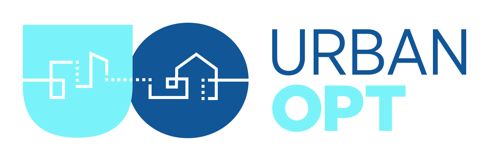
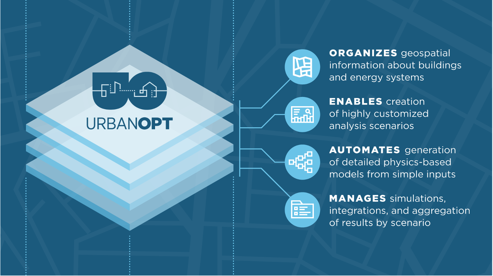
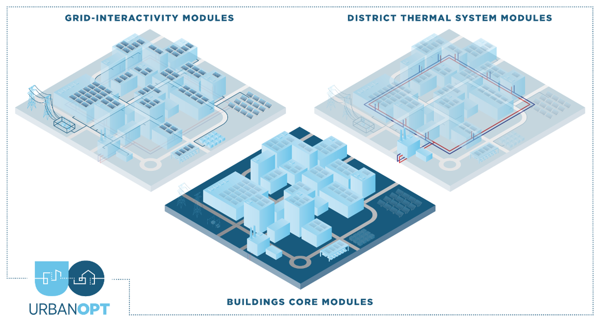
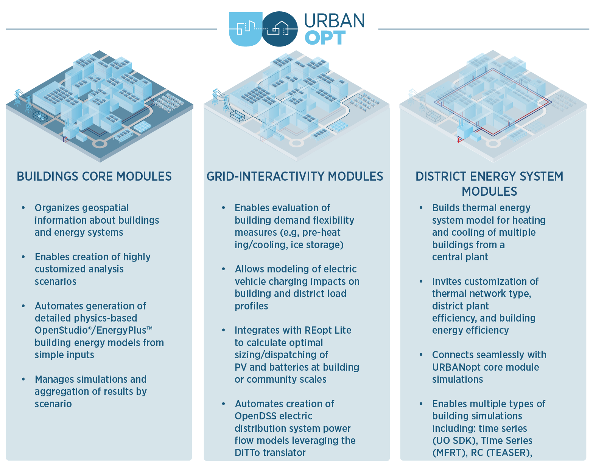

# URBANopt SDK Documentation

URBANopt&trade; (Urban Renewable Building And Neighborhood optimization) is an EnergyPlus&trade;- and OpenStudio&copy;-based simulation platform aimed at district- and campus-scale thermal and electrical analysis for Community and Urban District Energy Modeling.

**_URBANopt is not a standalone program for end users._** URBANopt is a Software Development Kit (SDK) &mdash; a collection of open source modules focused on underlying analytics for a variety of multi-building design and analysis use cases. Commercial software developers can use existing URBANopt modules, customize URBANopt modules, and create new modules to help implement the desired workflows for their end user tools. Other users of the SDK could include researchers looking to create customized workflows to perform specific environmental design tasks.

## Use Cases

The URBANopt project is focused on enabling three primary use cases:

1. Design of low energy campuses and districts through multi-building efficiency scenario analysis
2.  Design and optimization of grid-interactive efficient buildings (GEBs) at a district-scale in conjunction with distributed energy resources (DERs) and electric distribution systems
3. Detailed design of next-generation district thermal systems

A summary of the capabilities associated with each use case is shown below:

<!--  -->

click to expand image

A diagram of the technologies needed to enable each capability is shown below:

## Quicklinks

[Getting Started](./getting_started/getting_started){: .btn .btn-uo .white-text} &mdash; Visit the [Getting Started page](./getting_started/getting_started) for detailed instructions on how to use URBANopt in a variety of workflows. You can also view the [tutorial videos](./resources/tutorials/tutorials) to guide you through various aspects of the URBANopt SDK and its workflows.

[Workflows](./workflows/workflows){: .btn .btn-uo .white-text} &mdash; For more details about the workflows enabled through URBANopt, visit the [Workflows](./workflows/workflows) section.

[Resources](./resources/about){: .btn .btn-uo .white-text} &mdash; Visit the [Resources](./resources/about) section for general information on URBANopt structure and customizations.

[For Developers](./developer_resources/developer_resources){: .btn .btn-uo .white-text} &mdash; Visit the [Developer Resources](developer_resources/developer_resources) section for details on how to develop and test new URBANopt functionality as well as a compatibility matrix for all URBANopt dependencies.

[Questions, Comments, Requests?](https://github.com/orgs/urbanopt/discussions){: .btn .btn-uo .white-text} &mdash; Visit the new [URBANopt Discussions](https://github.com/orgs/urbanopt/discussions) page on GitHub to ask questions or make feature requests.