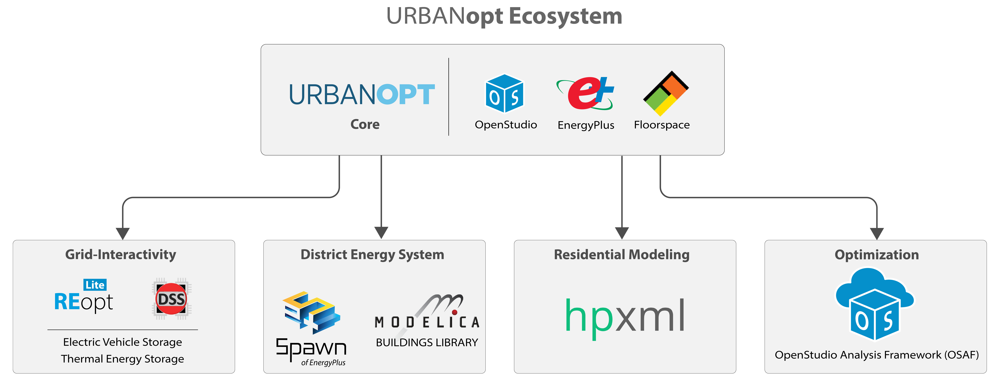

# URBANopt SDK Documentation

URBANopt&trade; is an Open-Source Software Development Kit (SDK) for Community and Urban District Energy Modeling 

## Use Cases

The URBANopt project is focused on enabling three primary use cases:

1. Design of low energy campuses and districts through multi-building efficiency scenario analysis 
2.  Design and optimization of grid-interactive efficient buildings (GEBs) at a district-scale in conjunction with distributed energy resources (DERs) and electric distribution systems
3. Detailed design of next-generation district thermal systems

The URBANopt ecosystem is shown below. 

Current capabilities include:

- Commercial and Residential Building modeling analyses
- Grid-Interactivity analyses (via REopt and OpenDSS)
- District Energy Systems design (via DES)
- Optimization (OSAF)

## Quicklinks

[Getting Started](./getting_started/getting_started){: .btn .btn-uo .white-text} &mdash; Visit the [Getting Started page](./getting_started/getting_started) for detailed instructions on how to use URBANopt in a variety of workflows.  

[Workflows](./workflows/workflows){: .btn .btn-uo .white-text} &mdash; For more details about the workflows enabled through URBANopt, visit the [Workflows](./workflows/workflows) section.

[Resources](./resources/about){: .btn .btn-uo .white-text} &mdash; Visit the [Resources](./resources/about) section for general information on URBANopt structure and customizations.

[For Developers](./developer_resources/developer_resources){: .btn .btn-uo .white-text} &mdash; Visit the [Developer Resources](developer_resources/developer_resources) section for details on how to develop and test new URBANopt functionality as well as a compatibility matrix for all URBANopt dependencies.
