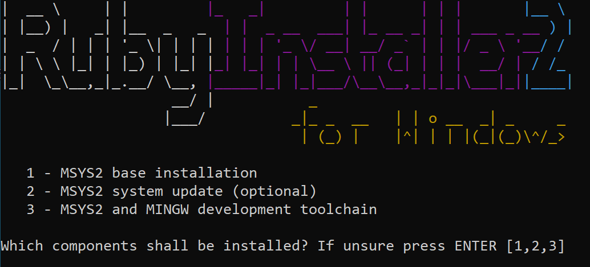

# Windows Installation Instructions

As of version 0.3.1, an URBANopt<sup>&trade;</sup> installer (64-bit Windows 7 – 10) is available to install the URBANopt CLI, Ruby 2.5.x, and OpenStudio SDK at the same time.  If you'd rather install the dependencies manually, view the [manual install](#manual-install) section below.  

For CLI usage examples, see our [usage examples page](../usage/run_project.md)

## Install with the URBANopt installer

1. Download the desired version of the [.exe installer](http://urbanopt-cli-installers.s3-website-us-west-2.amazonaws.com/). 

1. Use the GUI installer and choose a directory to install. Once installed, open a  terminal and run the provided setup script for that shell (below are the setup scripts for each respective shell environment).

**Note: GitBash is recommended**

**GitBash**
```terminal
c:/urbanopt-cli-X.X.X/setup-env.sh  
. ~/.env_uo.sh  
```

**Powershell**
```terminal
c:\urbanopt-cli-X.X.X\setup-env.ps1  
. ~\.env_uo.ps1  
```

**Windows Command Prompt**
```terminal
c:\urbanopt-cli-X.X.X\setup-env.bat  
%HOMEPATH%\.env_uo.bat  
``` 


<span class="label label-red">Important Note</span> Each time you want to work on URBAnopt and you open a new terminal to do so, you will need to run the `env_uo` script to configure your terminal session environment:

**GitBash**
```terminal
. ~/.env_uo.sh  
```

**Powershell**
```terminal
. ~\.env_uo.ps1  
```

**Windows Command Prompt**
```terminal
%HOMEPATH%\.env_uo.bat  
``` 

## Manual Install

1. Install [Ruby 2.5 (x64)](https://github.com/oneclick/rubyinstaller2/releases/download/RubyInstaller-2.5.5-1/rubyinstaller-2.5.5-1-x64.exe)  

	Make sure that you select option 3: **MSYS2 and MINGW development toolchain** during the installation process:
	

1. Include path to Ruby by adding the following to your environment variables path: 

	`C:\Ruby25-x64\bin`
1. Create a new environment variable `HOME` and set the variable value to the following: 

	`C:\Users\<user_name>`

	Detailed instructions for [creating environment variables](https://helpdeskgeek.com/how-to/create-custom-environment-variables-in-windows/) can be found online.
1. Install Bundler version 2.1:

	```terminal
	gem install bundler -v 2.1
	```

1. Install [OpenStudio 3.1.0](https://github.com/NREL/OpenStudio/releases/tag/v3.1.0)  

1. Create file `C:\ruby-2.5.5-1-x64-mingw32\lib\ruby\site_ruby\openstudio.rb` and edit it to contain the path to your installed OpenStudio (where X.X.X is the OpenStudio version installed):

	```ruby
	require 'C:\openstudio-X.X.X\Ruby\openstudio.rb'
	```

1. Verify your OpenStudio and Ruby configuration:

	```terminal
	ruby -e "require 'openstudio'" -e "puts OpenStudio::Model::Model.new"
	```

	Expected output:

	```terminal
	OS:Version,
	 {<long-uuid>},                          !- Handle
	 3.1.0;                                  !- Version Identifier`
	 ```

<!-- 1. Install [Git](https://git-scm.com/) if not already installed. A list of [optional git
   GUIs](https://github.com/NREL/OpenStudio/wiki/Using-OpenStudio-with-Git-and-GitHcub) can
  be found here,
   along with some help using git with OpenStudio. 

1. Configure git to allow long path names in git:

	```terminal
	git config --global core.longpaths true
	``` -->

1. Install the URBANopt Command Line Interface (CLI). This should not take longer than a few minutes. Visit the [known issues](../developer_resources/known_issues.md) page if the installation stalls.

    ```terminal
    gem install urbanopt-cli
    ```

## URBANopt CLI Usage

1. View available CLI commands with:

    ```terminal
    uo --help
    ```

1. For detailed instructions, see the [usage examples](../usage/run_project.md) page.

## OpenDSS and DiTTo Reader Set-up

As of version 0.4.0, the URBANopt CLI includes DiTTo/OpenDSS support.  Since this functionality is implemented in Python, a different set of dependencies must be installed in order to use it.  

If you'd like to use this functionality, follow the [OpenDSS installation](./ditto_reader.md) instructions.  

Note that Windows users may experience some difficulty during the install (particularly with the environment variable setup).  If you are not able to access the opendss command via the CLI, you can always access it manually by following the general [OpenDSS instructions](../opendss/opendss.md#converting-and-running-opendss).
