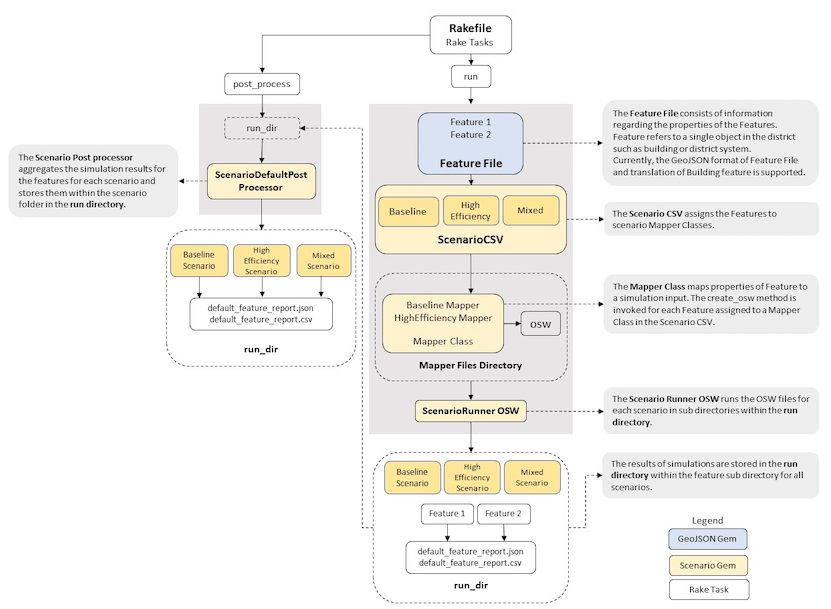

## Structure

URBANopt currently includes 3 main modules: `urbanopt-core-gem`, `urbanopt-scenario-gem`, and `urbanopt-geojson-gem`. [Detailed documentation](#advanced-usage) are available for each module.

The **Core** gem defines a FeatureFile class. The feature file can be in any format (CityGML, GeoJSON, etc.) and describes properties of each `feature`, such as location, floor area, number of stories, building type, cooling source, etc. This Core gem in the SDK architecture allows the development of new modules that are independent of other modules.

The **GeoJSON** gem is an OpenStudio Extension gem that translates a GeoJSON feature file into Openstudio model inputs. The GeoJSON gem reads each feature (currently _**buildings are the only supported feature**_) from the feature file (such as this [example feature file](https://github.com/urbanopt/urbanopt-example-geojson-project/blob/develop/industry_denver.geojson)), converts geospatial coordinates to cartesian coordinates, performs auto-zoning to establish perimeter and core zones as needed, and extrudes geometry from 2D footprints to 3D surfaces. These properties from each feature are translated to *.osm model inputs leveraging methods in the OpenStudio Model Articulation Gem and OpenStudio Standards Gem. _Methods to translate district systems and transformers into model inputs will be added in a future release._

The **Scenario** gem does the heavy lifting in URBANopt.  It takes the `scenario` you want to examine (such as [this example scenario](https://github.com/urbanopt/urbanopt-example-geojson-project/blob/develop/baseline_scenario.csv)), [runs](#rake-tasks) the FeatureFile (translated by the GeoJSON gem) through OpenStudio building energy simulation, and reports results for each feature. These reported results are defined by the [default_feature_report](#Feature-Reports) measure.  A `run` directory gets created in your example project directory with folders for each scenario and each `feature_id` within each scenario. Feature level results will be stored in a `default_feature_report` folder within the run directory for each feature. [Post-processing](#rake-tasks) may then be executed to aggregate all feature reports of a scenario into a scenario level report (e.g. aggregate energy use, aggregated building program information) that is written at the top level of each scenario folder, inside the `run` folder.

