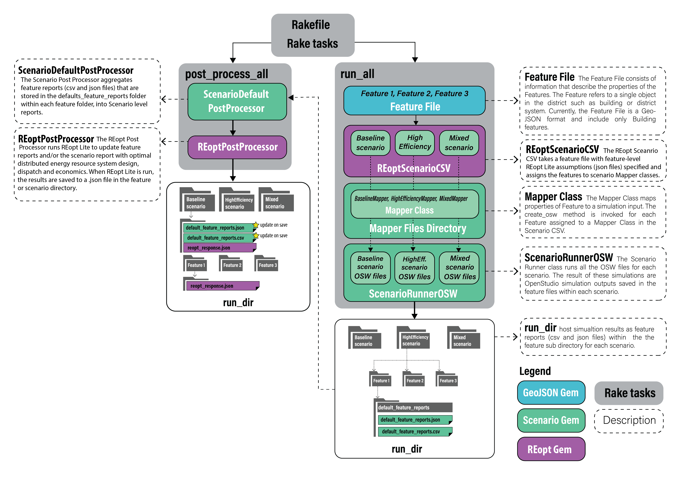

## Intro

Rake tasks are used to run and post-process each scenario a user defines. **REopt Lite** optimization happens during the post-processing of each scenario, and is facilitated using a _**REoptPostProcessor**_ that can be run on a _**FeatureReport**_, a collection of _**Feature Reports**_, or a _**Scenario Report**_ (either on the aggregate load or on each _**FeatureReport**_ load profile before aggregation). **REopt Lite** non-default assumptions (i.e. utility rate, capital costs) are specified in JSON files that are either loaded from input CSV's for _**FeatureReports**,_ by a  _**URBANopt::Scenario::REoptScenarioCSV**_, or specified within the scenario Rake task (as shown below). 

## Workflow

The first code block below creates and runs a `baseline_scenario` parser for OpenStudio results. It also integrates REopt Lite settings for analysis during post processing. The example is set up so that the **REopt Lite** analysis will use assumptions defined in a `reopt/base_assumptions.json` file for a scenario level analysis, as well as for subsequent individual site analyses at the feature level. 

The inputs to this rake task are defined as follows:

- `name` : name of the Scenario
- `run_dir`: the directory to run and save results
- `feature_file_path`: the  path for the `geojson` file (for example: `example_project.json`)
- `csv_file`: `csv` file formatted with a column for each feature's mapper class and column for the name of the REopt assumptions file to use within the _reopt_files_dir_ folder (For an example see `baseline_scenario.csv` which is reproduced in part below). Note the REopt Assumptions column is ordered fourth from the left, and contains just the name of the assumptions file to use. The actual folder in which the assumptions file is saved is defined in the _reopt_files_dir_ parameter (which is required if any assumptions will be used for Scenario or Feature Reports).

  | Feature Id | Feature Name | Mapper Class                       | REopt Assumptions     |
  |------------|--------------|------------------------------------|-----------------------| 
  | 1          | Mixed_use 1  | URBANopt::Scenario::BaselineMapper | base_assumptions.json | 

- `mappers_files_dir`: the file path for the `base_workflow.osw`
- `reopt_files_dir`: the file path for a folder containing .json files for defining non-default **REopt Lite** analysis assumptions. All assumption files must be saved in this folder. Note this folder is optional; if base assumptions are not provided for a feature, then defaults will be used as defined in [https://developer.nrel.gov/docs/energy-optimization/reopt-v1/](https://developer.nrel.gov/docs/energy-optimization/reopt-v1/). If default assumptions are used utility charges will consist of $0.13/kWh without demand charges.
- `scenario_reopt_assumptions_file_name`: the base **REopt Lite** assumption .json file within the _reopt_files_dir_ folder to use if running an optimization for an aggregated scenario.

````ruby
def baseline_scenario
  name = 'Baseline Scenario'
  run_dir = File.join(File.dirname(__FILE__), 'run/baseline_scenario/')
  feature_file_path = File.join(File.dirname(__FILE__), 'example_project.json')
  csv_file = File.join(File.dirname(__FILE__), 'baseline_scenario.csv')
  mapper_files_dir = File.join(File.dirname(__FILE__), 'mappers/')
  reopt_files_dir = File.join(File.dirname(__FILE__), 'reopt/')
  scenario_reopt_assumptions_file_name = 'base_assumptions.json'
  num_header_rows = 1

  feature_file = URBANopt::GeoJSON::GeoFile.from_file(feature_file_path)
  scenario = URBANopt::Scenario::REoptScenarioCSV.new(name, root_dir, run_dir, feature_file, mapper_files_dir, csv_file, num_header_rows, reopt_files_dir, scenario_reopt_assumptions_file_name)
  return scenario
end
````

The tasks described below are in the Rakefile. To list all available tasks in the Rakefile:

```terminal
bundle exec rake -T
```

#### *run_all*

{: .no-toc }

The `run_all` Rake task creates and runs a `ScenarioRunnerOSW` for each Scenario e.g. the
*Baseline*, *HighEfficiency*, and *Mixed* Scenarios, passing the Scenario method as an argument.

- `run_baseline`, `run_high_efficiency` and `run_mixed` rake tasks can be used for running individual Scenarios.

Note, this only runs the initial OpenStudio simulation. It does not run the REopt Lite analysis.

#### *post_process_all*

{: .no-toc }

This task "post-processes" a scenario by aggregating the _**Feature reports**_ into results summarizing the whole scenario, then runs **REopt Lite** post-processing as defined in the post-process function (i.e. `post_process_baseline`). Accordingly, each post-processing rake task creates and runs _**ScenarioDefaultPostProcessor**_ then subsequently a _**REoptPostProcessor**_ for each scenario and saves the results to a file on disk.

When **REopt Lite** is run on a _**ScenarioReport**_ or _**FeatureReport**_ the object's `distributed_generation` attributes (including system financial and sizing attributes) are updated as shown in an example below. 

```
  "distributed_generation": {
        "lcc_us_dollars": 100000000.0,
        "npv_us_dollars": 10000000.0,
        "year_one_energy_cost_us_dollars": 7000000.0,
        "year_one_demand_cost_us_dollars": 3000000.0,
        "year_one_bill_us_dollars": 10000000.0,
        "total_energy_cost_us_dollars": 70000000.0,
        "solar_pv": {
          "size_kw": 30000.0
        },
        "wind": {
          "size_kw": 0.0
        },
        "generator": {
          "size_kw": 0.0
        },
        "storage": {
          "size_kw": 2000.0,
          "size_kwh": 5000.0
        }
      }
```

Moreover, the following optimal dispatch fields are added to its `timeseries CSV`.

|            new column name               |  unit   |
| -----------------------------------------| ------- |
| ElectricityProduced:Total                | kWh     |
| Electricity:Load:Total                   | kWh     |
| Electricity:Grid:ToLoad                  | kWh     |
| Electricity:Grid:ToBattery               | kWh     |
| Electricity:Storage:ToLoad               | kWh     |
| Electricity:Storage:ToGrid               | kWh     |
| Electricity:Storage:StateOfCharge        | kWh     |
| ElectricityProduced:Generator:Total      | kWh     |
| ElectricityProduced:Generator:ToBattery  | kWh     |
| ElectricityProduced:Generator:ToLoad     | kWh     |
| ElectricityProduced:Generator:ToGrid     | kWh     |
| ElectricityProduced:PV:Total             | kWh     |
| ElectricityProduced:PV:ToBattery         | kWh     |
| ElectricityProduced:PV:ToLoad            | kWh     |
| ElectricityProduced:PV:ToGrid            | kWh     |
| ElectricityProduced:Wind:Total           | kWh     |
| ElectricityProduced:Wind:ToBattery       | kWh     |
| ElectricityProduced:Wind:ToLoad          | kWh     |
| ElectricityProduced:Wind:ToGrid          | kWh     |


The following shows how to post-process a ScenarioReport in aggregate. This is suitable for community-scale optimizations. 

````ruby
  puts 'Post Processing Baseline Scenario...'
  default_reopt_post_processor = URBANopt::Scenario::ScenarioDefaultPostProcessor.new(baseline_scenario) 
  scenario_report = default_reopt_post_processor.run

  reopt_post_processor = URBANopt::REopt::REoptPostProcessor.new(scenario_report,baseline_scenario.scenario_reopt_assumptions_file, baseline_scenario.reopt_feature_assumptions, DEVELOPER_NREL_KEY) 
  
  #Run Aggregate Scenario
  scenario_report = reopt_post_processor.run_scenario_report(scenario_report, reopt_post_processor.scenario_reopt_default_assumptions_hash, reopt_post_processor.scenario_reopt_default_output_file, reopt_post_processor.scenario_timeseries_default_output_file)
  scenario_report.save('baseline_scenario_level')
  
````

Alternatively, the following shows how to post-process a Scenario Report in for each of its Feature Reports before aggregating into a summary in the Scenario Report.

````ruby
  puts 'Post Processing Baseline Scenario...'
  default_reopt_post_processor = URBANopt::Scenario::ScenarioDefaultPostProcessor.new(baseline_scenario) 
  scenario_report = default_reopt_post_processor.run

  reopt_post_processor = URBANopt::REopt::REoptPostProcessor.new(scenario_report,baseline_scenario.scenario_reopt_assumptions_file, baseline_scenario.reopt_feature_assumptions, DEVELOPER_NREL_KEY) 
  
  #Run features individually  
  scenario_report = reopt_post_processor.run_scenario_report_features(scenario_report, reopt_post_processor.feature_reports_reopt_default_assumption_hashes, reopt_post_processor.feature_reports_reopt_default_output_files, reopt_post_processor.feature_reports_timeseries_default_output_files)
  scenario_report.save('baseline_feature_level')
````


#### *update_all*

{: .no-toc }

This rake task combines the `run_all` and `post_process_all` tasks.

#### *default*

{: .no-toc }

This runs the `update_all` rake task.

#### *clear_all*

{: .no-toc }

This rake task clears (deletes) the Scenario results from any previous runs.

- `clear_baseline`, `clear_high_efficiency`, `clear_mixed` rake tasks can be used for
  individual Scenarios.

The figure below describes the workflow that takes place on  implementing the *run* and *post_process* rake tasks.




The following figure represents how Simulation Mapper Classes can be assigned to different
Features from the FeatureFile in the Scenario CSV.


