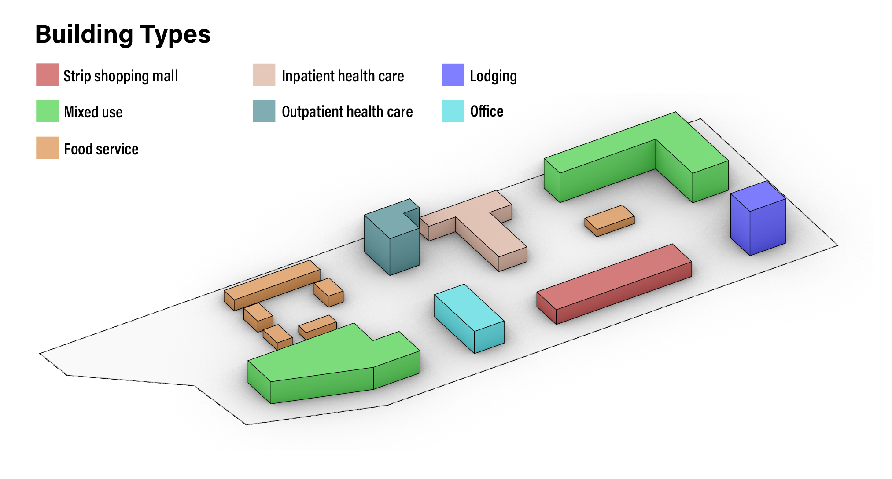

## Before you begin!

To run a project you will need an internet connection so the REopt Gem can access the REopt Lite API.

You'll also need an API key from the [NREL Developer Network](https://developer.nrel.gov/). Copy and paste your key as an environment variable on your computer. Step-by-step instructions for creating env variables are found in the [installation](../installation/installation.md) docs for your operating system.

    DEVELOPER_NREL_KEY = '<insert your NREL developer key here>'

## Example Project    
To run an example project incorporating REopt Lite functionality, use the [URBANopt Command Line Interface](../usage/run_project.md) (CLI).

