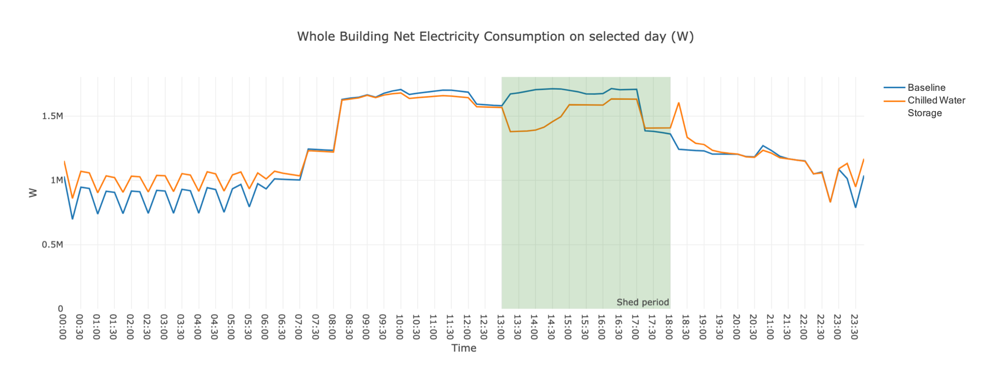

The Chilled Water Storage Scenario adds a chilled water tank to the building for thermal energy storage. By charging the tank at night and discharge it during the day, the load can be shed during the peak hours.
The measure used in this scenario is `add_chilled_waster_storage_tank` from the [Openstudio-GEB-gem](https://github.com/LBNL-ETA/Openstudio-GEB-gem) developed by LBNL. The gem features a series of measures that provide the capabilities to achieve Grid-interactive Efficient Buildings.

## Measure 
### Description

The measure add_chilled_waster_storage_tank adds a chilled water storage tank and links it to an existing chilled water loop. Users can specify the operating season, charge period, discharge period, setpoint temperature and volume of the chilled water tank. 
If the tank volume is not provided, a sizing simulation will be run to autosize the tank.

### Arguments
Arguments that can be specified for this measure are listed below.

- `Tank volume`: Thermal storage chilled water tank volume in m<sup>3</sup>
- `Energy storage objective`: Select from 'Full Storage' and 'Partial Storage'
- `Chilled water loop`: Select a chilled water loop name in the model to connect the tank
- `Setpoint temperature`: Chilled water tank setpoint temperature in degree C
- `Loop design delta T`: Loop design temperature difference in degree C; Use "Use Existing Loop Value" to use the current loop setting
- `Secondary loop design delta T`: Secondary loop design temperature difference in degree C
- `Available season`: Seasonal Availability of Chilled Water Storage in MM/DD-MM/DD format
- `Discharge start time`: Starting Time for Chilled Water Tank Discharge in HR:mm (24 hour format)
- `Discharge end time`: Ending Time for Chilled Water Tank Discharge in HR:mm (24 hour format)
- `Charge start time`: Starting Time for Chilled Water Tank Charge in HR:mm (24 hour format)
- `Charge end time`: Ending Time for Chilled Water Tank Charge in HR:mm (24 hour format)
- `Work on weekends?`: Allow Chilled Water Tank Work on Weekends?  
- If a tank's size is not provided, a sizing run will be performed beforehand to autosize the tank. An output path and a weather file can be specified to be used for sizing run.  

Users can find the default settings of these arguments in the ChilledWaterStorageMapper.


## Using or Modifying the Chilled Water Storage Scenario

To run and post-process the *Chilled Water Storage* scenario simply specify the chilled_water_storage_scenario.csv file when executing at the command line. 

```bash
uo run -s <path to chilled_water_storage_scenario.csv> -f <path to example_project.json>
```

```bash
uo run -r -s <path to chilled_water_storage_scenario.csv> -f <path to example_project.json>
```

The figure below shows the effect of using this scenario on an example large office model. The load for cooling is shifted from the day to the night.


## Using the add_chilled_waster_storage_tank Measure in Your Own Project

To use the add_chilled_waster_storage_tank measure with your own project, ensure that the [Openstudio-GEB-gem](https://github.com/LBNL-ETA/Openstudio-GEB-gem) is added in your project's Gemfile:

```bash
  gem 'openstudio-geb'
```

and then require it within your custom mapper file:

```bash
require 'openstudio/geb'
```

Then within your .osw workflow file, add the measure and set any common argument values. For example:

```bash
{
      "measure_dir_name":"add_chilled_waster_storage_tank",
      "arguments":{
        "__SKIP__": true,
        "objective": "Partial Storage",
        "primary_loop_sp": 6.7,
        "secondary_loop_sp": 6.7,
        "primary_delta_t": "Use Existing Loop Value",
        "discharge_start": "08:00",
        "discharge_end": "21:00",
        "charge_start": "23:00",
        "charge_end": "07:00",
        "run_output_path": "."
        }
    }
```
*If the sizing run is needed, please make sure that all the external files used in the model are specified in absolute paths. Otherwise, the sizing run performed in another folder cannot identify those file paths.*
