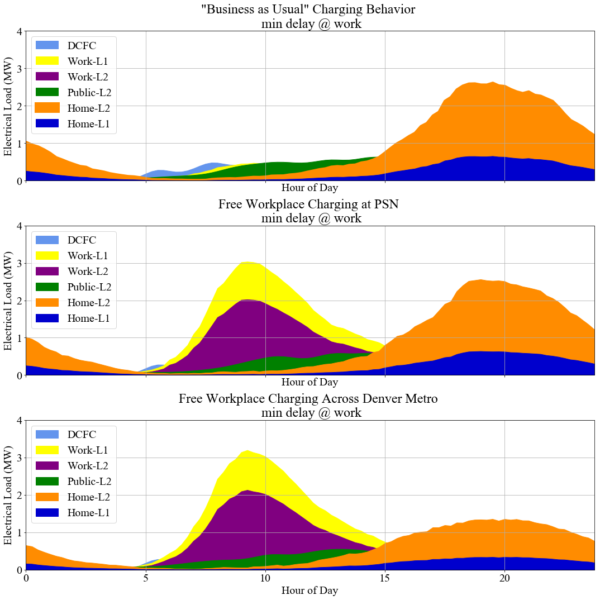
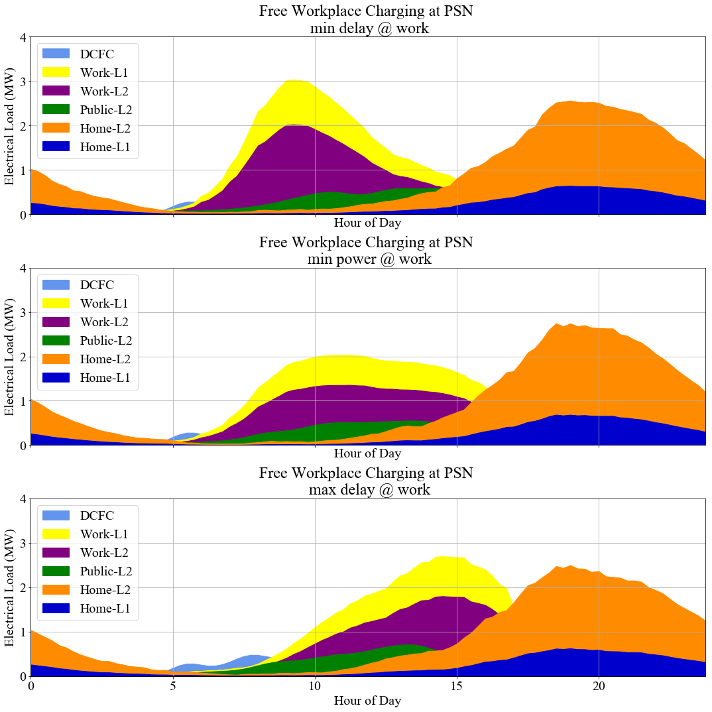
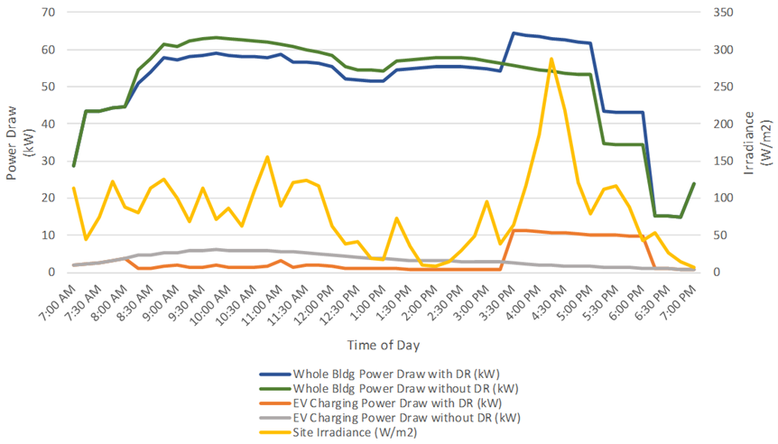

The EV Charging Scenario adds loads due to **Electric Vehicle (EV)** charging associated with Building
Features in the FeatureFile. The EV Charging MapperClass inherits from the High Efficiency
MapperClass and adds EV loads in addition to high efficiency building measures.

The two measures used for this scenario are in the
[openstudio-common-measures](https://github.com/NREL/openstudio-common-measures-gem "GitHub
Repository") gem. The functionality and available user inputs are briefly described below and links
to additional documentation are provided.

## add_ev_load Measure

The measure is based on static profiles of power draw  for a district in Denver to reflect
different potential scenarios for EV charging behavior as described in  *Integrating Electric
Vehicle Charging Infrastructure into Commercial Buildings and Mixed-Use Communities: Design,
Modeling, and Control Optimization Opportunities*  ([Pless et al. 2020](#ref1)).
These profiles were created leveraging output from EVI-Pro Tool generated as part of a study of
projected future EV adoption for the state of California ([Bedir et al. 2018](#ref2)).

The profiles are divided into **residential**, **public** and **workplace** charging stations. The vehicle
population is assumed to be the same as the building occupancy, derived from the occupancy schedules
in OpenStudio Standards used in the model. The magnitude of the load based on the
proportion of vehicles at site that are EVs can be configured as well.

Users can specify their inputs for the following arguments:

### EV charging behavior

*Business as usual* : This represents home dominant charging behavior where the majority of the
electrical energy consumed by EV charging is during evening hours and overnight.

*Free workplace charging at project site* : Indicates that the peak power draw from EV charging on
weekdays occurs during morning hours, due to EV charging at workplaces. Overnight residential
charging remains a significant share of the total electricity use for EV charging.

*Free workplace charging across metro area* : This reduces the Home EV charging relative to the Free
workplace charging at project site scenario, for people who work elsewhere and can charge their
vehicles for free at those workplaces.

The following graphs depict the different charging behavior and flexibility scenarios generated for
the Denver district and used by the measure. They are disaggregated by charging station type,
for home charging (Level 1 and Level 2), workplace and public charging (Level 1 and Level 2), and DC
fast charging ([Pless et al. 2020](#ref1)).






### Delay type

Represents charging demand flexibility scenarios applied to workplace charging. Users can select from the
following scenarios:

*Minimum delay* : EVs begin charging immediately upon arriving at work

*Maximum delay* : EVs are plugged in immediately but do not begin charging until necessary

*Minimum power* : EVs are charged at minimum rate over the parking event.

### Charging station type

Users can select from the following options:

**Typical Home** : Representing Single-Family, Multifamily, Lodging URBANopt<sup>&trade;</sup>
building types.

*Note: The measure does not support the Single-Family Detached building type in the URBANopt [residential workflows](../residential_workflows.md).*

**Typical Work** : Representing URBANopt building types such as Office, Laboratory, Education, Healthcare etc.

**Typical Public** : Representing URBANopt building types such as Retail, Shopping Mall, Food Services etc.

 
### EV percent

Denotes percentage of vehicles between 0 to 100 that are electric on site. The measure currently
does not support adding discrete values of Electric Vehicles directly. The default value is 100.


### EV use model occupancy

When set to true, it uses the occupancy of the OpenStudio model to determine the number of electric vehicles
on site. When false, it resorts to the default behavior of leveraging occupancy from typical
building types from OpenStudio Standards to determine number of electric vehicles on site.

The EV percent argument can be further used to scale the percentage of electric vehicles.

### Assumptions and Limitations

The charging profiles used in the measure are static profiles developed for a district in
Denver for three different charging day types (weekday, Saturday and Sunday) and for three charging
locations (work, public and home). These profiles are a result of averaging the charging
profiles for the work, public and home building types and are therefore generalized profiles for those
building types.
The URBANopt building types are  mapped to these building types within the
URBANopt project. While using the measure for an URBANopt project, it should be noted that the EV
profiles are generalized to represent work, public and home building types and therefore and may not correspond
directly to the schedules used in the URBANopt buildings.


## add_ems_to_control_ev_charging Measure

This measure uses EnergyPlus' EnergyManagementSystem objects to control an electric vehicle charging
load to better align the charging power draw with expected solar PV power production. The measure is
intended for use at a 15-minute simulation timestep. *When used, the measure should be run after applying the `Add EV Load
measure`.* It is structured around the assumption of an office building occupancy schedule, with
occupants requiring vehicles to be charged by 7pm, and therefore is best suited to be applied to the
*Typical Work* charging station type. Load shifting events are characterized by
declining levels of solar radiation, which is used as a proxy for diminishing power output from
on-site solar PV. Load shifting occurs only on weekdays, when commercial buildings would typically
have higher EV charging loads.

Users need to specify the `Curtailment Fraction` argument for the measure. It is a number between 0 and 1 that denotes the fraction by which EV charging
is curtailed during load shifting events. The default value set in the measure is 0.5. The total delivered energy for EV charging over the day remains the same;only the distribution over time is shifted. It is assumed that vehicles charging at a workplace would be parked there for the duration of the day, and thus that a shifting of the charging load would not interfere with the use of the vehicle.

The following graph shows the EV charging profile load shifted on applying the
`add_ems_to_control_ev_charging` measure ([Pless et al. 2020](#ref1)):




*More information about the measures can be found in the **[here](https://www.nrel.gov/docs/fy20osti/77438.pdf)**.*

## Using or Modifying the EV Charging scenario

To run and post-process the EV Charging scenario simply specify the ev_charging_scenario.csv file when executing at the command line.

```
uo run -s <path to ev_charging_scenario.csv> -f <path to example_project.json>
```

After running the EV charging scenario the default post process command can be used to generate Default
Feature and Scenario reports. The results of EV charging are under the
`ExteriorEquipment(Electricity)` output field.

```
uo process -d -s <path to ev_charging_scenario.csv> -f <path to example_project.json>
```

## Using EV Charging in Your Own Project

The following steps are required to use the `add_ev_load` measure in your project:

- To add the EV charging load to a building Feature, set `ev_charging` to true for the feature in
  the FeatureFile.
- Specify additional inputs  such as charging station type, EV percent etc. If
  additional inputs are not specified, default values for the measure arguments will be assumed.

For example:

```
    {
      "type": "Feature",
      "properties": {
        "id": "2",
        "name": "Restaurant 1",
        "type": "Building",
        "building_type": "Food service",
        "floor_area": 22313,
        "footprint_area": 22313,
        "number_of_stories": 1,
        "ev_charging": true,
        "ev_charging_behavior": "Business as Usual",
        "ev_percent": 100,
        "ev_use_model_occupancy": true
        "ev_curtailment_frac": 0.5
      }
```

Within the .osw file, add the measure and set argument values. For example:

```
    {
      "measure_dir_name": "add_ev_load",
      "arguments": {
        "__SKIP__": false,
        "chg_station_type": "Typical Public",
        "delay_type": "Min Delay",
        "charge_behavior": "Business as Usual",
        "ev_percent": 100
      }
    }
```

Within the mapper add any measure arguments that differ from those set in the .osw file. For example:

```ruby
OpenStudio::Extension.set_measure_argument(osw, 'add_ev_load', 'ev_percent', 50)
```

The  steps for adding the `add_ems_to_control_ev_charging` are the same as adding the `add_ev_load`
measure.

*Note: The `add_ev_load` measure must be run before running the
`add_ems_to_control_ev_charging` measure. This can be done by adding the `add_ev_load` measure
before the `add_ems_to_control_ev_charging` measure in the .osw file*

## References

<a name="ref1"></a> Shanti Pless, Amy Allen, Lissa Myers, David Goldwasser, Andrew Meintz, Ben Polly, and Stephen Frank.
"Integrating Electric Vehicle Charging Infrastructure into Commercial Buildings and Mixed-Use
Communities: Design, Modeling, and Control Optimization Opportunities". Presented at 2020 ACEEE
Summer Study on Energy Efficiency in Buildings, August, 2020. Available
[online](https://www.nrel.gov/docs/fy20osti/77438.pdf).

<a name="ref2"></a> Bedir, A. Crisostomo, N., Allen, J., Wood, E., and Rames. C. (2018). California Plug-In Electric Vehicle
Infrastructure Projections: 2017-2025. California Energy Commission. CEC-600-2018-001. Available [online](https://www.nrel.gov/docs/fy18osti/70893.pdf).