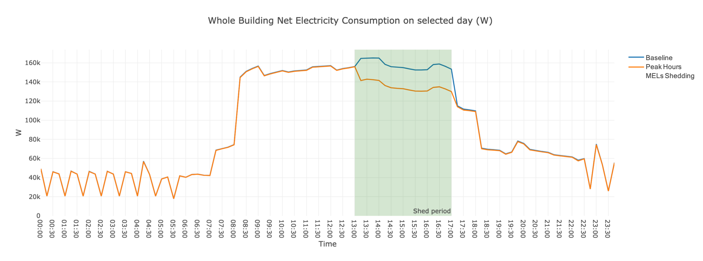

The Peak Hours MELs Shedding Scenario adjusts the electric equipment power density of the building during peak hours.
The measure used in this scenario is `reduce_epd_by_percentage_for_peak_hours` from the [Openstudio-GEB-gem](https://github.com/LBNL-ETA/Openstudio-GEB-gem) developed by LBNL. The gem features a series of measures that provide the capabilities to achieve Grid-interactive Efficient Buildings.
## Measure
### Description
The measure reduce_epd_by_percentage_for_peak_hours reduces electric equipment loads by a user-specified percentage for a user-specified time period (usually the peak hours). The reduction can be applied to at most three periods throughout out the year specified by the user. This is applied throughout the entire building

### Arguments
Arguments that can be specified for this measure are listed below.

- `Percentage Reduction of Electric Equipment Power (%)`: A value between 0 and 100
- `Start Time for the Reduction`: In HH:MM:SS format
- `End Time for the Reduction`: In HH:mm:SS format
- `First start date for the Reduction`: In mm-dd format
- `First end date for the Reduction`: In mm-dd format
- `Second start date for the Reduction` (optional): In mm-dd format; leave blank if not needed
- `Second end date for the Reduction` (optional): In mm-dd format; leave blank if not needed
- `Third start date for the Reduction` (optional): In mm-dd format; leave blank if not needed
- `Third end date for the Reduction` (optional): In mm-dd format; leave blank if not needed  

Users can find the default settings of these arguments in the PeakHoursMelsSheddingMapper.

## Using or Modifying the Peak Hours MELs Shedding Scenario

To run and post-process the *PeakHoursMelsShedding* scenario simply specify the peak_hours_mels_shedding_scenario.csv file when executing at the command line. 

```bash
uo run -s <path to peak_hours_mels_shedding_scenario.csv> -f <path to example_project.json>
```

```bash
uo run -r -s <path to peak_hours_mels_shedding_scenario.csv> -f <path to example_project.json>
```

The figure below shows the effect of using this scenario on an example medium office model. The load during peak hours is shed.


## Using the reduce_epd_by_percentage_for_peak_hours Measure in Your Own Project

To use the reduce_epd_by_percentage_for_peak_hours measure with your own project, you must install the [Openstudio-GEB-gem](https://github.com/LBNL-ETA/Openstudio-GEB-gem):

```bash
gem install openstudio-geb
```

and then require it within your mapper file:

```bash
require 'openstudio/geb'
```

Then within your .osw file, add the measure and set any common argument values. For example:

```bash
{
      "measure_dir_name":"reduce_epd_by_percentage_for_peak_hours",
      "arguments":{
        "__SKIP__": true,
        "epd_reduce_percent": 50,
        "start_time": "17:00:00",
        "end_time": "21:00:00",
        "start_date1": "07-01",
        "end_date1": "08-31"
        }
    }
```