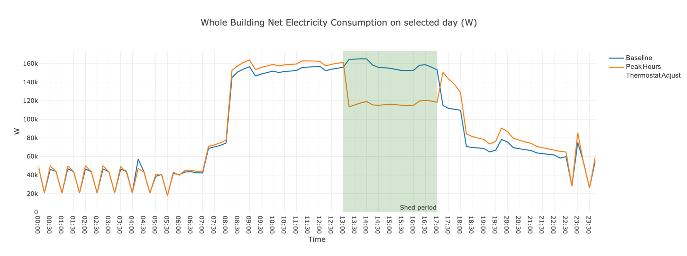

The Peak Hours Thermostat Adjust Scenario adjusts the thermostat setpoints for cooling and heating during peak hours.
The measure used in this scenario is `AdjustThermostatSetpointsByDegreesForPeakHours` from the [Openstudio-GEB-gem](https://github.com/LBNL-ETA/Openstudio-GEB-gem) developed by LBNL. The gem features a series of measures that provide the capabilities to achieve Grid-interactive Efficient Buildings.

## Measure
### Description
The measure AdjustThermostatSetpointsByDegreesForPeakHours adjusts heating and cooling setpoints by a user-specified number of degrees for a user-specified time period. This is applied throughout the entire building.  

### Arguments
Arguments that can be specified for this measure are listed below.

- `Degrees Fahrenheit to Adjust Cooling Setpoint By`
- `Daily Start Time for Cooling Adjustment`: Use 24 hour format HH:MM:SS
- `Daily End Time for Cooling Adjustment:` Use 24 hour format HH:MM:SS
- `Start Date for Cooling Adjustment`: In mm-dd format
- `End Date for Cooling Adjustment`: In mm-dd format
- `Degrees Fahrenheit to Adjust heating Setpoint By`
- `Start Time for Heating Adjustment`: Use 24 hour format HH:MM:SS
- `End Time for Heating Adjustment`: Use 24 hour format HH:MM:SS
- `Start Date for Heating Adjustment Period 1`: In mm-dd format
- `End Date for Heating Adjustment Period 1`: In mm-dd format
- `Start Date for Heating Adjustment Period 2`: In mm-dd format
- `End Date for Heating Adjustment Period 2:` In mm-dd format
- `Alter Design Day Thermostats`: Apply the adjustment to design day?  

Users can find the default settings of these arguments in the PeakHoursThermostatAdjustMapper.


## Using or Modifying the Peak Hours Thermostat Adjust Scenario

To run and post-process the *PeakHoursMelsShedding* scenario simply specify the peak_hours_mels_shedding_scenario.csv file when executing at the command line. 

```bash
uo run -s <path to peak_hours_mels_shedding_scenario.csv> -f <path to example_project.json>
```

```bash
uo run -r -s <path to peak_hours_mels_shedding_scenario.csv> -f <path to example_project.json>
```

The figure below shows the effect of using this scenario on an example medium office model. The load during peak hours is shed.



## Using the add_hpwh Measure in Your Own Project

To use the `AdjustThermostatSetpointsByDegreesForPeakHours` measure with your own project, ensure that the [Openstudio-GEB-gem](https://github.com/LBNL-ETA/Openstudio-GEB-gem) is added in your project's Gemfile:

```bash
  gem 'openstudio-geb'
```

and then require it within your custom mapper file:

```bash
require 'openstudio/geb'
```

Then within your .osw workflow file, add the measure and set any common argument values. For example:

```bash
{
      "measure_dir_name":"AdjustThermostatSetpointsByDegreesForPeakHours",
      "arguments":{
        "__SKIP__": true,
        "cooling_adjustment": 2,
        "cooling_daily_starttime": "16:01:00",
        "cooling_daily_endtime": "20:00:00",
        "cooling_startdate": "06-01",
        "cooling_enddate": "09-30",
        "heating_adjustment": 2,
        "heating_daily_starttime": "16:01:00",
        "heating_daily_endtime": "20:00:00",
        "heating_startdate_1": "01-01",
        "heating_enddate_1": "05-31",
        "heating_startdate_2": "10-01",
        "heating_enddate_2": "12-31"
        }
    }
```

