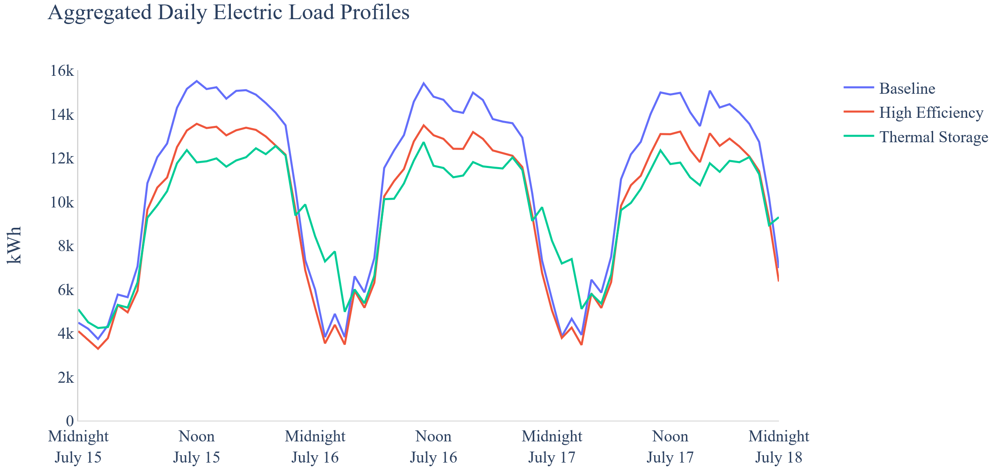
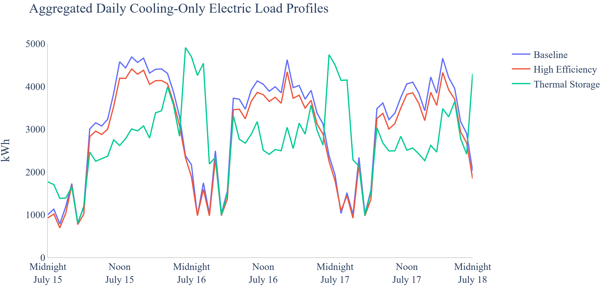
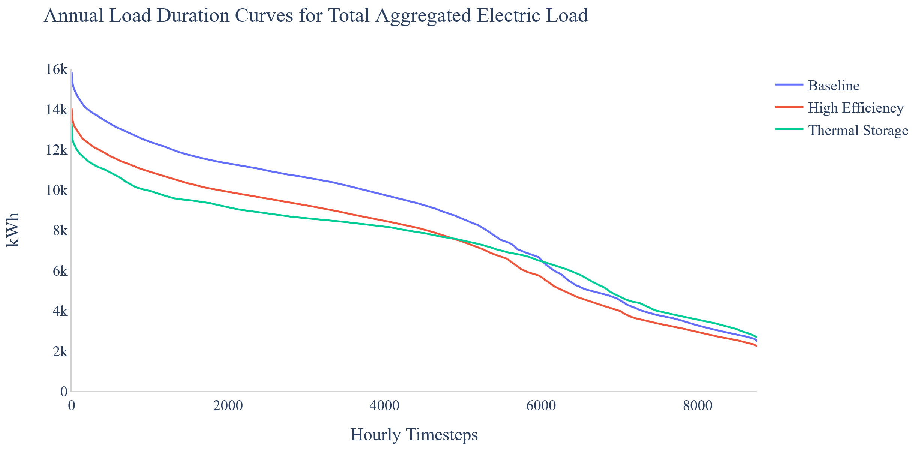

The Thermal Energy Storage (TES) scenario applies ice storage to each Building Feature defined in the FeatureFile using either [packaged](#ptes) or [central](#its) ice storage units, as appropriate for each building type. The TES MapperClass inherits from the High Efficiency MapperClass and provides cooling *load flexibility*, in addition to *energy efficiency*, relative to the Baseline Mapperclass.

[**Packaged**](#ptes) ice storage units are attached to individual packaged air conditioning or rooftop units. Each packaged unit is individually sized and controlled to provide [full storage](#full) from **12:00-18:00 daily**. Charging is performed overnight beginning at 23:00. For this scenario, packaged ice storage units are added to all the cooling coils in each of the following Building Features of the example project:

- All Six Restaurants
- Hotel 1 (excluding packaged terminal AC units)

[**Central**](#its) ice thermal storage tanks are added to large buildings with a central chilled water loop. The chillers are downsized to 80% of the capacities used in the High Efficiency scenario and the ice tanks are sized and controlled to provide [partial storage](#partial) from **08:00-20:00 daily**. A fixed 2&deg;C working fluid temperature difference is maintained across the ice tanks during discharge and all other cooling is met by the chiller(s). Charging is performed overnight beginning at 23:00. For this scenario, central ice storage tanks are added to the plant loops in each of the following Building Features of the example project:

- Mixed Use 1
- Office 1
- Hospital 1
- Hospital 2
- Mixed Use 2
- Mall 1

## Measures

The two thermal storage measures used for this scenario are contained in the [openstudio-load-flexibility-measures](https://github.com/NREL/openstudio-load-flexibility-measures-gem "GitHub Repository") gem. The function and available user inputs are briefly described below and links to additional documentation are provided.

### <a name="ptes"></a> add_packaged_ice_storage Measure


A packaged ice storage device is categorized by the Air-Conditioning, Heating, and Refrigeration Institute as a [unitary thermal storage system](#utss). These systems differ from central ice systems in both size (typically much smaller) and method of ice-production (internal vs. external compressors). Charging is performed by the device's internal ice making equipment and discharging is accomplished through a heat exchanger coil placed into the airstream.

This measure applies to packaged single zone air conditioning systems or packaged variable air volume systems that were originally modeled with *CoilSystem:Cooling:DX* or *AirLoopHVAC:UnitarySystem* container objects. It adds a *Coil:Cooling:DX:SingleSpeed:ThermalStorage* coil object to each user-selected thermal zone and deletes the existing cooling coil; however, original coil performance characteristics are replicated within the new thermal storage object so baseline (TES Off) operation is consistent.

Users inputs are accepted for cooling coil selection, ice storage capacity, system control method, season of PTES availability, and daily operating schedule.

Complete documentation is available [here](https://github.com/NREL/openstudio-load-flexibility-measures-gem/tree/master/lib/measures/add_packaged_ice_storage).

### <a name="its"></a> add_central_ice_storage Measure

This measure applies to buildings with central chilled water plants and allows users to rapidly implement most of the design configurations and control schemes described in the ASHRAE Design Guide for Cool Thermal Storage. Charging is provided by the external chiller and discharging is controlled through temperature setpoints and mixing valves.

User inputs are accepted for control strategy, chiller selection and sizing, ice tank capacity, various loop temperature setpoints and control mechanisms, season of availability, and daily operating schedule.

Complete documentation is available [here](https://github.com/NREL/openstudio-load-flexibility-measures-gem/blob/master/lib/measures/add_central_ice_storage/docs/Ice%20Measure%20Implementation%20Guide.pdf).

## Using or Modifying the TES Scenario

To run and post-process the Thermal Storage scenario simply specify the thermal_storage_scenario.csv file when executing at the command line. The TES scenario may also be used with REopt&trade;.

```
uo run -s <path to thermal_storage_scenario.csv> -f <path to example_project.json>
```

To modify the Thermal Storage scenario in order to explore other load flexibility options, edit the ThermalStorage.rb mapper and base_workflow.osw as necessary.

## Using TES in Your Own Project

To use the TES measures with your own project, you must download the [openstudio-load-flexibilty-measures](https://github.com/NREL/openstudio-load-flexibility-measures-gem "GitHub Repository") gem (also available from [rubygems.org](https://rubygems.org/gems/openstudio-load-flexibility-measures "RubyGems Download")) and then require it within your mapper file:

```ruby
require 'openstudio/load_flexibility_measures'
```

Then specify within the mapper any measure arguments that differ from those set in the .osw file. For example:

```ruby
OpenStudio::Extension.set_measure_argument(osw, 'add_central_ice_storage', 'storage_capacity', 1500)
```

Within your .osw file, add the measure and set any common argument values. For example:

```
  {
  "measure_dir_name": "add_central_ice_storage",
  "arguments": {
  "__SKIP__": true,
  "chiller_resize_factor": 0.8,
  "discharge_start": "08:00",
  "discharge_end": "20:00",
  }
```

Note that the "add_packaged_ice_storage" measure is an EnergyPlus<sup>&trade;</sup> type measure and must be placed after all OpenStudio&reg; type measures and before reporting measures.

## Comparing Scenarios

Below are figures comparing the **Baseline**, **High Efficiency**, and **Thermal Storage** scenarios over three example summer days, illustrating both efficiency gains and load shifting.





On an annual basis, the load duration curves for each scenario show how **High Efficiency** provides a general lowering of the curve; while **Thermal Storage** provides a 'flattening' effect.



## Definitions

<a name="full"></a> **Full Storage**: "A cool thermal energy storage sizing strategy that meets the entire cooling load during a predefined on-peak demand period with discharge from the thermal storage system." *From [ASHRAE Design Guide for Cool Thermal Storage, 2019](https://www.techstreet.com/ashrae/standards/ashrae-design-guide-for-cool-thermal-storage-2nd-ed?product_id=2046532 "ASHRAE Bookstore")*.

<a name="partial"></a> **Partial Storage**: "A cool thermal energy storage sizing strategy in which only a portion of the on-peak cooling load is met from thermal energy storage, with the rest being met by operating the chilling equipment." *From [ASHRAE Design Guide for Cool Thermal Storage, 2019](https://www.techstreet.com/ashrae/standards/ashrae-design-guide-for-cool-thermal-storage-2nd-ed?product_id=2046532 "ASHRAE Bookstore")*.

<a name="utss"></a> **Unitary Thermal Storage System (UTSS)**: "An assembly of components including a Thermal Storage Device and refrigeration equipment for charging which is rated by the manufacturer as a UTSS. The Thermal Storage Device consists of a heat exchanger submerged in a water filled tank. During the Charge Period, an evaporating refrigerant or cold Secondary Coolant is circulated through the heat exchanger causing ice to form on the external surface. During the Discharge (cooling) Period, a condensing refrigerant or warm Secondary Coolant is cooled by internal and/or external melt processes." *From [AHRI Standard 900-2014 (Reaffirmed 2020)](http://www.ahrinet.org/App_Content/ahri/files/STANDARDS/ANSI/ANSI_AHRI_Standard_900_I-P_2014.pdf "AHRI Standard 900")*.

## References

"Chapter 51: Thermal Storage." *ASHRAE Handbook: 2016 HVAC Systems and Equipment*. ASHRAE, Atlanta, 2016. Latest edition available [for purchase](https://www.techstreet.com/ashrae/standards/s50-thermal-storage-si?product_id=2121409 "ASHRAE Bookstore").

Glazer, J. "ASHRAE Design Guide for Cool Thermal Storage." 2nd Edition. ASHRAE RP-1719. Atlanta, GA, January 2019. Available [for purchase](https://www.techstreet.com/ashrae/standards/ashrae-design-guide-for-cool-thermal-storage-2nd-ed?product_id=2046532 "ASHRAE Bookstore").

Heine, K., P. C. Tabares-Velasco, M. Deru, and B. Polly. "Quantifying the Value of Unitary Thermal Storage Systems (UTSS) - A Modelling Study." *Proceedings of Building Simulation 2019: 16th Conference of IBPSA*. Rome, Italy, September 2020. pp. 1684-1691. Available [online](http://www.ibpsa.org/proceedings/BS2019/BS2019_210505.pdf "Download Conference Paper (.pdf)").

Heine, K., P. C. Tabares-Velasco, R. Meyer, and M. Deru. "Modeling the Load Flexibility Potentials for Ice Energy Storage," presented at Building Performance Analysis Conference and SimBuild 2020, Chicago, IL, September, 2020. (Accepted)

Kung, F., M. Deru, and E. Bonnema. "Evaluation Framework and Analyses for Thermal Energy Storage Integrated with Packaged Cooling Equipment." Technical Report NREL/TP-550-60415. October 2013. Available [online](https://www.nrel.gov/docs/fy14osti/60415.pdf "Download Report (.pdf)").
