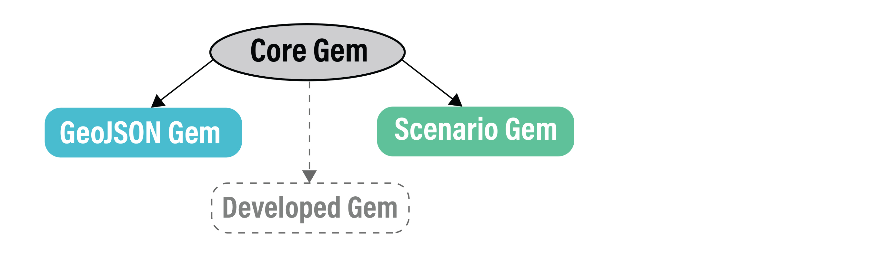

The URBANopt&trade; SDK consists of 3 main modules at its core: `urbanopt-core-gem`, `urbanopt-scenario-gem`, and `urbanopt-geojson-gem`.

The **Core** gem defines a FeatureFile class. The feature file format currently supported is GeoJSON, other formats can be supported in the future as more workflows are integrated in the SDK. The FeatureFile describes properties of each `Feature`, such as location, floor area, number of stories, building type, cooling source, etc. This Core gem in the SDK architecture allows the development of new modules that are independent of other modules.

The **GeoJSON** gem is an OpenStudio Extension gem that translates a GeoJSON feature file into OpenStudio model inputs. The GeoJSON gem reads each feature from the FeatureFile (such as this [example FeatureFile](https://github.com/urbanopt/urbanopt-example-geojson-project/blob/develop/example_project/example_project.json)), converts geospatial coordinates to cartesian coordinates and extrudes geometry from 2D footprints to 3D surfaces. These properties from each Feature are translated to OpenStudio model (OSM file) inputs leveraging methods in the OpenStudio Model Articulation Gem and OpenStudio Standards Gem. _Methods to translate district systems and transformers into model inputs will be addressed in future releases._

The **Scenario** gem takes the `Scenario` you want to examine (such as [this example Scenario](https://github.com/urbanopt/urbanopt-example-geojson-project/blob/develop/example_project/baseline_scenario.csv) and runs the FeatureFile (translated by the GeoJSON gem) through OpenStudio building energy simulation. A `run` directory is created in your example project directory with folders for each Scenario and each `feature_id` within each Scenario.

The **Reporting** gem includes output-writing measures for the OpenStudio simulations. These reported results are defined by the [default_feature_report](customization/feature_reports.md) Measure. Feature level results are stored in a `default_feature_report` folder within the run directory for each Feature. Post-Processing may be executed to aggregate all Feature reports of a Scenario into a Scenario level report (e.g. aggregated energy use, aggregated building program information) that is written at the top level of each Scenario folder, inside the `run` folder.

New developed modules can use the FeatureFile in the Core Gem to test their functionality. All developed modules are accessed via the Command Line Interface (`urbanopt-cli`). The **Command Line Interface** can then be used to connect the gems together and run/test projects.

Visit the [Getting Started](../getting_started/getting_started) page for more details on how to run an URBANopt project.

## Workflow Details

The figure below describes the workflow that takes place for the *run* and *post_process* calls.

