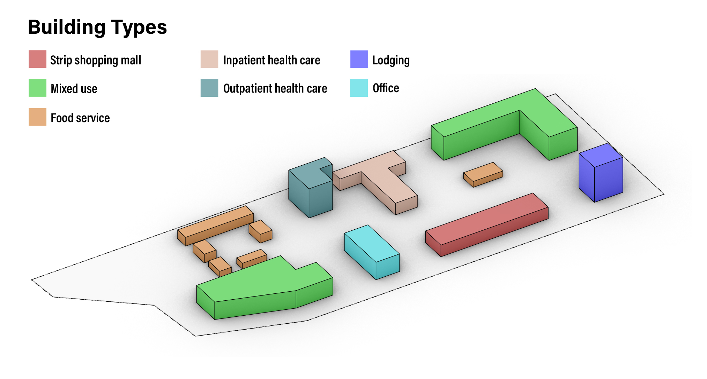

You have access to a ***<u>hypothetical</u>*** URBANopt example project that was created to demonstrate various capabilities of the URBANopt SDK in version 0.1.0 (e.g. modeling of various building types and heights in one district). An actual location for the <u>hypothetical</u> project was needed to demonstrate geospatial aspects of the URBANopt SDK.

The <u>hypothetical</u> example project’s location is within the boundary of an actual district project that is a participant in the U.S. Department of Energy Zero Energy District Accelerator. See “Western New York Manufacturing Zero Energy District” in [this NREL paper](https://www.nrel.gov/docs/fy18osti/71841.pdf) for a description of the actual project. The design in the <u>hypothetical</u> URBANopt example project has no relation to the designs and site requirements of the actual development project.

The <u>hypothetical</u> example project design and building typologies are shown in the figure below.

