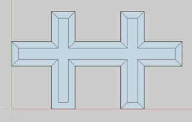
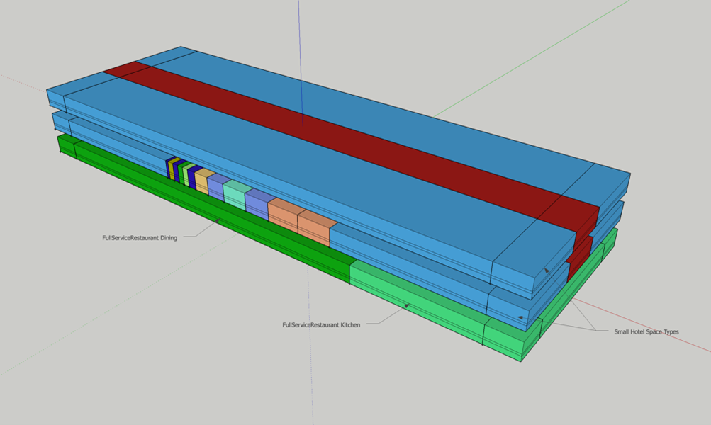

The URBANopt&trade; project offers different options for creating building geometry to suit various
modeling requirements. This section gives an overview of these workflows.

**Default workflow**

The default workflow in the URBANopt example project uses the `urban-geometry-creation-zoning`
measure in the [GeoJSON gem](https://urbanopt.github.io/urbanopt-geojson-gem/) to create building
features with core and perimeter zoning from GeoJSON footprint coordinates in the Feature File. It has the options to model surrounding buildings as context shading.

More details on the measures used in the
workflow can be found in the [base workflow section](../customization/base_workflow.md).

**Createbar workflow**

This workflow uses the
[create_bar_from_building_type_ratios](https://github.com/NREL/openstudio-model-articulation-gem/tree/develop/lib/measures/create_bar_from_building_type_ratios)
measure from the openstudio-model-articulation-gem that attempts to create geometry from high level
building inputs such as number of stories, floor area, and aspect ratio. It can support a mix of up to four different building types. The space type ratios for each building type are taken from the DOE
prototype models.

The measure has an argument for adding a perimeter multiplier that can be used for accurately representing
the exposure conditions for non-rectangular buildings by creating two perpendicular bars.

It can also specify the custom height of a space by setting the `Enable
Custom Height Bar Application argument` to true. This can be used for modeling space types with heights that differ from the rest of the building. For example, modeling a gym or auditorium for a
SecondarySchool building type. This is accomplished by pulling space types with a custom height into a separate rectangular building that sits away from the main structure.

The measure can model circulation space types, when they exist by enabling the `Double Loaded Corridor`
argument. The double loaded corridor leads to space division and thermal zoning instead of typical
sliced core and perimeter zoning. It creates a circulation space type running down the center of the
bar, surrounded by spaces of another space type. For an example, for a primary school the corridor will be paired with the classrooms.

This workflow does not take the actual building footprint into account and does not consider
the impact of self and context shading.

**FloorspaceJS workflow** 

This workflow starts with floor plans and stub space types drawn using FloorSpaceJS. The
FloorspaceJS file is converted to an OpenStudio model by a measure that merges it with a seed model,
which is then passed into the `Create Typical Building from Model` measure. The seed model contains
the actual space type assignments that correspond to the stub space type names in the FloorSpaceJS
file and can be taken from the standard space type templates. One of the web tools to create FloorSpaceJS files can be found [here](https://nrel.github.io/floorspace.js/)

The FloorSpaceJS file and the OpenStudio seed model must have the same name, for example
`feature.js` and `feature.osm` and must be placed in
the osm_building directory within the project directory. The FloorSpaceJS file name must also be added to the
`detailed_model_filename` property for that feature in the feature file.

*For all these workflows, an existing OpenStudio model of a building feature can be used, if desired, by
specifying the name of the model in the `detailed_model_filename` property of the particular feature in the Feature File and adding the OpenStudio model in the osm_building directory within the project directory.*