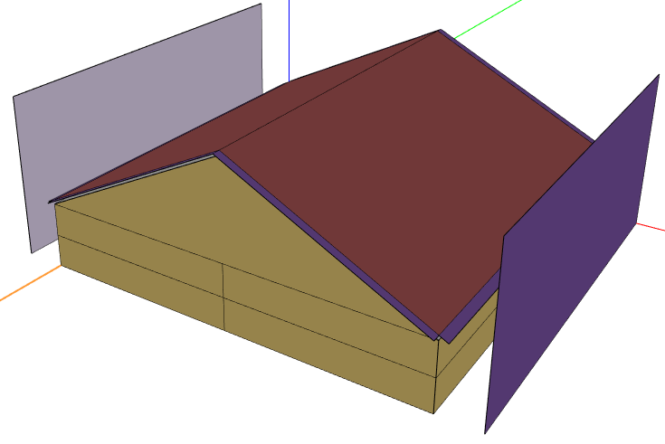
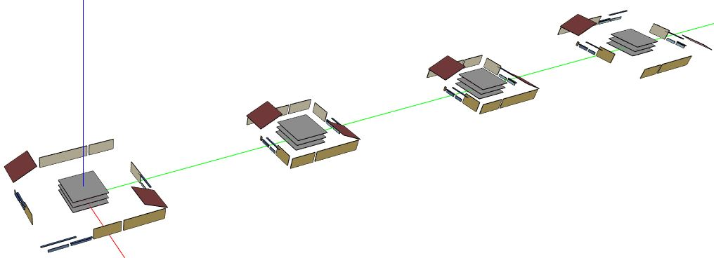

## Single-Family Attached 

For single-family attached buildings, high-level inputs from the geojson are used to construct a simplified building model.
This building model is used to determine the orientation (i.e., vertical level and horizontal location) of individual living units contained in the building.
An example 3D rendering of this building model is shown below for the following high-level inputs:

* 2 stories above ground
* slab foundation
* vented attic
* 2 living units
* no rear units
* left/right neighbors at 10 ft



Then, for each unit of the building, an HPXML and OSM model is constructed.
By determining the orientation of individual units relative the whole building, types and boundary conditions of surfaces (e.g., adiabatic, etc.) can be stored in the HPXML.
These OSM models are merged into a single OSM model, as shown below.




### Modeling Notes

- *Single-Family Attached* home models may be heated only, air conditioned only, or both heated and cooled. 
  - Partial Conditioning: heating and cooling may be applied to just a portion of the living space of the home or to the entire living space. Representation of partial conditioning of the living space of a home is accomplished by adding ideal air load system to heat and cool the un-conditioned portion of the living area. In this situation, district heating or cooling loads may show up in end uses for the home.
  - Undersized Mechanical System: District heating or cooling loads may also show up in end uses when a designed mechanical system cannot meet the load required to maintain thermostat temperatures. An example would be an evaporative cooling system in a hot humid climate. 
  - For both the partially conditioned and undersized examples, it is possible for reporting or post processing to filter out these unintended district heating and cooling loads.
- It is important to know, that unlike the commercial models that will result in unmet heating or cooling hours, the residential models will not have any unmet heating or cooling hours. To understand how the HVAC system is conditioning for *Single-Family Attached* home models, users should look at district heating and cooling loads.


### GeoJSON Schema

The URBANopt geojson schema differentiates between sets of required and optional fields for *Single-Family Attached* residential buildings:

* Required fields:

  1. floor_area (i.e., building total conditioned floor area)
  2. number_of_stories_above_ground
  3. number_of_stories (includes foundation stories)
  4. number_of_residential_units
  5. number_of_bedrooms
  6. foundation_type: `slab`, `crawlspace - vented`, `crawlspace - unvented`, `basement - unconditioned`, `basement - conditioned`
  7. attic_type: `attic - vented`, `attic - unvented`, `attic - conditioned`, `flat roof`

* Optional fields:

  1. system_type: combinations of `electric resistance`, `furnace`, `boiler`, `central air conditioner`, `room air conditioner`, `evaporative cooler`, `air-to-air heat pump`, `mini-split heat pump`, `ground-to-air heat pump`
  2. heating_system_fuel_type: `electricity`, `natural gas`, `fuel oil`, `propane`, `wood`
  3. template (see below)

An example "Single-Family Attached" building feature snippet is shown below.

  ```
  {
      "id": "17",
      "name": "Residential 4",
      "type": "Building",
      "building_type": "Single-Family Attached",
      "floor_area": 18320,
      "footprint_area": 9160,
      "number_of_stories_above_ground": 2,
      "number_of_stories": 2,
      "number_of_bedrooms": 6,
      "foundation_type": "slab",
      "attic_type": "attic - vented",
      "system_type": "Residential - furnace and room air conditioner",
      "heating_system_fuel_type": "natural gas",
      "number_of_residential_units": 2,
      "template": "Residential IECC 2015 - Customizable Template Sep 2020"
    }
  ```
