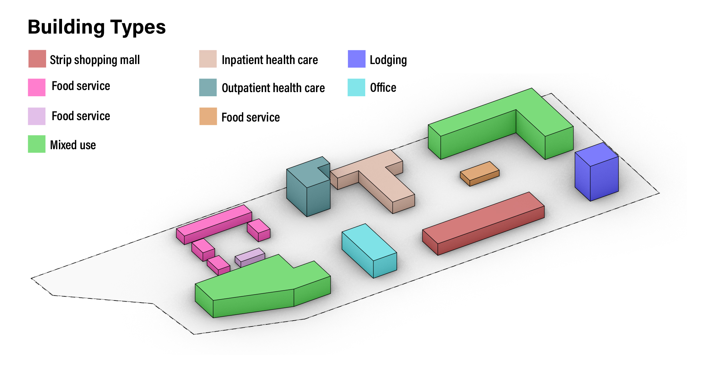

You have access to a ***<u>hypothetical</u>*** URBANopt example project that was created
to demonstrate various capabilities of the URBANopt SDK in version 0.1.0 (e.g. modeling
of various building types and heights in one district). An actual location for the
<u>hypothetical</u> project was needed to demonstrate geospatial aspects of the URBANopt SDK.
The <u>hypothetical</u> example project’s location is within the boundary of an actual
district project that is a participant in the U.S. Department of Energy Zero Energy
District Accelerator. See “Western New York Manufacturing Zero Energy District” in [this
NREL paper](https://www.nrel.gov/docs/fy18osti/71841.pdf) for a description of the actual
project. The design in the <u>hypothetical</u> URBANopt example project has no relation
to the designs and site requirements of the actual development project.

The <u>hypothetical</u> example project design and building typologies are shown in the figure below.

To run URBANopt and try out the example project, install the [URBANopt Command Line Interface](../installation/installation.md) using:

```terminal
gem install uo_cli
```

Once the CLI is install, help is available by typing `uo -h` from the command line.

1. Create a project folder in your current directory using:

    ```terminal
    uo -p <FOLDERNAME>
    ```

1. Put your [FeatureFile](../overview/definitions.md) in the root of the folder you just created, or use the provided example.
1. Create [ScenarioFiles](../overview/definitions.md) based off the example _mappers_ using:

    ```terminal
    uo -m -f <FEATUREFILE>
    ```

    You may write your own mapper file for your own specific use case as needed

1. Simulate energy usage of each feature in your FeatureFile by using:

    ```terminal
    uo -r -f <FEATUREFILE> -s <SCENARIOFILE>
    ```

1. Aggregate simulated features into a [Scenario](../overview/definitions.md) by using:

    ```terminal
    uo -a -f <FEATUREFILE> -s <SCENARIOFILE
    ```

1. Delete an outdated [Scenario](../overview/definitions.md) by using:

    ```terminal
    uo -d -s <SCENARIOFILE>
    ```


