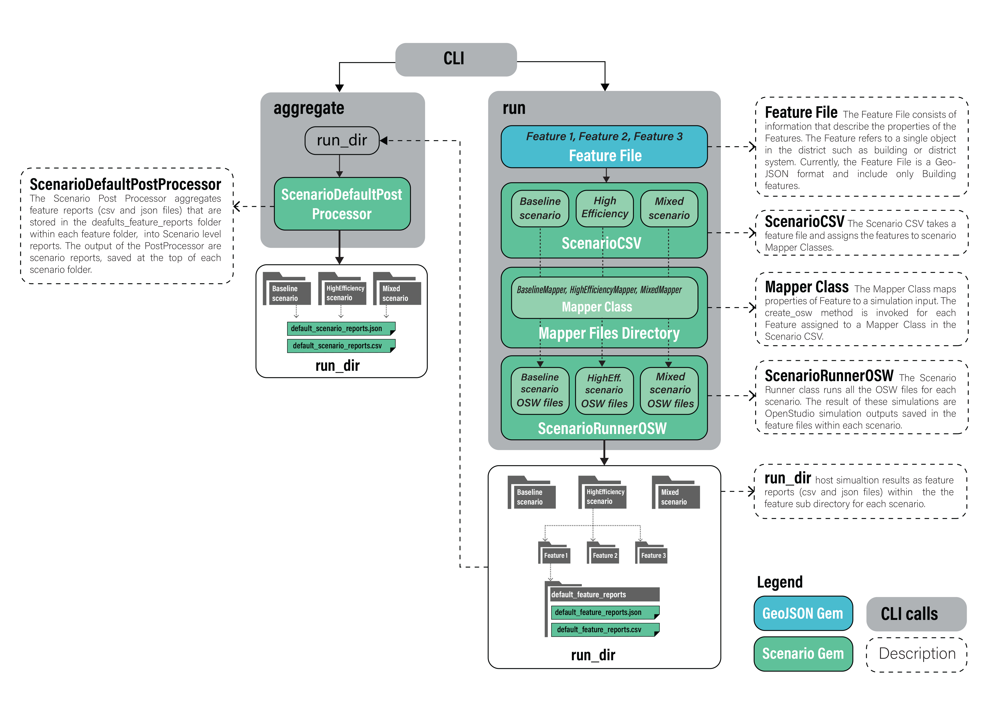
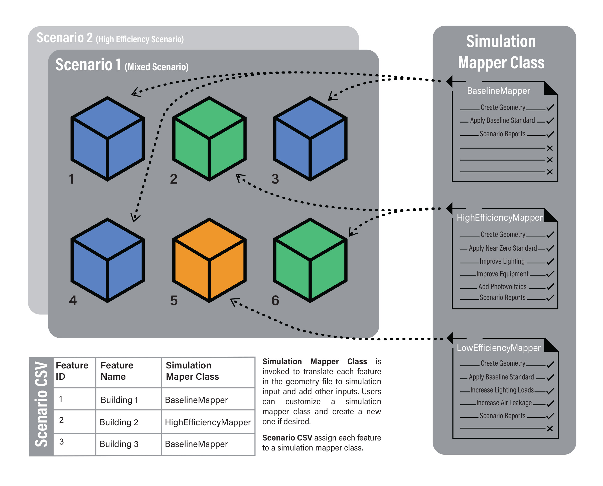

To run URBANopt<sup>&trade;</sup>, first follow the [installation](../installation/installation.md) instructions.

Once the CLI is installed, help is available by typing `uo --help` from the command line. Detailed help for each command can be found with `uo <command> --help`.  There are 5 main commands of the CLI: create, run, process, visualize, opendss, and delete.

## Important Notes

- Keep the project directory path short to avoid an error due to long
paths, especially while running on Windows. For more information on this error, refer to [known issues](../developer_resources/known_issues.md).

- We recommend calling all URBANopt commands from _outside_ the project folder you created, using relative or absolute paths to the relevant files.

## URBANopt CLI Usage Examples

### 1. Create Project

Create a project folder in your current directory using:

```terminal
uo create --project-folder <path/to/PROJECT_DIRECTORY_NAME>
```

This creates a project folder containing the [example project](example.md) using the
default geometry workflow with `urban-geometry-creation-zoning` measure, and downloads
related weather files and detailed models to the appropriate directories.

Users can add a subcommand to use an alternate geometry creation workflow. The following
alternate geometry methods can be used:

* **Createbar**

    This uses the `create_bar_from_building_type_ratio` measure to create building geometry.
    ```terminal
    uo create --project-folder --createbar <path/to/PROJECT_DIRECTORY_NAME>
    ```

* **Floorspace**

    This creates building geometry from floor plans with stub space types drawn using
    `FloorSpaceJS`.

    ```terminal
    uo create --project-folder --floorspace <path/to/PROJECT_DIRECTORY_NAME>
    ```
    For more details on these geometry workflows, refer to [geometry_workflows](geometry_workflows.md).

* **Residential Buildings**

    As of version 0.4.0, URBANopt support a workflow that combines commercial building types and residential building types (*Single-family Detached* only for now, *Single-family Attached* and *Multifamily* will be included in a future release).  To create a project that contains all files required to run this combined workflow, add the ```--combined``` option to the create command:

    ```terminal
    uo create --combined --project-folder <path/to/PROJECT_DIRECTORY_NAME>
    ```

    For more information on residential building support, visit the [residential buildings](../usage/residential_workflows.html) page.

* **Empty Project**

    Create an empty base project folder by using:

    ```terminal
    uo create --empty --project-folder <path/to/PROJECT_DIRECTORY_NAME>
    ```

    This creates project folder without an example FeatureFile and an empty weather folder. You can
    download weather files and add to this folder from energyplus.net/weather.

* **Overwrite Existing Project**

    By default, the CLI will abort if the project directory being created already exists. To overwrite an existing folder, use the ```--overwrite``` option:

    ```terminal
    uo create --overwrite --project-folder <path/to/PROJECT_DIRECTORY_NAME>
    ```

    This deletes anything in the named folder and creates a fresh project directory. Can be combined
    with `-e` to overwrite a directory with a new empty URBANopt project directory.

### 2. Create Scenario CSV File

1. First put your [FeatureFile](../overview/definitions.md) in the root of the project directory you just created, or use the provided example feature file: ```example_project.json```.


1. Create a [ScenarioFile](../overview/definitions.md) for each _mapper_ contained in the project directory by running the following command:


    ```terminal
    uo create --scenario-file <path/to/FEATUREFILE.json>
    ```

    The resulting CSV files will contain a mapper for each feature in the FeatureFile to the particular scenario mapper.

    **Single Feature**

    To create a ScenarioFile for a single [Feature](../overview/definitions.md), specify the Feature_ID in the arguments as shown here:

    ```terminal
    uo create --scenario-file <path/to/FEATUREFILE.json> --single-feature <FEATURE_ID>
    ```

    **REopt Functionality**

    If you wish to include REopt Lite post-processing, you will need to create a scenario CSV file with additional information with the following command:

    ```terminal
    uo create --reopt-scenario-file <path/to/EXISTING_SCENARIO_FILE.csv>
    ```

    This command will create a new scenario CSV (named REopt_scenario.csv by default) that has an extra column to map assumption files to features. Use this scenario CSV file going forward in future steps.

    **Customizations**

    In addition to the CLI methods, you can write your own mapper file for your own specific use case as needed, as well as make your own ScenarioFile by copying the structure of an example file.  You may also make edits to the ScenarioFiles to mix and match mappers.

### 3. Run project

1. Simulate energy usage of each feature or for a single Feature by specifying the appropriate ScenarioFile with the following command:

    ```terminal
    uo run --feature <path/to/FEATUREFILE.json> --scenario <path/to/SCENARIOFILE.csv>
    ```

    **REopt Functionality**

     To simulate energy usage for a scenario that will require additional **REopt Lite** post-processing, run this command instead:

    ```terminal
    uo run --reopt --feature <path/to/FEATUREFILE.json> --scenario <path/to/SCENARIOFILE.csv>
    ```

    Note that there is a *runner.conf* file automatically created in the project folder.  This file can be used to configure the number of features to process in parallel as well as a few other parameters.  Make edits to this file prior to running the above command.

### 4. Post-process project

1. To post-process the simulated features into a [Scenario](../overview/definitions.md) report, call the CLI process command using `default` as the `type`:

    ```terminal
    uo process --<TYPE> --feature <path/to/FEATUREFILE.json> --scenario <path/to/SCENARIOFILE.csv>
    ```

    Valid types are: `default`, `opendss`, `reopt-scenario`, `reopt-feature`

    **REopt Functionality**

    If you intend to post-process with **REopt Lite** (i.e. using `reopt-scenario`, `reopt-feature`), please now refer to the instructions outlined in [REopt Post-Processing](../reopt/reopt_post_processing.md). Otherwise, post-process simulated features into a [Scenario](../overview/definitions.md) report by using `default` as the `type`:

    ```terminal
    uo process --<TYPE> --feature <path/to/FEATUREFILE.json> --scenario <path/to/SCENARIOFILE.csv>
    ```

    **OpenDSS Functionality**

    If you intend to post-process **OpenDSS** results, use `opendss` as the type:

    ```terminal
    uo process --<TYPE> --feature <path/to/FEATUREFILE.json> --scenario <path/to/SCENARIOFILE.csv>
    ```

    For more information on the OpenDSS workflow, visit the [OpenDSS](../opendss/opendss.md) page.

    **SQL output**

    Post-processing also generates a database file of aggregate energy use (all buildings included) at each hour for the named scenario.

    The database file is called *default_scenario_report.db* and be found in the scenario directory.
    The relevant table is named *ReportData*:

    |TimeIndex|Year|Month|Day|Hour|Minute|Dst|ReportDataDictionaryIndex   |Value         |
    |:-------:|:--:|:---:|:-:|:--:|:----:|:-:|:--------------------------:|:------------:|
    | Integer |Var |Var  |Var|Var |Var   |Var| Integer                    | Integer      |
    |         |    |     |   |    |      |   |10 = Electricity  1382 = Gas| Amount (J)   |


### 5. Visualize project

Once a project has been post-processed, the results can be visualize either at the scenario level, or for each individual feature of a scenario.

-  To visualize and compare the post-processing results for **all scenarios**, run the following command:

    ```terminal
    uo visualize --scenario <path/to/FEATUREFILE.json>
    ```
    The resulting visualizations can be viewed in the `scenario_comparison.html` file in the run folder.

- To visualize and compare the post-processing results for **all features** in a particular scenario:

    ```terminal
    uo visualize --feature <path/to/SCENARIOFILE.csv>
    ```
    The resulting visualizations can be viewed in the `feature_comparison.html` file in the scenario folder.

    *Note: You need to run the `default` post-process command before visualizing the results.*

1. Delete an outdated [Scenario](../overview/definitions.md):

    ```terminal
    uo delete --scenario <path/to/SCENARIOFILE.csv>
    ```

### Run District Energy System (DES) simulations

Once a project has been run with the URBANopt SDK (following the above documentation), you may run a district thermal simulation using the output from the SDK. In version 0.5.2 only time series simulations of 4th generation district heating & cooling systems are available. Additional district energy system simulation capabilities will be added in the future.

1. Build a system parameters JSON config file from your existing simulations:

    ```terminal
    uo des_params --sys-param-file path/and/name/of/new/sys_params.json --scenario path/to/baseline_scenario.csv --feature path/to/example_project.json --model-type time_series
    ```

1. Create a Modelica model directory and give it a name:

    ```terminal
    uo des_create --sys-param path/to/sys_params.json --feature path/to/example_project.json --des-name path/and/name/of/new/modelica_dir --model-type time_series
    ```

1. Run the Modelica simulation:

    ```terminal
    uo des_run --model path/to/modelica_dir
    ```

## Workflow Details

The figure below describes the workflow that takes place for the *run* and *post_process* calls.




The following figure represents how Simulation Mapper Classes can be assigned to different Features from the FeatureFile in the Scenario CSV.


