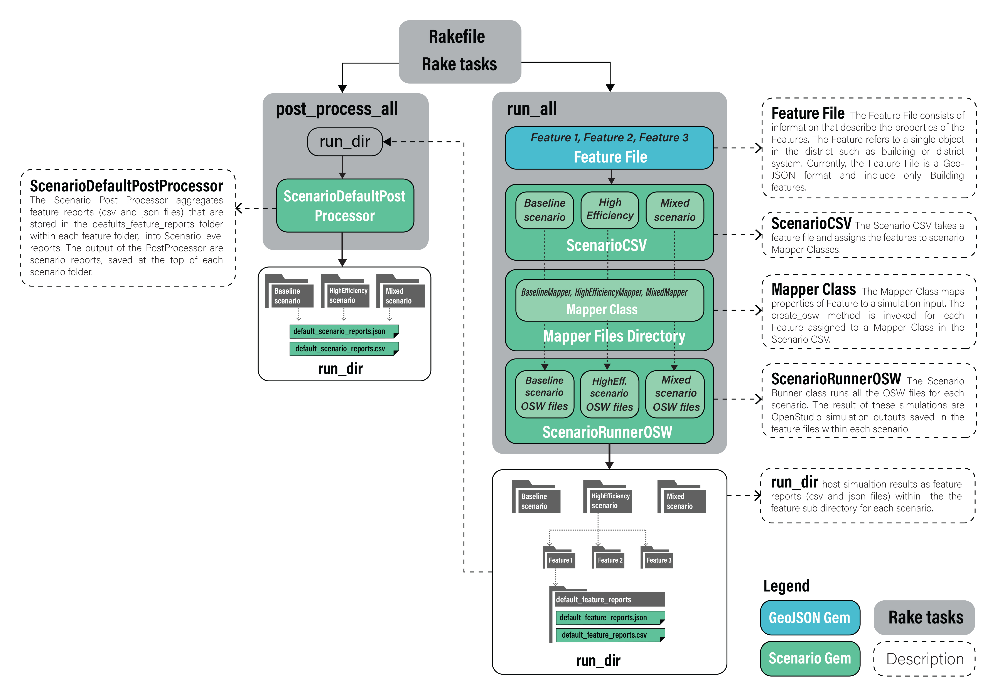

To run URBANopt, first [install](../installation/installation.md) the project dependencies and the URBANopt Command Line Interface.

Once the CLI is installed, help is available by typing `uo -h` from the command line.

1. Create a project folder in your current directory using:

    ```bash
    uo -p <FOLDERNAME>
    ```

1. Put your [FeatureFile](../overview/definitions.md) in the root of the folder you just created, or use the provided example.
1. Create [ScenarioFiles](../overview/definitions.md) based off the example _mappers_ using:

    ```bash
    uo -m -f <FEATUREFILE>
    ```

    You may write your own mapper file for your own specific use case as needed, as well as make your own ScenarioFile by hand.  You may also make edits to the ScenarioFiles to mix and match mappers.

1. Simulate energy usage of each feature in your FeatureFile by using:

    ```bash
    uo -r -f <FEATUREFILE> -s <SCENARIOFILE>
    ```

1. Aggregate simulated features into a [Scenario](../overview/definitions.md) report by using:

    ```bash
    uo -a -f <FEATUREFILE> -s <SCENARIOFILE>
    ```

1. Delete an outdated [Scenario](../overview/definitions.md) by using:

    ```bash
    uo -d -s <SCENARIOFILE>
    ```

# Workflow Details

The figure below describes the workflow that takes place for the *run* and *post_process* calls.




The following figure represents how Simulation Mapper Classes can be assigned to different
Features from the FeatureFile in the Scenario CSV.

