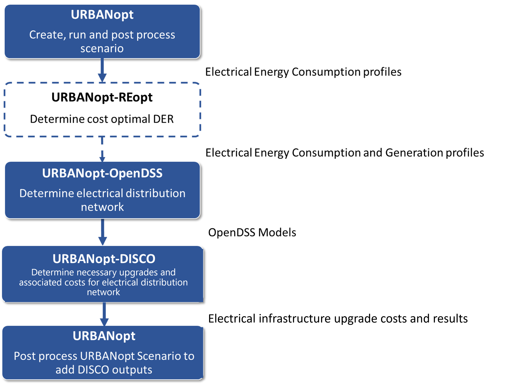

# DISCO

[DISCO](https://github.com/NREL/disco) (Distribution Integration Solution Cost Options) is an open-source, NREL-developed,
python-based software tool for automating distribution analyses at scale. Originally developed to
support photovoltaic (PV) impact analyses, DISCO can also be used to understand the impact of other
distributed energy resources on distribution networks. DISCO analysis is based
on power flow modeling with OpenDSS used as the simulation engine. PyDSS is used to interface with
OpenDSS and provide additional control layers.

DISCO combines many features in forms of analysis modules such as snapshot and dynamic hosting
capacity analysis, grid impact analysis, automated upgrade cost analysis, and cost-benefit analysis
for selected grid control strategies.

The URBANopt<sup>TM</sup>-DISCO workflow leverages the automated **upgrade cost analysis module** to determine the distribution system upgrades required
to mitigate any voltage and thermal violations that exist on the feeder and then calculate the cost
associated with those upgrades. The upgrades currently only include traditional infrastructure upgrade
options (reconductoring, upgrade transformers, installing voltage regulators and capacitor banks,
and changing the controls or setpoints on voltage regulators and capacitor banks).

## URBANopt-DISCO Workflow

Prior to running the DISCO analysis, OpenDSS models for the distribution system need to be created. 
 These OpenDSS models, along with the cost database file and technical catalog for distribution
system equipment is passed on to DISCO (more details about these inputs is provided below). Several URBANopt scenarios can be defined to represent the district with varying
amounts of building efficiency, building demand flexibility, PV penetration, and battery storage.

The DISCO module loops through these scenarios and analyzes the thermal and voltage violations to
determine the grid infrastructure upgrades required, if any, and report the associated costs in each
case.

An overview of the URBANopt-DISCO workflow is shown below: 



## DISCO Installation
Visit the [DISCO Installation page](../../installation/disco.md) to install DISCO.
## Usage

The DISCO workflow is available via the `disco` URBANopt CLI command.

For in-terminal help:
```bash
uo disco --help
```

In order to use the URBANopt-DISCO capabilities, the `DISCO Project` can be created and run using the
URBANopt CLI using the steps below: 


1. ### Create a DISCO Project

	Create a DISCO project by including the `-a` flag in the create command:

	```bash
	uo create --project-folder <path/to/electrical/folder> --disco
	```

	This will create a `disco` folder in the URBANopt example project which includes DISCO specific files such
as the `cost_database.xlsx`, `technical_catalog.json` and the `config.json` file. A description of
these files is provided below.

	- `cost_database.xlsx`: This is a customizable cost database containing technical specifications
	and associated per unit upgrade costs for electrical network equipment such as lines,
	transformers etc.. Users can customize and/or create
	their own databases of proprietary equipment costs if they wish to do so to reflect the costs
	and available equipment of the distribution system they are looking to represent. The cost
	database provided in DISCO is based on the catalog of equipment used to create synthetic network
	designs in the [URBANopt-RNM](../rnm.md) workflow.


	- `technical_catalog.json`: The technical catalog contains the detailed electrical specifications of the equipment that is represented in the `cost_database.xlsx` file. The components used are those specified in the RNM equipment catalog.

	- `config.json`: This configuration file specifies the DISCO analysis jobs to be run as a part of the analysis, and also defines the input technical parameters that need to be defined for the simulation.

	The DISCO example
project also includes the `example_project_with_electric_network.json` Feature File that includes
the building features as well as the
electrical distribution network of a given district.


2. ### Create Scenario Files

	Scenario files are created next. If using the REopt workflow, scenario files for REopt need to be
created. More details on creating scenario files are provided under the [Set up
Scenario](../getting_started/getting_started.md) section.

	```bash
	uo create --scenario-file <path/to/FEATUREFILE.json>
	```

3. ### Run the Project

	Run the project using the DISCO feature file, and the scenario file created from it:
	
	```bash
	uo run --feature <path/to/DISCO/featurefile.json> --scenario <path/to/SCENARIOFILE.csv>
	```
	
4. ### Default post-process Scenario

	Post-process using the default post-processor:

	```bash
	uo process --default --feature <path/to/FEATUREFILE.json> --scenario <path/to/SCENARIOFILE.csv>
	```
	
	Or, post process using the REopt Feature Post-Processor if using
  the REopt workflow.

	```bash
	uo process --reopt-scenario --feature <path/to/FEATUREFILE.json> --scenario <path/to/SCENARIOFILE.csv>
	```

5. ### Run OpenDSS

	To run OpenDSS, use the OpenDSS command and specify detailed options or a config
JSON file with pre-specified options. For more details on running OpenDSS refer to
the [OpenDSS documentation](../opendss/opendss.md).

	To access the list of all the options:

	```bash
	uo opendss -h
	```

	Example `opendss` CLI call:
	```bash
	uo opendss --feature <path/to/FEATUREFILE.json> --scenario <path/to/SCENARIOFILE.csv>
	```

	An example `opendss` CLI call using a config JSON file:
	```bash
	uo opendss --config path/to/config.json

6. ### Run DISCO
	To run use the DISCO command and specify the DISCO Feature File and Scenario file.

	Additional options namely the custom cost database and the technical catalog can also be specified. Details on all disco options can be viewed using the
`-h` flag as shown below: 

	```bash
	uo disco -h
	```

	This prints out the following options and their description:

	
	`--scenario` &mdash; Required, Path to scenario csv file\
	`--feature` &mdash; Required, Path to feature json file\
	`--cost_database` &mdash; Optional, Filename for custom cost database filename\
	`--technical_catalog` &mdash; Optional, Filename for custom technical catalog


7. ### Post-Process DISCO results

	To integrate DISCO results into URBANopt Scenario Reports, use the DISCO post-process as shown:

	```bash
	uo process --disco --feature <path/to/FEATUREFILE.json> --scenario <path/to/SCENARIOFILE.csv>
	```

	The DISCO results are summarized under `scenario_power_distribution_cost` key in the
	*scenario_report_disco.json* file in the scenario results folder. The DISCO results reported are: 

	**results**\:\
		- `num_violations`: Number of violations present in the feeder after
 upgrades cost analysis is completed.\
		- `total_cost_usd`: Total cost (in US dollars) needed to upgrade the feeder to mitigate violations.

	**outputs**:  This points the user to the `run_upgrade_cost_analysis.log` file path and includes detailed output files for each job.
	
	**violation_summary**: This provides a summary of number and magnitude of all violations, both before and after thermal and voltage upgrades. Users can refer to this if they want to get a better understanding of the impacts on feeder power quality at various stages of the automated upgrades cost analysis. 

	**costs_per_equipment**: This gives costs for each upgraded equipment.

	**equipment**: This is a list of all equipment in the feeder with information on whether it’s been upgraded as well as details on any changed parameters.

	A *DISCO folder* containing detailed results is also created within the outputs folder for
	the scenario and contains the following:

	 `job_outputs`: This folder contains sub-folders for each job. Each job folder has the upgraded
	 OpenDSS files as well detailed feeder statistics in case the user wants to delve deeper into
	 the technical aspects of the feeder.
	 `run_upgrade_cost_analysis.log`: Contains detailed run log for the DISCO simulation including
	 `INFO` and `ERROR` messages. More details on debugging the error codes can be found [here](https://nrel.github.io/disco/debugging-issues.html).\
	 `upgrade_summary.json`: This file reports out the DISCO results for the analysis. It contains
	 information on results, violation_summary, costs_per_equipment and equipment which have been
	 described above.
	 
	 More documentation on the DISCO automated upgrades cost analysis can be found [here](https://nrel.github.io/disco/analysis-workflows/upgrade-cost-analysis.html).

