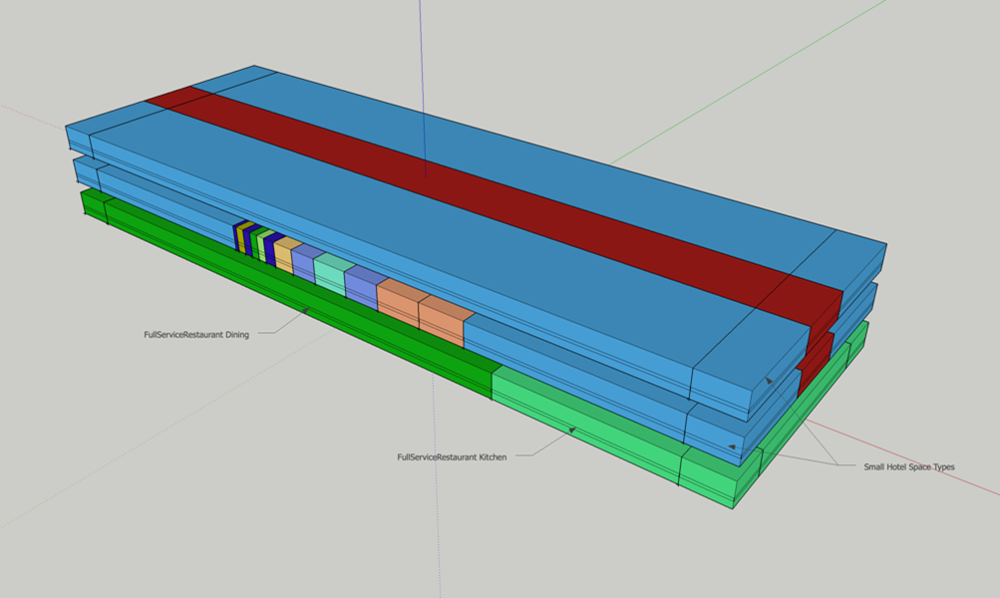

The URBANopt&trade; project offers different options for creating building geometry to suit various
modeling requirements. This section gives an overview of these workflows.

## Default workflow

The default workflow in the URBANopt example project uses the `urban-geometry-creation-zoning`
measure in the [GeoJSON gem](https://urbanopt.github.io/urbanopt-geojson-gem/) to create building
features with core and perimeter zoning from GeoJSON footprint coordinates in the Feature File. It has the options to model surrounding buildings as context shading.

More details on the measures used in the
workflow can be found in the [base workflow section](../resources/customization/base_workflow.md).

## Createbar workflow

This workflow uses the
[create_bar_from_building_type_ratios](https://github.com/NREL/openstudio-model-articulation-gem/tree/develop/lib/measures/create_bar_from_building_type_ratios)
measure from the openstudio-model-articulation-gem that attempts to create geometry from high level
building inputs such as number of stories, floor area, and aspect ratio. It can support a mix of up to four different building types. The space type ratios for each building type are taken from the DOE
prototype models.

The measure has an argument for adding a perimeter multiplier that can be used for accurately representing
the exposure conditions for non-rectangular buildings by creating two perpendicular bars.

It can also specify the custom height of a space by setting the `Enable
Custom Height Bar Application argument` to true. This can be used for modeling space types with heights that differ from the rest of the building. For example, modeling a gym or auditorium for a
SecondarySchool building type. This is accomplished by pulling space types with a custom height into a separate rectangular building that sits away from the main structure.

The measure can model circulation space types, when they exist by enabling the `Double Loaded Corridor`
argument. The double loaded corridor leads to space division and thermal zoning instead of typical
sliced core and perimeter zoning. It creates a circulation space type running down the center of the
bar, surrounded by spaces of another space type. For an example, for a primary school the corridor will be paired with the classrooms.

As shown below, the workflow does take the actual building footprint into account by creating a second bar when necessary to match the perimeter by orienting non-rectangular geoJSON footprints. Additionally, custom high spaces like school cafeterias are pulled into their own bar from the rest of the building spaces. This more accurately represents the volume of those spaces. This workflow does not take into account the impact of self and context shading.

### QAQC Reporting
Three additional reporting measures are enabled in this workflow. These reporting measures can be used on any workflow; however, the QAQC report isn't as meaningful on workflows like the urban geometry which create blended space types instead of recognized standard space types. Below is a brief summary of each report. They all make an HTML file, and they all add some output variable requests into the EnergyPlus IDF file that increases the EnergyPlus SQL file size for each building feature.

* OpenStudio Results: This contains annual and monthly energy use breakdown by end use, and unmet heating and cooling hours. It also contains model and results details for many different building components. It is described in more detail [on its common measures readme page](https://github.com/NREL/openstudio-common-measures-gem/tree/develop/lib/measures/openstudio_results).

* Envelope and Internal Load Breakdown: This contains annual and monthly heat gain and heat loss breakdown by building component and load type. Heat gains can be from internal loads or envelope components. The current version accounts for infiltration but not for ventilation.  It is described in more detail [on its common measures readme page](https://github.com/NREL/openstudio-common-measures-gem/tree/develop/lib/measures/envelope_and_internal_load_breakdown).

* Generic QAQC: This Quality Assurance / Quality Control (QAQC) measure was initially made for utility design assistance programs for users and reviewers. A generic version has been created for general use. Individual categories of checks can be turned on and off, and the tolerance of the check can be changed. Many of the checks also require a target standards, which is user configurable in the measure, but in this workflow is tied to the defined Template. It is described in more detail [on the measure's common measures readme page](https://github.com/NREL/openstudio-common-measures-gem/tree/develop/lib/measures/generic_qaqc). Note that when a flag is reported by this measure, it doesn't mean something is wrong with the model. It indicates that something may be atypical and might require further inspection, but isn't necessarily a problem. If you are seeing too many flags for a specific category, the tolerance can be loosened or the section can be disabled. This measure is under active development and will be enhanced over the new few releases. If you have feature requests for this measure, post it on the GitHub link for the measure provided above. Currently, the QAQC checks are not used by downstream project level URBANopt reports, but this feature will be added in a future URBANopt release.

## FloorspaceJS workflow

This workflow starts with floor plans and stub space types drawn using FloorSpaceJS. The
FloorspaceJS file is converted to an OpenStudio model by a measure that merges it with a seed model,
which is then passed into the `Create Typical Building from Model` measure. The seed model contains
the actual space type assignments that correspond to the stub space type names in the FloorSpaceJS
file and can be taken from the standard space type templates. Visit the link for one of the [web tools to create FloorSpaceJS](https://nrel.github.io/floorspace.js/) files.

The FloorSpaceJS file and the OpenStudio seed model must have the same name, for example
`feature.js` and `feature.osm` and must be placed in
the osm_building directory within the project directory. The FloorSpaceJS file name must also be added to the
`detailed_model_filename` property for that feature in the feature file.

*For all these workflows, an existing OpenStudio model of a building feature can be used, if desired, by
specifying the name of the model in the `detailed_model_filename` property of the particular feature in the Feature File and adding the OpenStudio model in the osm_building directory within the project directory.*
