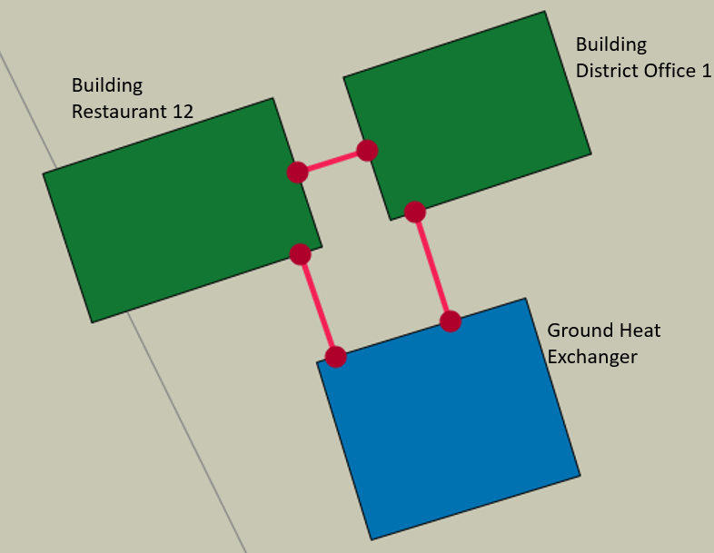

# Geothermal Heat Pump (GHP) Analysis

The URBANopt-Geothermal Heat Pump (GHP) workflows are used for modeling and simulation of district-scale GHP systems.  URBANopt is used to calculate building loads connected to the GHP system. The building loads along with technical specifications  for the GHP system, stored in the system parameter file, are used for sizing and simulations of custom district GHP systems. The installation and usage of these capabilities are described below.

## Installation

Run the following URBANopt CLI command to install Python and the required GHP-related dependencies:

```bash
uo install_python
```

## Usage


In order to use the URBANopt-GHP capabilities, the example `GHP Project` can be created and run using the URBANopt CLI following the steps below:


1. ### Create a GHP Project

	Create a GHP project by including the `--ghe` flag (or `-g` as a shortcut) in the create command:

	```bash
	uo create --project-folder <path/to/ghp/folder> --ghe
	```

	This will create an URBANopt example project which includes a feature file with a single pipe closed GHP network as shown in the figure below:

	

	The Feature File includes the footprint area of the GHP will be used as an input for GHP sizing.


2. ### Create Scenario Files

	Scenario files are created next using the following command:

	```bash
	uo create --scenario-file <path/to/FEATUREFILE.json>
	```

3. ### Run the Project

	Run the project using the GHP feature file, and the scenario file created in the previous step:

	```bash
	uo run --feature <path/to/GHP/featurefile.json> --scenario <path/to/SCENARIOFILE.csv>
	```

4. ### Default post-process Scenario

	Post-process using the default post-processor, this generates the timeseries building loads (kW) using the `export_modelica_loads` measure and stored in the run folder for the scenario:

	```bash
	uo process --default --feature <path/to/FEATUREFILE.json> --scenario <path/to/SCENARIOFILE.csv>
	```

5. ### Create System Parameter file

	This is used to create a system parameters file that stores technical properties related to GHP components such as boreholes, soil, fluid, and pipe definitions.

	The following command can be used to create the system parameters file:

	```bash
	uo des_params --sys-param-file <path/to/sys_param.json> --feature <path/to/FEATUREFILE.json> --scenario <path/to/SCENARIOFILE.csv> --ghe
	```

	The `ghe_specific_params` section within the system parameters file generated by this command stores properties for each GHP in the network. It pulls the GHP ID as well as the length and width of GHP from the feature file.

6. ### Size GHP

	Sizing the GHP system involves calculating properties such as number of boreholes, length of boreholes, and the g-function.

	This is done using the following command:


	```bash
	uo ghe_size --sys-param-file <path/to/sys_param.json> --feature <path/to/FEATUREFILE.json> --scenario <path/to/SCENARIOFILE.csv> --ghe
	```

	On running this command, a new folder `ghe_dir` is created that stores sizing results such as the g-function and the ground loads for the GHP. The system parameters file is also updated with the results of sizing such as the number of boreholes and length of boreholes.

7. ### Create Modelica Model and Modelica Directory

	This uses the URBANopt-DES module to create a Modelica package for the sized GHP network, as shown in the [DES Functionality section](../../getting_started/getting_started). It takes in the building loads, GHE sizing results, and the system parameter file with GHE-specific properties to create the Modelica package for the district thermal energy system.

	The following command is used:

	```bash
	uo des_create --sys-param-file <path/to/sys_param.json> --feature <path/to/FEATUREFILE.json> --des-name <path/to/example_modelica_project>
	```

8. ### Run Modelica Models

	```bash
	uo des_run --model <path/to/modelica_dir>
	```
