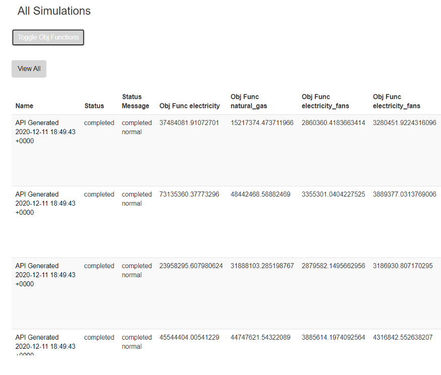
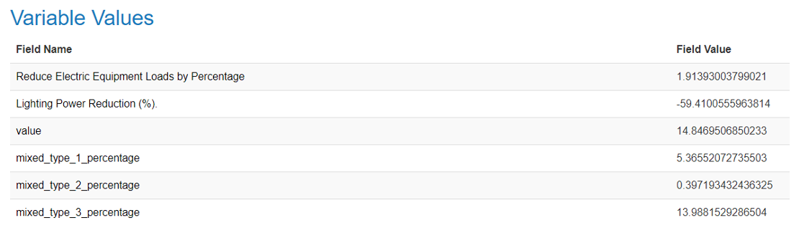
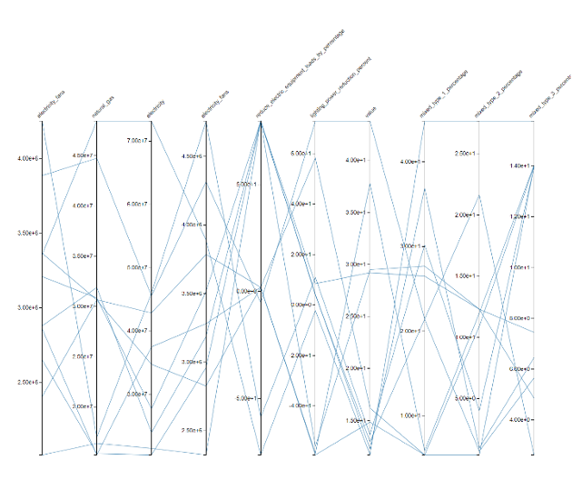
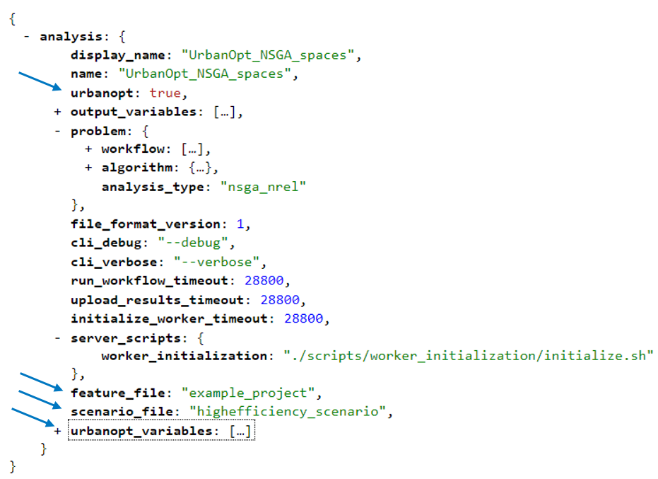
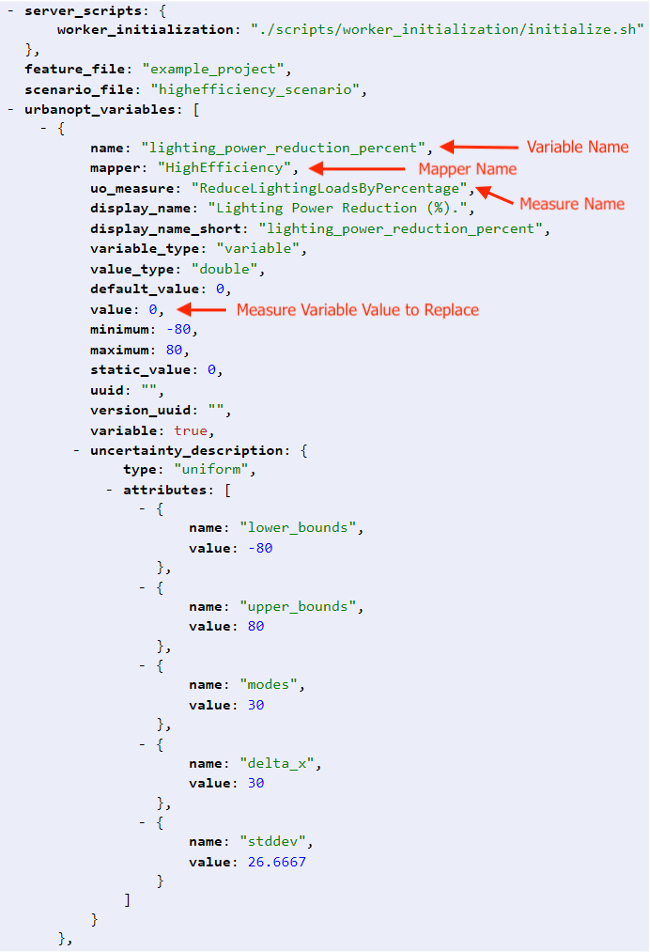
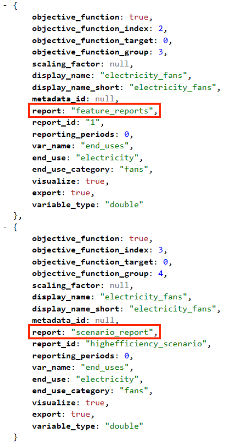

# Optimization

URBANopt can now run optimization and sensitivity analysis algorithms by using the [OpenStudio&reg; Analysis Framework (OSAF)](https://www.tandfonline.com/doi/full/10.1080/19401493.2020.1778788).  This is facilitated by using the OpenStudio Meta CLI from the [Parametric Analysis Tool (PAT)](https://github.com/NREL/OpenStudio-PAT/releases).

## Example Optimization

An example file is available to demonstrate the optimization capability. In this example, electricity consumption was optimized over two variables: Reduce Electric Equipment Loads by Percentage and Lighting Power Reduction (%).

Follow the steps below to install the necessary dependencies and run the file with the openstudio_meta.

## Installation and Usage

1. Install [PAT](https://github.com/NREL/OpenStudio-PAT/releases) to have access to the `openstudio_meta CLI` and all gems necessary to run it.  (it is assumed the install directory is c:/ParametricAnalysisTool-3.1.0)

1. Start an OSAF server cluster on AWS, Google or Microsoft using the [Helm](https://github.com/NREL/openstudio-server-helm) charts.  Note the server IP address; you will need it to submit the jobs. 

1. Once the cluster is up and running, open a terminal prompt or powershell in the directory with the URBANopt example files:

	- [URBANopt_NSGA.json](https://github.com/NREL/OpenStudio-server/blob/develop/server/spec/files/UrbanOpt_NSGA.json)
	- [URBANopt_NSGA.zip](https://github.com/NREL/OpenStudio-server/blob/develop/server/spec/files/UrbanOpt_NSGA.zip)

1. The command to run the analysis is as follows. You will need to replace the values in angle brackets (< >) with your values.

	```bash
		<path/to/PAT/ruby> <path/to/openstudio-meta> run_analysis --debug --verbose <path/of/URBANopt_NSGA.json> <Server IP address> -a nsga_nrel
	```

	For example:
	```bash
	C:\ParametricAnalysisTool-3.1.0\pat\ruby\bin\ruby.exe  C:\ParametricAnalysisTool-3.1.0\pat\OpenStudio-server\bin\openstudio_meta run_analysis --debug --verbose C:\PATProject\URBANopt_NSGA.json 10.10.10.10 -a nsga_nrel
	```

Once the job is submitted, you should be able to see the analysis on the Server Web Interface:





## Customization

The URBANopt analysis is defined using the OpenStudio OSA file.  This allows you to define the names of the feature file and scenario file as well as the variables. 

### Variables

The following variables must be added to the OSA to perform and URBANopt analysis:

- `urbanopt` (set to true)
- `feature_file` (the feature file JSON to use)
- `scenario_file` (the scenario file CSV to use)
- `urbanopt_variables` (array of variable definitions)

Here is a snippet of the OSA:


And an example URBANopt variable definition:


### Objective Functions

A `report` key should be added to each objective function to specify whether it is operating at the feature level or the scenario level:



PAT can be used to generate a template OSA that can then be manually adjusted for an URBANopt analysis.

