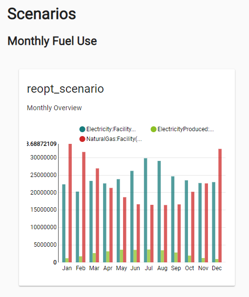

# Solar Photovoltaics Workflows

As of version 0.6.3, URBANopt&trade; supports community photovoltaic and ground mount photovoltaic workflows in addition to the rooftop photovoltaic workflow supported by previous versions.

## Community Photovoltaics

Community Photovoltaic features can be added to the GeoJSON Feature File as a district system of type "Community Photovoltaic".  View the [district system schema](https://docs.urbanopt.net/urbanopt-geojson-gem/schemas/district-system-properties.html) for more details. The REopt&trade; scenario optimization post-processor will use this information in its PV capacity calculations when run with the [multi-PV assumptions file](#assumptions-files). A `gcr` field representing the ground coverage ratio, or the percentage of the building's available roof area that will be covered by PV, can be specified in the REopt assumptions file, and is defaulted to 0.99. PV generation results can be found in the `scenario_optimization` output files in the scenario directory.

## Ground Mount Photovoltaics

Ground Mount Photovoltaic features can also be added to the GeoJSON Feature File as a district system feature of type "Ground Mount Photovoltaic". A ground mount PV feature should have an `associated_building_id` element specified, with the ID of a building feature in the Feature File. Grount Mount photovoltaic systems are assumed to be "behind the meter" of the utility meter for the associated building feature. View the [district system schema](https://docs.urbanopt.net/urbanopt-geojson-gem/schemas/district-system-properties.html) for more details.

The REopt optimization post-processors will use this information in their PV capacity calculations provided that there is a PV specification with location equal to `ground` in the REopt [assumptions file](#assumptions-files) for the building feature with associated ground mount PV. (See the `multi-pv` assumptions file in the `reopt` folder of your project directory for an example.) A `gcr` field representing the ground coverage ratio, or the percentage of the area given by the ground mount feature area that will be covered by PV, is also found in the REopt [assumptions file](#assumptions-files). It is defaulted to 0.99 but can be adjusted to represent the PV coverage of the ground mount feature. More information on REopt assumptions files can be found in the [Assumptions Files](#assumptions-files) section below.

Alternatively, ground mount photovoltaics can be considered in the REopt feature optimization without defining district system features and associating them with a building in the GeoJSON file. If no features are defined in the GeoJSON file, REopt return the optimal amount of ground mount PV with an upper limit of area equivalent to the total site area for each feature that was run with an [assumptions file](#assumptions-files) that contained a PV definition with location = `ground`. More realistically, there will be a more specific area limitation based on the area available for Ground Mount PV associated with the Feature and, therefore, district systems should be defined in the GeoJSON files for those building features where ground mount PV is considered.  An additional refinement would be to specify different assumptions files for features with ground mount PV and those without. Feature-by-feature assumptions file assignment is done in the scenario CSV file for a particular [reopt-enabled](../getting_started/getting_started.md#step2) scenario.

## Rooftop Photovoltaics

Rooftop photovoltaics can be optimized through the REopt post-processors. The default `base` and `multi-PV` [assumptions files](#assumptions-files) can be used for the feature optimization and scenario optimization post-processors. A `gcr` field representing the ground coverage ratio, or the percentage of the building's available roof area that will be covered by PV, can be specified in the REopt assumptions file, and is defaulted to 0.99. The building's available roof area is automatically calculated by the default URBANopt post-processor. Ground Mount and Rooftop photovoltaics can be explored simultaneously by using the `multi-PV` assumptions file.

## Example Project

Use the following CLI command to create a PV-enabled example project:

```bash
uo create --project-folder <path/to/PROJECT_DIRECTORY_NAME> --photovoltaic
```

Once you have a project directory, you will want to create the Scenario CSV and enable REopt functionality:

```bash
uo create --scenario-file <path/to/FEATUREFILE_WITH_PV.json>
```

```bash
uo create --reopt-scenario-file <path/to/EXISTING_SCENARIO_FILE.csv>
```

### Assumptions Files
The command above creates a `reopt` directory within the project directory as well as a REopt enabled Scenario CSV. This directory contains two example assumptions file:
1. a `base` assumptions file that can be used for a basic optimization
2. a `multi-pv` assumptions file that can be used to optimize both rooftop and ground mount PV.

Feel free to modify these files directly in your project, or create new files. A complete list of input fields&mdash;including type, description, and acceptable range&mdash;can be retrieved from the REopt API by entering the following URL in your browser:

```bash
https://developer.nrel.gov/api/reopt/stable/help?API_KEY=<insert your NREL developer key here>
```

The method of specifying which assumption file to use in an optimization depends on the type of REopt optimization:

- For feature-level optimizations, the assumptions files are listed in the REopt Scenario CSV file.
- For scenario-level optimizations, use the `--reopt-scenario-assumptions-file` flag to specify the assumptions file to use when issuing the `uo process --reopt-scenario` command. The `base` assumptions file will be used as a default if the flag is not found.

Through CLI commands, the assumptions files will be updated with basic information from your project's Feature and Scenario Reports (i.e. latitude, longitude, electric load profile) and submitted to the REopt API. Visit the [Getting Started](../getting_started/getting_started) page for more information on creating and running an example PV project.

### Outputs

PV generation results can be found in the `scenario_optimization` output files in the scenario directory when the `--reopt-scenario` post-processor is run.  Results are also found in the `feature_optimization` output files within each feature's individual directory when the `--reopt-feature` post-processor is run.

The results from the scenario and feature level optimization can also be visualized using the
instructions provided in the "Plot Results" section of the [Getting Started](../getting_started/getting_started) page.

An example visualization of scenario optimization is shown below, showing the breakdown Electricity
and Natural Gas consumed and Electricity Produced for the scenario.


