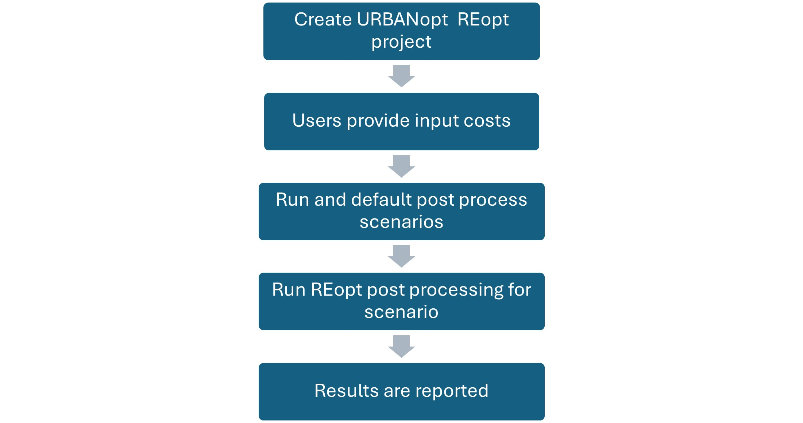

## URBANopt&trade;-REopt&reg; Cost Analysis (Alpha) Capabilities

The URBANopt-REopt Cost Analysis capabilities can be used to calculate capital and operational costs associated with buildings in a district, campus, or neighborhood using URBANopt-REopt workflows. These cost calculations will support comparison of various **URBANopt** scenarios, providing insights into the financial implications of different design decisions and enhancing visibility into project feasibility and cost-effectiveness. For example, users can define costs for a baseline new construction project and compare them with scenarios featuring increasing levels of energy efficiency. This functionality also supports evaluating tradeoffs between capital investments in building energy efficiency and demand flexibility technologies and their resulting impacts on operational energy savings. 

The workflow utilizes user-defined costs for each **URBANopt** scenario and leverages the **REopt** techno-economic engine to calculate financial parameters such as Net Present Value and Lifecycle Capital Cost for the analysis period. These are Alpha capabilities initially released in URBANopt version 1.2.0 for initial user testing and feedback and may be refined and updated in future releases.

These following sections detail the inputs required, expected outputs, software architecture and workflow for running the analysis.

## User Cost Inputs

### Capital Costs for Buildings

This is a user input for the total capital cost associated with a single building in each scenario. It can be added as a total cost \(\$\) or cost per floor area \(\$/sq.ft.\). The capital costs for each building will be aggregated for all the buildings on the site and will be reported at the scenario level, allowing direct comparison across scenarios. This input field provides flexibility for different use case, such as:

- Users may specify known total capital costs per building for both baseline and high-efficiency scenarios.

Note that dummy values of \$1 and \$1/sq.ft. will be propagated for each building in the **REopt Scenario File** initially. Users should modify the values to reflect the actual capital costs of their project.

### Analysis Period

The analysis period for financial calculations can be modified in the **REopt Assumptions File**, under the `Financial.analysis_years` field. This is set at 20 years in the example URBANopt-REopt assumptions files.

### Electricity Utility Rate

The electricity utility rate will be specified through the [Utility Rate Database (URDB)](https://apps.openei.org/USURDB/) label at the project level. This is used to calculate the operating costs for electricity consumption across scenarios. 

### Fuel Utility Rate

The fuel utility rate is user specified \(\$/MMBtu\) at the project level. The rate is applied when calculating operating costs for fuel consumption across scenarios. The initial capability supports `Natural Gas` fuel type. Note that placeholder values of \$4.5/MMBtu will be used in the **REopt Assumptions File** initially. **Users should modify the value to reflect the actual fuel cost of their project.**

|             Input           |      Unit      | URBANopt SDK Location  |                     Notes                     |
| ----------------------------| -------------- | ---------------------- | --------------------------------------------- |
| Capital costs for buildings | \$ or \$/sq.ft.| REopt Scenario File          | New fields added for \$ and \$/sq.ft. |
| Electricity utility rate    | URDB Label     | REopt Assumption File | Existing field used                   |
| Fuel utility rate           | \$/MMBtu       | REopt Assumption File | New field added                       |

## REopt Calculations

### Building Capital Cost Calculation

Currently, building energy upgrades are not supported as a distinct technology type within the **REopt** engine. To enable cost calculations associated with building technology upgrades, the `Wind` technology type is being used as a placeholder.

Although `Wind` is not modeled within the **URBANopt–REopt** integration, it provides the necessary input fields and analytical capabilities required to represent building energy upgrade costs. By repurposing the `Wind` technology type in this manner, we can support upgrade cost analysis without modifications to the core **REopt** schema.

In the future, if/when **REopt** introduces explicit support for input of building capital costs, the integration will be updated to leverage the new inputs directly, replacing the temporary Wind-based representation.

The **REopt** input assumption file is used to include building energy upgrade costs under `Wind`.

### Fuel Cost Calculation

To calculate the fuel cost for building fuel energy consumption, the `SpaceHeatingLoad > fuel_loads_mmbtu_per_hour` **REopt** property is used. The `fuel_loads_mmbtu_per_hour` field takes an array of hourly fuel consumption values for the building. Using the **URBANopt** default feature reports, the hourly fuel load values are populated into this field. The `fuel cost per MMBtu` is then copied from the user-specified value in the **REopt Assumption File** into the `ExistingBoiler > fuel_cost_per_mmbtu` property in the **REopt** input schema. These inputs are passed on to **REopt**, which then calculates the total fuel cost associated with the building. The `Boiler` object is used in order to calculate Natural Gas fuel costs while the boiler is not actually modeled on the site.

More details on the **REopt** input schema can be found at: https://developer.nrel.gov/api/reopt/stable/help/?API_KEY=DEMO_KEY.

### REopt Input Cost Parameters

**REopt** input cost parameters are specified at the project level, and include the `electricity cost escalation rate`, `analysis years`, `discount rate fraction` and `tax rate fraction`. More details for these inputs, including the default values, are provided in the [REopt user manual](https://reopt.nrel.gov/tool/reopt-user-manual.pdf).

## Overall Workflow

This figure describes the overall workflow for running the **REopt** cost analysis. The user creates an **URBANopt-REopt** project and adds the necessary user cost inputs. The **URBANopt** project is then run, followed by default post processing. Next, the **REopt** scenario post processing command is run. During this step, the user inputs are copied into the **REopt Assumption Files**. To get the total capital costs for a scenario, individual building capital costs would be multiplied with the floor area (if costs were input as \$/sq.ft.) or taken as is if costs were input as total per building, then individual building capital costs would be added to calculate total building capital costs across all buildings. Then, the **REopt API** call is made with the **REopt** input assumptions file and the analysis is run. The **REopt** outputs are then reported back to the **URBANopt SDK**.

## Outputs

The existing **REopt** output reports will be used to report the financial outputs from the analysis. The outputs reported from the **REopt** techno economic analysis are:

- `initial_capital_costs`: Up-front capital costs for all technologies, in present value, excluding replacement costs and incentives. If third party ownership, represents cost to third party.

- `initial_capital_costs_after_incentives`: Up-front capital costs for all technologies, in present value excluding replacement costs, and accounting for incentives.

- `lifecycle_capital_costs`: Net capital costs for all technologies, in present value, including replacement costs and incentives. Note: The replacement costs and incentives are currently not considered in the analysis.

- `lifecycle_fuel_costs_after_tax`: LCC component. Present value of all fuel costs over the analysis period, after tax

- `lifecycle_elecbill_after_tax`: LCC component. Present value of all electric utility charges, including compensation for exports, after tax.
