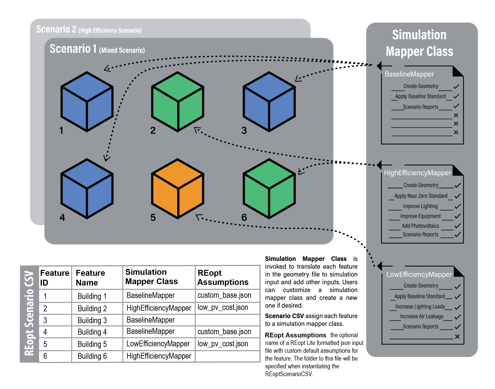
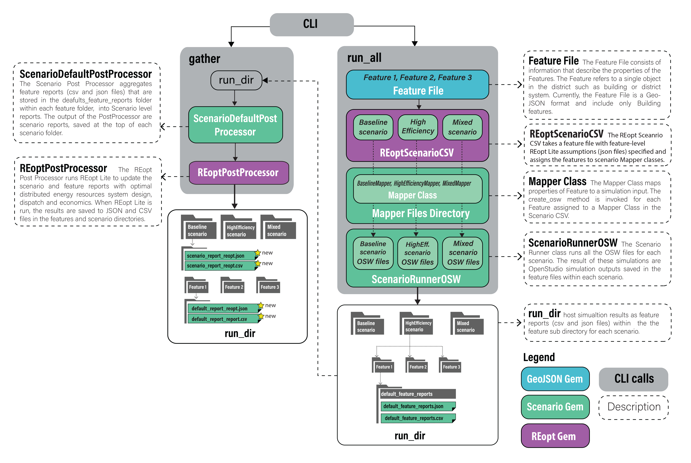

## Intro

This document outlines capabilities for calculating capital and operational costs associated with buildings in a district, campus, or neighborhood using **URBANopt**. These cost calculations will support comparison of various **URBANopt** scenarios, providing insights into the financial implications of different design decisions and enhancing visibility into project feasibility and affordability. For example, users can define costs for a baseline new construction project and compare them with scenarios featuring increasing levels of efficiency. This functionality also supports evaluating tradeoffs between capital investments in building energy efficiency and demand flexibility technologies and their resulting impacts on operational energy savings. The workflow utilizes user-defined costs for each **URBANopt** scenario and leverages **REopt** techno-economic engine to calculate financial parameters such as Net Present Value and Lifecycle Capital Cost for the analysis period.

These following sections detail the inputs required, expected outputs, software architecture and workflow for running the analysis.


## User Cost Inputs

### Capital Costs for Buildings

This is a user input for the total capital cost associated with a single building in each scenario. It can be added as a total cost \(\$\) or cost per floor area \(\$/sq.ft.\). The capital costs for each building will be aggregated for all the buildings on the site and will be reported at the scenario level, allowing direct comparison across scenarios. This input field provides flexibility for different use case, such as:

- Users may specify known total costs per building for both baseline and high-efficiency scenarios.
- Alternatively, users may enter incremental costs for high-efficiency scenarios, defined relative to the baseline cost. 

### Electricity Utility Rate

This will be specified through the [Utility Rate Database (URDB)](https://apps.openei.org/USURDB/) label at the project level. This is used to calculate the operating costs for electricity consumption across scenarios. 

### Fuel Utility Rate

This is the user specified fuel cost \(\$/MMBtu\) at the project level. The rate is applied when calculating operating costs for fuel consumption across scenarios. The initial capability supports `Natural Gas` fuel type.

### Mapping REopt Assumption Files to Features

In your Scenario File enabled for **REopt** you will see a `REopt Assumptions` column. Before post-processing ensure that each feature has the appropriate assumptions file specified in this CSV file.

The following figure represents how Simulation Mapper Classes can be assigned to different Features from the FeatureFile in the Scenario CSV.




### Running REopt

The `type` of optimization is specified in the CLI call:

The `--reopt-scenario` command allows you to post-process a ScenarioReport in aggregate. This is suitable for community-scale optimizations.

```terminal
  uo process --reopt-scenario --feature <path/to/FEATUREFILE.json> --scenario <path/to/SCENARIOFILE.csv>
```
The `--reopt-scenario-assumptions-file` option can be used with this command to specify the assumptions file to use. If omitted, the `base_assumptions.json` file from the `reopt` folder will be used, as described above.

Alternatively, The `--reopt-feature` command allows you to post-process a Scenario for each of its Feature Reports before aggregating into a summary in the Scenario Report. This runs REopt optimization on each building individually. The assumptions file to use for each feature should be specified in the REopt-enabled ScenarioCSV file.

```terminal
  uo process --reopt-feature --feature <path/to/FEATUREFILE.json> --scenario <path/to/REOPT_SCENARIOFILE.csv>
```

### Understanding REopt Results

After **REopt** post-processing, you will find that the new ScenarioReport contains updated `distributed_generation` and `timeseries_CSV` attributes.

#### Distributed Generation Updates

The following provides an example of `distributed_generation` attributes that have been updated by post-processing with **REopt**.

```json
  "distributed_generation": {
      #optimal lifecycle costs
      "lcc_us_dollars": 30943,
      #business as usual lifecycle costs
      "lcc_bau_us_dollars": 40040.0,
      #optimal net present value
      "npv_us_dollars": 9097.0,
      #optimal costs paid to the utility for energy charges, year 1
      "year_one_energy_cost_us_dollars": 750.3,
      #optimal costs paid to the utility for demand charges, year 1
      "year_one_demand_cost_us_dollars": 0.0,
      #optimal total costs paid to the utility
      "year_one_bill_us_dollars": 1521.66,
      #optimal costs paid to the utility for demand charges, lifetime
      "total_demand_cost_us_dollars": 0.0,
      #optimal costs paid to the utility for energy charges, lifetime
      "total_energy_cost_us_dollars": 7189.5,
      #business as usual costs paid to the utility for energy charges, year 1
      "year_one_energy_cost_bau_us_dollars": 3407.27,
      #business as usual costs paid to the utility for demand charges, year 1
      "year_one_demand_cost_bau_us_dollars": 0.0,
      #business as usual total costs paid to the utility
      "year_one_bill_bau_us_dollars": 4178.63,
      #business as usual costs paid to the utility for energy charges, lifetime
      "total_energy_cost_bau_us_dollars": 32649.02,
      #business as usual costs paid to the utility for demand charges, lifetime
      "total_demand_cost_bau_us_dollars": 2189.75,
      #total optimal solar PV
      "total_solar_pv_kw": 0.0,
      #min outage duration system can sustain
      "resilience_hours_min": 3.0,
      #max outage duration system can sustain
      "resilience_hours_max": 6116.0,
      #average outage duration system can sustain
      "resilience_hours_avg": 0.0,
      #probability of surviving an outage by timestep
      "probs_of_surviving":
        [ 0.0027, 0.0027,...condensing full response... ,0.0027],
      #probability of surviving an outage by month
      "probs_of_surviving_by_month":
        [ 0.0027, 0.0027...condensing full response...0.0027],
      #probability of surviving an outage by hour of day
      "probs_of_surviving_by_hour_of_the_day":
        [ 0.0027, 0.0027...condensing full response...0.0027],
      #list of all optimal solar PV systems
      "solar_pv": [
        {"size_kw": 8.0124}
      ],
      #list of all optimal wind systems
      "wind": [],
      #list of all optimal generator systems
      "generator": [],
      #list of all optimal battery storage systems
      "storage": [
        {"size_kw": 2.1848, "size_kwh": 4619}
      ]
    },
      }
```

Note that the `solar_pv`, `wind`, `generator` and `storage` arrays will contain lists of all economic technologies across all features. For example, if solar PV is economic for two _Feature Reports_ then the `solar_pv` array will contain these two capacities. Moreover, the total capacity of both systems will be recorded in the _total_solar_pv_kw_ attribute. Also, note that the attributes in `distributed_generation` containing "bau" in the name are _business as usual_ metrics that can be used to understand the relative economic attactiveness of the optimal solution.

#### Timeseries CSV Updates

After **REopt** post-processing, you will also find that ScenarioReport `timeseries_CSV` contains the following new optimal dispatch fields:

|            new column name                        |  unit  |
| --------------------------------------------------| ------ |
| REopt:ElectricityProduced:Total(kW)               | kW     |
| REopt:Electricity:Load:Total(kW)                  | kW     |
| REopt:Electricity:Grid:ToLoad(kW)                 | kW     |
| REopt:Electricity:Grid:ToBattery(kW)              | kW     |
| REopt:Electricity:Storage:ToLoad(kW)              | kW     |
| REopt:Electricity:Storage:ToGrid(kW)              | kW     |
| REopt:Electricity:Storage:StateOfCharge(kW)       | kW     |
| REopt:ElectricityProduced:Generator:Total(kW)     | kW     |
| REopt:ElectricityProduced:Generator:ToBattery(kW) | kW     |
| REopt:ElectricityProduced:Generator:ToLoad(kW)    | kW     |
| REopt:ElectricityProduced:Generator:ToGrid(kW)    | kW     |
| REopt:ElectricityProduced:PV:Total(kW)            | kW     |
| REopt:ElectricityProduced:PV:ToBattery(kW)        | kW     |
| REopt:ElectricityProduced:PV:ToLoad(kW)           | kW     |
| REopt:ElectricityProduced:PV:ToGrid(kW)           | kW     |
| REopt:ElectricityProduced:Wind:Total(kW)          | kW     |
| REopt:ElectricityProduced:Wind:ToBattery(kW)      | kW     |
| REopt:ElectricityProduced:Wind:ToLoad(kW)         | kW     |
| REopt:ElectricityProduced:Wind:ToGrid(kW)         | kW     |

**NOTE**: A REopt solution may contain multiple PV systems. In this case the aggregate generation from all PV systems will be reported in the PV columns.


### Additional Outputs

**REopt** API responses are saved in `reopt` folders. This information may be helpful in interpreting results or debugging errors (i.e. identifying if API rate-limits have been reached).

If you post-processed with `--reopt-scenario` the `reopt` folder will be at the top level of scenerio in the `run` (i.e. `run\reopt_scenario\reopt`). Otherwise, if you run with `--reopt-feature` each feature will have its own `reopt` folder (i.e. `run\reopt_scenario\1\reopt`).

### Additional Information

The figure below describes the workflow that takes place on implementing the `run` and `process` CLI commands.


