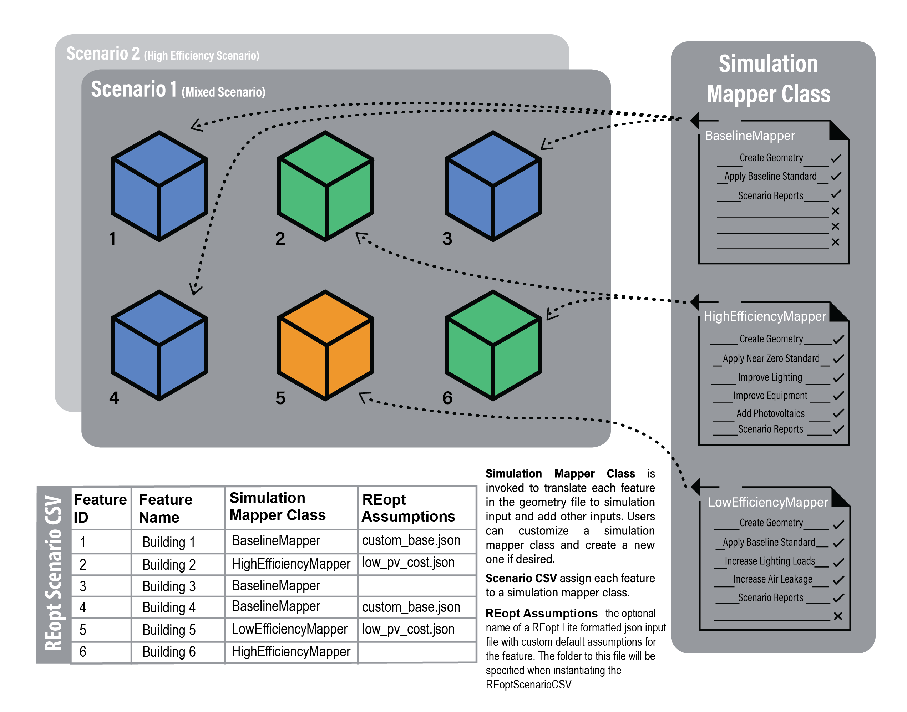
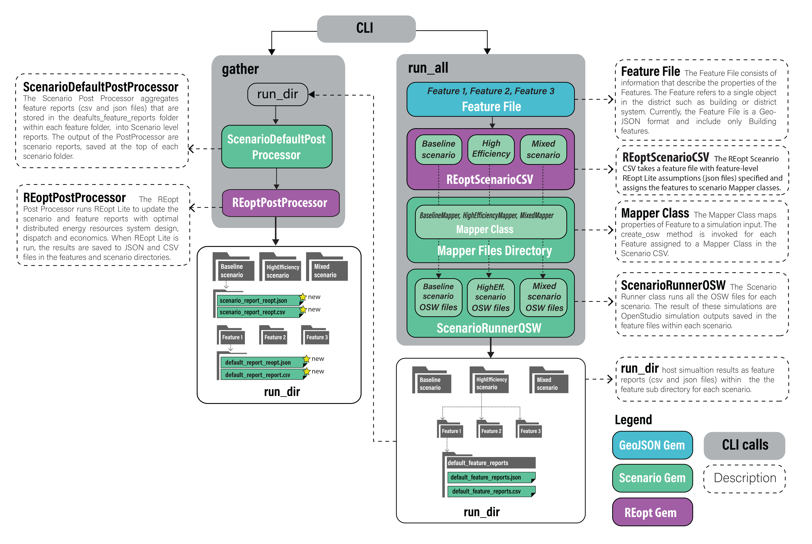

## Intro

**REopt Lite** optimization happens during the post-processing of each scenario. Refer to the [Getting Started page](../getting_started/getting_started) for instructions on creating and running building energy models.

CLI commands are used to run and post-process each scenario, and onscreen help is always available with `uo --help`.

Also note that two types of REopt optimization are available:
- **_scenario-level_**, which optimizes for the aggregate load of the entire district being simulated, and
- **_feature-level_**, which optimizes each building's load individually.

You may chose to optimize by one or both of these approaches according to your project objectives.

## Workflow

### REopt Lite Optimization Assumption Files

In your URBANopt project directory, you should see two example **REopt Lite** assumption files in a `reopt` folder (`base_assumptions.json` and `multiPV_assumptions.json`). If the `reopt` folder is missing, first create a REopt-enabled ScenarioFile with the `uo create --reopt-scenario-file` command (type `uo create --help` for usage help). These files follow the format outlined in the [API documentation](https://developer.nrel.gov/docs/energy-optimization/reopt-v1/) and can be customized to your specific project needs. Though CLI commands, they will be updated with basic information from your _Feature_ and _Scenario_ Reports (i.e. latitude, longitude, electric load profile) and submitted to the **REopt Lite API**.

In particular, you will want to make sure that the `urdb_label` in the assumptions file maps to a suitable utility rate _label_ from the [URDB](https://openei.org/apps/IURDB/). The _label_ is the last term of the URL of a utility rate detail page (i.e. the _label_ for the rate at [https://openei.org/apps/IURDB/rate/view/5b0d83af5457a3f276733305](https://openei.org/apps/IURDB/rate/view/5b0d83af5457a3f276733305) is 5b0d83af5457a3f276733305).

Also note that the example `reopt/multiPV_assumptions.json` file contains an array of PV inputs to allow for the optimization of multiple PV systems at once.

### REopt Lite Time Series Resolution

The **REopt Lite** time series resolution is controlled by the **Scenario** `time_steps_per_hour` setting in the assumptions file, and can be different than the Scenario or Feature Report resolution resulting from the OpenStudio simulation (and recorded in the CSV). Note that resolutions that are not evenly divisible by each other (i.e. 7 time steps per hour into 4 per hour) may cause unexpected results or errors due to rounding errors. If a **REopt Lite** resolution is not defined in the assumptions file, the recommended resolution of 1 per hour is used.

### Mapping REopt Lite Assumption Files to Features

In your Scenario File enabled for **REopt Lite** you will see a `REopt Assumptions` column. Before post-processing ensure that each feature has the appropriate assumtions file specified in this CSV file.

The following figure represents how Simulation Mapper Classes can be assigned to different Features from the FeatureFile in the Scenario CSV.




### Running REopt Lite

The `type` of optimization is specified in the CLI call:

The `--reopt-scenario` command allows you to post-process a ScenarioReport in aggregate. This is suitable for community-scale optimizations.

```terminal
  uo process --reopt-scenario --feature <path/to/FEATUREFILE.json> --scenario <path/to/SCENARIOFILE.csv>
```
The `--reopt-scenario-assumptions-file` option can be used with this command to specify the assumptions file to use. If omitted, the `base_assumptions.json` file from the `reopt` folder will be used, as described above.

Alternatively, The `--reopt-feature` command allows you to post-process a Scenario for each of its Feature Reports before aggregating into a summary in the Scenario Report. This runs REopt optimization on each building individually. The assumptions file to use for each feature should be specified in the REopt-enabled ScenarioCSV file.

```terminal
  uo process --reopt-feature --feature <path/to/FEATUREFILE.json> --scenario <path/to/REOPT_SCENARIOFILE.csv>
```

### Understanding REopt Lite Results

After **REopt Lite** post-processing, you will find that the new ScenarioReport contains updated `distributed_generation` and `timeseries_CSV` attributes.

#### Distributed Generation Updates

The following provides an example of `distributed_generation` attributes that have been updated by post-processing with **REopt Lite**.

```json
  "distributed_generation": {
      #optimal lifecycle costs
      "lcc_us_dollars": 30943,
      #business as usual lifecycle costs
      "lcc_bau_us_dollars": 40040.0,
      #optimal net present value
      "npv_us_dollars": 9097.0,
      #optimal costs paid to the utility for energy charges, year 1
      "year_one_energy_cost_us_dollars": 750.3,
      #optimal costs paid to the utility for demand charges, year 1
      "year_one_demand_cost_us_dollars": 0.0,
      #optimal total costs paid to the utility
      "year_one_bill_us_dollars": 1521.66,
      #optimal costs paid to the utility for demand charges, lifetime
      "total_demand_cost_us_dollars": 0.0,
      #optimal costs paid to the utility for energy charges, lifetime
      "total_energy_cost_us_dollars": 7189.5,
      #business as usual costs paid to the utility for energy charges, year 1
      "year_one_energy_cost_bau_us_dollars": 3407.27,
      #business as usual costs paid to the utility for demand charges, year 1
      "year_one_demand_cost_bau_us_dollars": 0.0,
      #business as usual total costs paid to the utility
      "year_one_bill_bau_us_dollars": 4178.63,
      #business as usual costs paid to the utility for energy charges, lifetime
      "total_energy_cost_bau_us_dollars": 32649.02,
      #business as usual costs paid to the utility for demand charges, lifetime
      "total_demand_cost_bau_us_dollars": 2189.75,
      #total optimal solar PV
      "total_solar_pv_kw": 0.0,
      #min outage duration system can sustain
      "resilience_hours_min": 3.0,
      #max outage duration system can sustain
      "resilience_hours_max": 6116.0,
      #average outage duration system can sustain
      "resilience_hours_avg": 0.0,
      #probability of surviving an outage by timestep
      "probs_of_surviving":
        [ 0.0027, 0.0027,...condensing full response... ,0.0027],
      #probability of surviving an outage by month
      "probs_of_surviving_by_month":
        [ 0.0027, 0.0027...condensing full response...0.0027],
      #probability of surviving an outage by hour of day
      "probs_of_surviving_by_hour_of_the_day":
        [ 0.0027, 0.0027...condensing full response...0.0027],
      #list of all optimal solar PV systems
      "solar_pv": [
        {"size_kw": 8.0124}
      ],
      #list of all optimal wind systems
      "wind": [],
      #list of all optimal generator systems
      "generator": [],
      #list of all optimal battery storage systems
      "storage": [
        {"size_kw": 2.1848, "size_kwh": 4619}
      ]
    },
      }
```

Note that the `solar_pv`, `wind`, `generator` and `storage` arrays will contain lists of all economic technologies across all features. For example, if solar PV is economic for two _Feature Reports_ then the `solar_pv` array will contain these two capacities. Moreover, the total capacity of both systems will be recorded in the _total_solar_pv_kw_ attribute. Also, note that the attributes in `distributed_generation` containing "bau" in the name are _business as usual_ metrics that can be used to understand the relative economic attactiveness of the optimal solution.

#### Timeseries CSV Updates

After **REopt Lite** post-processing, you will also find that ScenarioReport `timeseries_CSV` contains the following new optimal dispatch fields:

|            new column name                        |  unit  |
| --------------------------------------------------| ------ |
| REopt:ElectricityProduced:Total(kW)               | kW     |
| REopt:Electricity:Load:Total(kW)                  | kW     |
| REopt:Electricity:Grid:ToLoad(kW)                 | kW     |
| REopt:Electricity:Grid:ToBattery(kW)              | kW     |
| REopt:Electricity:Storage:ToLoad(kW)              | kW     |
| REopt:Electricity:Storage:ToGrid(kW)              | kW     |
| REopt:Electricity:Storage:StateOfCharge(kW)       | kW     |
| REopt:ElectricityProduced:Generator:Total(kW)     | kW     |
| REopt:ElectricityProduced:Generator:ToBattery(kW) | kW     |
| REopt:ElectricityProduced:Generator:ToLoad(kW)    | kW     |
| REopt:ElectricityProduced:Generator:ToGrid(kW)    | kW     |
| REopt:ElectricityProduced:PV:Total(kW)            | kW     |
| REopt:ElectricityProduced:PV:ToBattery(kW)        | kW     |
| REopt:ElectricityProduced:PV:ToLoad(kW)           | kW     |
| REopt:ElectricityProduced:PV:ToGrid(kW)           | kW     |
| REopt:ElectricityProduced:Wind:Total(kW)          | kW     |
| REopt:ElectricityProduced:Wind:ToBattery(kW)      | kW     |
| REopt:ElectricityProduced:Wind:ToLoad(kW)         | kW     |
| REopt:ElectricityProduced:Wind:ToGrid(kW)         | kW     |

**NOTE**: A REopt Lite solution may contain multiple PV systems. In this case the aggregate generation from all PV systems will be reported in the PV columns.


### Additional Outputs

**REopt Lite** API responses are saved in `reopt` folders. This information may be helpful in interpreting results or debugging errors (i.e. identifying if API rate-limits have been reached).

If you post-processed with `--reopt-scenario` the `reopt` folder will be at the top level of scenerio in the `run` (i.e. `run\reopt_scenario\reopt`). Otherwise, if you run with `--reopt-feature` each feature will have its own `reopt` folder (i.e. `run\reopt_scenario\1\reopt`).

### Additional Information

The figure below describes the workflow that takes place on implementing the `run` and `process` CLI commands.


