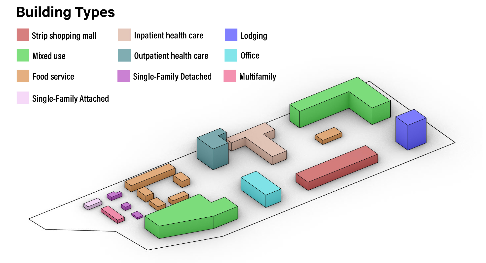

## Before you begin!

To run a project you will need an internet connection so the REopt™ Gem can access the REopt Lite API.

You'll also need an API key from the [NREL Developer Network](https://developer.nrel.gov/). Copy and paste your key as an environment variable on your computer. Step-by-step instructions for creating env variables are found in the [installation](../../installation/installation.md) docs for your operating system.

    GEM_DEVELOPER_KEY = '<insert your NREL developer key here>'

## Example Project    

We provide examples of running an URBANopt workflow that integrates **REopt Lite** optimization.

To run an simple example project, first visit the [Getting Started page](../getting_started/getting_started) to set up a project and run  energy use simulations. Then, refer to [REopt Post-Processing](reopt_post_processing.md) for how to optimize DER's based on baseline energy use. 

Alternatively, we provide an [example project](https://github.com/urbanopt/urbanopt-example-geojson-project) that exposes code that can be run and customized from your local machine.
