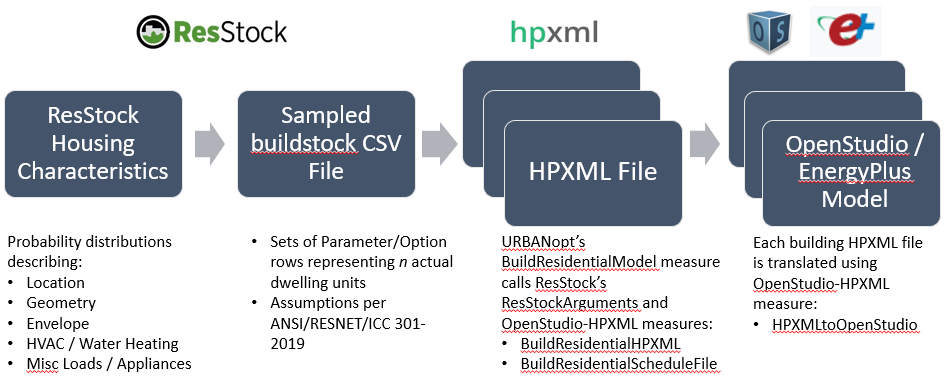

## Building Inputs

HPXML files are built based on feature information contained in the GeoJSON file.
The [Building Types](building_types.md) section lists all the required and optional GeoJSON fields for each building type.

Following the assignment of fields from the GeoJSON file (e.g., building type, number of stories, floor area), a number of inputs are defaulted using the OpenStudio-HPXML workflow.
Optionally, input values may be *further* refined/adjusted using either a customizable template or samples from the [ResStock™](https://www.nrel.gov/buildings/resstock.html) workflow. An alpha release of the ResStock samples workflow is included in URBANopt version 0.13.0.

- [Default Values](#default-values)
- [Customizable Template](#customizable-template)
- [ResStock Samples](#resstock-samples)

After all arguments are assigned input values and an HPXML file is built, a translator measure is then applied to construct an OpenStudio&copy; building model.

### Default Values

The [Input Defaults](https://openstudio-hpxml.readthedocs.io/en/latest/workflow_inputs.html#input-defaults) section of the [OpenStudio-HPXML documentation](https://openstudio-hpxml.readthedocs.io/en/latest/index.html) describes how HPXML fields may be defaulted.
Defaults are generally based on **ANSI / RESNET / ICC Std. 301 (2019)**.

For example, the air leakage infiltration rate of the building (i.e., air changes per hour at 50 Pascals obtained from a blower door measurement) is not specified using feature information from the GeoJSON file.
A default value of 3 ACH50 is used, which impacts the infiltration model.

The air leakage infiltration rate of the building may be changed from its default value of 3 ACH50 (e.g., to 7 ACH50 or 20 ACH50) using either approach described in the following [Customizable Template](#customizable-template) and [ResStock Samples](#resstock-samples) sections.

### Customizable Template

An optional template enumeration may be specified for each feature in the GeoJSON file.
See the [GeoJSON Schema](other_details#geojson-schema) optional fields section for the specific template field name.
The assignment of various argument values contained in *TSV lookup files* depend on the specified template enumeration.
Customizable template enumerations that are applicable to residential buildings:

- `Residential IECC <year> - Customizable Template Sep 2020`
- `Residential IECC <year> - Customizable Template Apr 2022`

for `<year> = 2006, 2009, 2012, 2015, 2018`.

The various arguments that may be assigned input values use mappings contained in the following [TSV lookup files](https://github.com/urbanopt/urbanopt-example-geojson-project/tree/develop/example_project/mappers/residential/template/iecc):

- clothes_dryer.tsv
- clothes_washer.tsv
- cooling_system.tsv
- dishwasher.tsv
- enclosure.tsv
- heat_pump.tsv
- heating_system.tsv
- mechanical_ventilation.tsv
- refrigerator.tsv
- water_heater.tsv

Argument values found in these lookup files span across the following categories:

- enclosure (insulation levels, air leakage, etc.)
- heating/cooling systems (types, efficiencies, etc.)
- appliances (refrigerator, clothes washer, etc.)
- mechanical ventilation
- water heating

All argument values for the previous categories may be customized by manually adjusting values in the lookup files, or a new customizable template with unique argument values may be created as described below.
The enumeration names include "Residential IECC 20XX" because a variety of enclosure, window, duct insulation, and whole-home air leakage assumptions are based on the different IECC model code years to illustrate how templates can be used to approximate different levels of efficiency.
Note that not all possible assumptions have been aligned with IECC requirements (e.g., see above regarding defaults), but the users can further customize these templates as needed for specific projects.

The residential workflows in URBANopt are designed to be flexible and extensible to adapt to specific user projects.
The building models are created on the basis of default assumptions made for different building components within lookup files, grouped together within a template, and assigned to the building feature in the feature file.
To modify the models, these templates and the underlying assumptions can be customized, or a new template with unique assumptions can be created.
The URBANopt example project includes alternate customizable "Residential IECC 20XX - Customizable Template Apr 2022" templates (e.g., for modeling homes where some types appliances are not present and/or efficiency of certain appliances/equipment needs to be adjusted) and illustrates how these could be assigned to the building features.

The specific assumptions made in these customized templates for different building equipment in the lookup files are:

- Clothes Dryer: The location is updated to be "none" and it is assumed that no clothes dryer is present.
- Clothes Washer: The location is updated to be "none" and it is assumed that no clothes dryer is present.
- Dishwasher: The location is updated to be "none" and it is assumed that no clothes dryer is present.
- Refrigerator: The efficiency of the appliance is modified.
- Water heater: The efficiency of the appliance is modified.

This customized template is assigned to the low-rise residential building features in the [alternate combined example project feature file](https://github.com/urbanopt/urbanopt-cli/blob/e7d29764eb9ae837078f92a488adb783a3e52616/example_files/example_project_combined.json).
It is to be noted that these values are meant to be representative to illustrate how templates can be used to customize the workflow for different communities and are not based on an actual community or formal study.
Users should ensure that specific assumptions in their templates are accurate for the homes/communities they are modeling.

### ResStock Samples

As of v0.13.0, optional boolean and path fields may be set in GeoJSON features to indicate assignment of argument values corresponding to mapped ResStock parameters.
See the [GeoJSON Schema](other_details#geojson-schema) optional fields section for specific boolean and path field names.
The path field should be either a:

- relative file path that references a ResStock **buildstock CSV file** directly sampled from a project, or
- relative file path that references a ResStock **buildstock CSV file** mapping GeoJSON feature ID to set of ResStock parameters.

The buildstock CSV file stores a collection of Parameter/Option pairs, organized by ResStock Building ID, that have been sampled from a set of statistical distributions derived from U.S. residential housing stock characterization data.
An example of a buildstock CSV file is given [here](https://github.com/NREL/resstock/blob/develop/test/base_results/baseline/annual/buildstock.csv).
Each sample (i.e., row of the buildstock CSV file) represents several individual dwelling units within the actual housing stock.

ResStock maps individual dwelling unit samples into OpenStudio-HPXML argument values using the:

- [options_lookup.tsv](https://github.com/NREL/resstock/blob/develop/resources/options_lookup.tsv) file
- [ResStockArguments](https://github.com/NREL/resstock/tree/develop/measures/ResStockArguments) OpenStudio measure

Each row of the buildstock CSV file, therefore, becomes a building model created from mapped model input values.
The basic OpenStudio-HPXML/ResStock/URBANopt workflow is depicted in the flow chart below.

URBANopt connects to ResStock by either:

- matching sampled buildstock CSV file sample row(s) to GeoJSON feature properties (e.g., building type, number of stories, floor area), or
- matching the row of the buildstock CSV file by GeoJSON feature ID

Once the appropriate ResStock Building ID from the buildstock CSV file is identified, argument values corresponding to sampled Parameter/Option pairs can be assigned.
Note that some argument assignments from the options_lookup.tsv file are ignored if they conflict with defined properties in the GeoJSON feature.
For example, the "County" parameter maps various weather-related arguments, but location is already defined in the GeoJSON file.

Previously defaulted input values are thus refined using argument value assignments corresponding to representative ResStock samples.
In the case of the air leakage infiltration rate example from above, ResStock explicitly samples "ACH50" options for its "Infiltration" parameter.
If the identified ResStock Building ID has a corresponding sampled "7 ACH50" option, this would result in overriding the default value of 3 ACH50 with 7 ACH50.
The [Housing Characteristics](https://resstock.readthedocs.io/en/latest/workflow_inputs/characteristics.html#housing-characteristics) section of the [ResStock documentation](https://resstock.readthedocs.io/en/latest/index.html) describes all parameters sampled by ResStock.

ResStock samples are defined at the individual dwelling unit level.
Therefore, with the exception of stochastic occupancy schedules, this workflow duplicates dwelling units for Single-Family Attached and Low-Rise Multifamily buildings.
Building units have variation across schedules but not in terms of their:

- attic type (e.g., vented, adiabatic)
- foundation type (e.g., slab, adiabatic)
- orientation (e.g., North, South)
- location (e.g., corner unit, top unit)

After each feature's HPXML file is built (containing 1 or more dwelling units), OpenStudio-HPXML's [HPXMLtoOpenStudio](https://github.com/NREL/OpenStudio-HPXML/tree/master/HPXMLtoOpenStudio) OpenStudio measure is applied to translate and construct an OpenStudio building model.
The building model is then simulated using OpenStudio/EnergyPlus.
