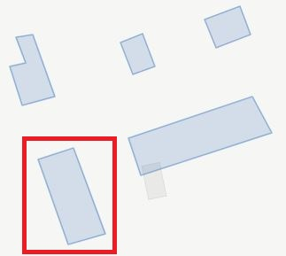
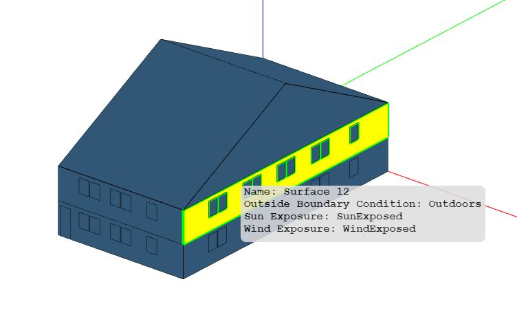

## Building Types

Currently, the following residential building types are supported:

- [Single-Family Detached](#single-family-detached)
- [Single-Family Attached](#single-family-attached)
- [Low-Rise Multifamily](#low-rise-multifamily)[^1]

Only the [Baseline Scenario](../../resources/scenarios/baseline.md) and [High Efficiency Scenario](../../resources/scenarios/highefficiency.md) are supported at this time; any additional mappers will need to be updated manually.

Note that the modeling capabilities for these building types are currently in Beta mode.
This means that testing and development is still in progress, and user feedback is welcome.

[^1]: Mid-Rise and High-Rise Multifamily building prototypes can be found in the commercial building workflows).

### Single-Family Detached

Consider the highlighted "Single-Family Detached" building footprint with the following high-level URBANopt<sup>&trade;</sup> GeoJSON inputs:

* 1 story above ground
* unvented crawlspace foundation
* vented attic
* 2 car garage


An example 3D rendering of the single-family detached building is shown below.


Note that the footprint of the modeled unit, less the garage, is always rectangular even though the GeoJSON footprint may not be.
See [Assumptions](other_details#assumptions) for more information.

The 3D building surfaces stored in HPXML and OSM models represent the area and orientation of ground and exterior exposure of surfaces, but do not represent their position relative to each other.
An example geometry rendering for a translated HPXML file is given below.


An example "Single-Family Detached" building feature snippet is shown below.

  ```json
  {
    "type": "Feature",
    "properties": {
      "id": "14",
      "name": "Residential 1",
      "type": "Building",
      "building_type": "Single-Family Detached",
      "floor_area": 3055,
      "footprint_area": 3055,
      "number_of_stories_above_ground": 1,
      "number_of_stories": 1,
      "number_of_bedrooms": 3,
      "foundation_type": "crawlspace - unvented",
      "attic_type": "attic - vented",
      "system_type": "Residential - furnace and central air conditioner",
      "heating_system_fuel_type": "natural gas",
      "onsite_parking_fraction": 1,
      "template": "Residential IECC 2015 - Customizable Template Sep 2020"
    }
  ```

### Single-Family Attached

Consider the highlighted "Single-Family Attached" building footprint with the following high-level URBANopt<sup>&trade;</sup> GeoJSON inputs:

* 2 stories above ground
* slab foundation
* vented attic
* 4 living units
* no rear units



The number of living units are used to determine the position (i.e., horizontal location) of individual living units contained in the building.
By determining the position of individual units relative the whole building, types and boundary conditions of surfaces (e.g., adiabatic) can be stored in the HPXML.

Example 3D renderings for a single unit from the building is shown below.
This unit is designated as having a "Right" horizontal location (when viewing from the front).
You can see outside boundary conditions of "Outdoors" on one facade, and "Adiabatic" on the opposite facade.




Note that the footprint of the modeled unit is always rectangular even though the GeoJSON footprint may not be.
See [Assumptions](other_details#assumptions) for more information.

For each unit of the building, an HPXML and OSM model is constructed.
These OSM models are merged into a single OSM model, as shown below.


An example "Single-Family Attached" building feature snippet is shown below.

  ```json
  {
      "id": "17",
      "name": "Residential 4",
      "type": "Building",
      "building_type": "Single-Family Attached",
      "floor_area": 18320,
      "footprint_area": 9160,
      "number_of_stories_above_ground": 2,
      "number_of_stories": 2,
      "number_of_bedrooms": 6,
      "foundation_type": "slab",
      "attic_type": "attic - vented",
      "system_type": "Residential - furnace and room air conditioner",
      "heating_system_fuel_type": "fuel oil",
      "number_of_residential_units": 4,
      "template": "Residential IECC 2015 - Customizable Template Sep 2020"
    }
  ```

### Low-Rise Multifamily

Consider the highlighted "Low-Rise Multifamily" building footprint with the following high-level URBANopt<sup>&trade;</sup> GeoJSON inputs:

* 2 stories above ground
* slab foundation
* flat roof
* 8 living units
* double exterior corridor


The number of living units and stories above ground are used to determine the position (i.e., horizontal location and vertical level) of individual living units contained in the building.
By determining the position of individual units relative the whole building, types and boundary conditions of surfaces (e.g., adiabatic) can be stored in the HPXML.

Example 3D renderings for a single unit from the building is shown below.
This unit is designated as having a "Left" horizontal location and a "Top" vertical level (when viewing from the front).
You can see outside boundary conditions of "Outdoors" on the roof and one facade, and "Adiabatic" on the floor and opposite facade.


Note that the footprint of the modeled unit is always rectangular even though the GeoJSON footprint may not be.
See [Assumptions](other_details#assumptions) for more information.

For each unit of the building, an HPXML and OSM model is constructed.
These OSM models are merged into a single OSM model, as shown below.


An example "Low-Rise Multifamily" building feature snippet is shown below.

  ```json
  {
    "type": "Feature",
    "properties": {
      "id": "18",
      "name": "Residential 5",
      "type": "Building",
      "building_type": "Multifamily",
      "floor_area": 28636,
      "footprint_area": 14318,
      "number_of_stories_above_ground": 2,
      "number_of_stories": 2,
      "number_of_bedrooms": 16,
      "foundation_type": "slab",
      "attic_type": "flat roof",
      "system_type": "Residential - furnace and room air conditioner",
      "heating_system_fuel_type": "wood",
      "number_of_residential_units": 8,
      "template": "Residential IECC 2015 - Customizable Template Sep 2020"
    }
  ```
