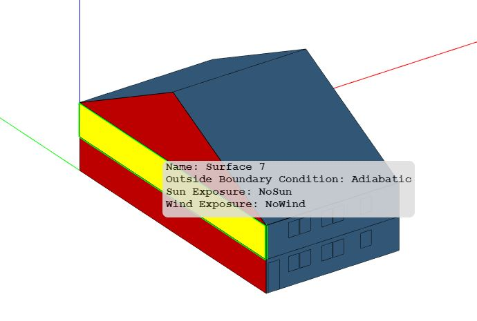
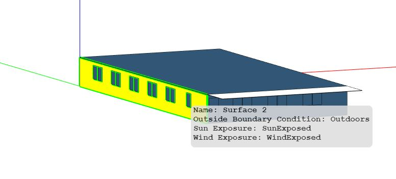

## Building Types

Currently, the following residential building types are supported:

- [Single-Family Detached](#single-family-detached)
- [Single-Family Attached](#single-family-attached)
- [Low-Rise Multifamily](#low-rise-multifamily)[^1]

Only the *Baseline* and *High Efficiency* Scenarios are supported at this time; any additional mappers will need to be updated manually.

Note that the modeling capabilities for these building types are currently in Beta mode.
This means that testing and development is still in progress, and user feedback is welcome.

[^1]: Mid-Rise and High-Rise Multifamily building prototypes can be found in the commercial building workflows).

### Single-Family Detached

Consider the highlighted "Single-Family Detached" building footprint with the following high-level URBANopt<sup>&trade;</sup> GeoJSON inputs:

* 1 story above ground
* unvented crawlspace foundation
* vented attic
* 2 car garage


An example 3D rendering of the single-family detached building is shown below.


Note that the footprint of the modeled unit, less the garage, is always rectangular even though the GeoJSON footprint may not be. See [Other Assumptions](residential_workflows#other-assumptions) for more information.

The 3D building surfaces stored in HPXML and OSM models represent the area and orientation of ground and exterior exposure of surfaces, but do not represent their position relative to each other.
An example geometry rendering for a translated HPXML file is given below.


#### Modeling Notes

- "Single-Family Detached" home models may contain unconditioned non-living spaces that are included as part of the total building area, such as a garage. As a result energy use intensities (EUIs) for homes, often calculated in units of kBtu/sqft/yr, will vary based on the unconditioned floor area if total building area is used for the calculation. Alternatively, conditioned floor area can be used for such calculations.
- "Single-Family Detached" home models may be heated only, cooled only, or both heated and cooled.
  - Partial Conditioning: heating and cooling may be applied to just a portion of the living space of the home or to the entire living space. Representation of partial conditioning of the living space of a home is accomplished by adding ideal air load system to heat and cool the unconditioned portion of the living area. In this situation, district heating or cooling loads may show up in end uses for the home.
  - Undersized Mechanical System: District heating or cooling loads may also show up in end uses when a designed mechanical system cannot meet the load required to maintain thermostat temperatures. An example would be an evaporative cooling system in a hot humid climate.
  - For both the partially conditioned and undersized examples, it is possible for reporting or post processing to filter out these unintended district heating and cooling loads.
- It is important to know, that unlike the commercial models that will result in unmet heating or cooling hours, the residential models will not have any unmet heating or cooling hours. To understand how the HVAC system is conditioning for "Single-Family Detached" home models, users should look at district heating and cooling loads.


#### GeoJSON Schema

The [URBANopt GeoJSON schema](https://github.com/urbanopt/urbanopt-geojson-gem/blob/develop/lib/urbanopt/geojson/schema/building_properties.json) differentiates between sets of required and optional fields for "Single-Family Detached" residential buildings:

Required fields:

|             Field             |     Type     |                                                                                             Enums                                                                                                                     |                                    Notes                                    |
| ----------------------------- | ------------ | --------------------------------------------------------------------------------------------------------------------------------------------------------------------------------------------------------------------- | --------------------------------------------------------------------------- |
| floor_area                    | number       |                                                                                                                                                                                                                       | Total conditioned floor area.                                               |
| footprint_area                | number       |                                                                                                                                                                                                                       | First floor conditioned floor area.                                         |
| number_of_stories_above_ground| integer      |                                                                                                                                                                                                                       |                                                                             |
| number_of_stories             | integer      |                                                                                                                                                                                                                       | Includes foundations.                                                       |
| number_of_bedrooms            | integer      |                                                                                                                                                                                                                       | Must be > 0.                                                                |
| foundation_type               | string       | (1) slab<br>(2) crawlspace - vented<br>(3) crawlspace - unvented<br>(4) crawlspace - conditioned<br>(5) basement - unconditioned<br>(6) basement - conditioned<br>(7) ambient                                         |                                                                             |
| attic_type                    | string       | (1) attic - vented<br>(2) attic - unvented<br>(3) attic - conditioned<br>(4) flat roof                                                                                                                                | Stories > 1 for conditioned attics.                                         |

Optional fields:

|             Field             |     Type     |                                                                                             Enums                                                                                                                                 |                                    Notes                                    |
| ----------------------------- | ------------ | --------------------------------------------------------------------------------------------------------------------------------------------------------------------------------------------------------------------------------- | --------------------------------------------------------------------------- |
| roof_type                     | string       | (1) Gable<br>(2) Hip                                                                                                                                                                                                              | NA when attic type is flat roof.                                            |
| occupancy_calculation_type    | string       | (1) asset<br>(2) operational                                                                                                                                                                                                      |                                                                             |
| number_of_occupants           | integer      |                                                                                                                                                                                                                                   | For operational calculations.                                               |
| system_type                   | string       | (1) electric resistance<br>(2) furnace<br>(3) boiler<br>(4) central air conditioner<br>(5) room air conditioner<br>(6) evaporative cooler<br>(7) air-to-air heat pump<br>(8) mini-split heat pump<br>(9) ground-to-air-heat-pump  |                                                                             |
| heating_system_fuel_type      | string       | (1) electricity<br>(2) natural gas<br>(3) fuel oil<br>(4) propane<br>(5) wood                                                                                                                                                     |                                                                             |
| onsite_parking_fraction       | number       | (1) No (0)<br>(2) Yes (1)                                                                                                                                                                                                         |                                                                             |
| template                      | string       |                                                                                                                                                                                                                                   | See [Customizable Template](residential_workflows#customizable-template)    |
| hpxml_directory               | string       |                                                                                                                                                                                                                                   | Relative to xml_building. Most required fields are then optional.           |

An example "Single-Family Detached" building feature snippet is shown below.

  ```json
  {
    "type": "Feature",
    "properties": {
      "id": "14",
      "name": "Residential 1",
      "type": "Building",
      "building_type": "Single-Family Detached",
      "floor_area": 3055,
      "footprint_area": 3055,
      "number_of_stories_above_ground": 1,
      "number_of_stories": 1,
      "number_of_bedrooms": 3,
      "foundation_type": "crawlspace - unvented",
      "attic_type": "attic - vented",
      "system_type": "Residential - furnace and central air conditioner",
      "heating_system_fuel_type": "natural gas",
      "onsite_parking_fraction": 1,
      "template": "Residential IECC 2015 - Customizable Template Sep 2020"
    }
  ```

### Single-Family Attached

Consider the highlighted "Single-Family Attached" building footprint with the following high-level URBANopt<sup>&trade;</sup> GeoJSON inputs:

* 2 stories above ground
* slab foundation
* vented attic
* 4 living units
* no rear units


The number of living units are used to determine the position (i.e., horizontal location) of individual living units contained in the building.
By determining the position of individual units relative the whole building, types and boundary conditions of surfaces (e.g., adiabatic) can be stored in the HPXML.

Example 3D renderings for a single unit from the building is shown below.
This unit is designated as having a "Right" horizontal location (when viewing from the front).
You can see outside boundary conditions of "Outdoors" on one facade, and "Adiabatic" on the opposite facade.




Note that the footprint of the modeled unit is always rectangular even though the GeoJSON footprint may not be. See [Other Assumptions](residential_workflows#other-assumptions) for more information.

For each unit of the building, an HPXML and OSM model is constructed.
These OSM models are merged into a single OSM model, as shown below.


#### Modeling Notes

- "Single-Family Attached" home models may be heated only, cooled only, or both heated and cooled.
  - Partial Conditioning: heating and cooling may be applied to just a portion of the living space of the home or to the entire living space. Representation of partial conditioning of the living space of a home is accomplished by adding ideal air load system to heat and cool the unconditioned portion of the living area. In this situation, district heating or cooling loads may show up in end uses for the home.
  - Undersized Mechanical System: District heating or cooling loads may also show up in end uses when a designed mechanical system cannot meet the load required to maintain thermostat temperatures. An example would be an evaporative cooling system in a hot humid climate.
  - For both the partially conditioned and undersized examples, it is possible for reporting or post processing to filter out these unintended district heating and cooling loads.
- It is important to know, that unlike the commercial models that will result in unmet heating or cooling hours, the residential models will not have any unmet heating or cooling hours. To understand how the HVAC system is conditioning for "Single-Family Attached" home models, users should look at district heating and cooling loads.


#### GeoJSON Schema

The [URBANopt GeoJSON schema](https://github.com/urbanopt/urbanopt-geojson-gem/blob/develop/lib/urbanopt/geojson/schema/building_properties.json) differentiates between sets of required and optional fields for "Single-Family Attached" residential buildings:

Required fields:

|             Field             |     Type     |                                                                                             Enums                                                                                                                 |                                    Notes                                    |
| ----------------------------- | ------------ | ----------------------------------------------------------------------------------------------------------------------------------------------------------------------------------------------------------------- | --------------------------------------------------------------------------- |
| floor_area                    | number       |                                                                                                                                                                                                                   | Total conditioned floor area.                                               |
| footprint_area                | number       |                                                                                                                                                                                                                   | First floor conditioned floor area.                                         |
| number_of_stories_above_ground| integer      |                                                                                                                                                                                                                   |                                                                             |
| number_of_stories             | integer      |                                                                                                                                                                                                                   | Includes foundations.                                                       |
| number_of_residential_units   | integer      |                                                                                                                                                                                                                   |                                                                             |
| number_of_bedrooms            | integer      |                                                                                                                                                                                                                   | Must be > 0.                                                                |
| foundation_type               | string       | (1) slab<br>(2) crawlspace - vented<br>(3) crawlspace - unvented<br>(4) crawlspace - conditioned<br>(5) basement - unconditioned<br>(6) basement - conditioned<br>(7) ambient                                     |                                                                             |
| attic_type                    | string       | (1) attic - vented<br>(2) attic - unvented<br>(3) attic - conditioned<br>(4) flat roof                                                                                                                            | Stories > 1 for conditioned attics.                                         |

Optional fields:

|             Field             |     Type     |                                                                                             Enums                                                                                                                                 |                                    Notes                                    |
| ----------------------------- | ------------ | --------------------------------------------------------------------------------------------------------------------------------------------------------------------------------------------------------------------------------- | --------------------------------------------------------------------------- |
| roof_type                     | string       | (1) Gable<br>(2) Hip                                                                                                                                                                                                              | NA when attic type is flat roof.                                            |
| occupancy_calculation_type    | string       | (1) asset<br>(2) operational                                                                                                                                                                                                      |                                                                             |
| number_of_occupants           | integer      |                                                                                                                                                                                                                                   | For operational calculations.                                               |
| system_type                   | string       | (1) electric resistance<br>(2) furnace<br>(3) boiler<br>(4) central air conditioner<br>(5) room air conditioner<br>(6) evaporative cooler<br>(7) air-to-air heat pump<br>(8) mini-split heat pump<br>(9) ground-to-air-heat-pump  |                                                                             |
| heating_system_fuel_type      | string       | (1) electricity<br>(2) natural gas<br>(3) fuel oil<br>(4) propane<br>(5) wood                                                                                                                                                     |                                                                             |
| template                      | string       |                                                                                                                                                                                                                                   | See [Customizable Template](residential_workflows#customizable-template)    |
| hpxml_directory               | string       |                                                                                                                                                                                                                                   | Relative to xml_building. Most required fields are then optional.           |

An example "Single-Family Attached" building feature snippet is shown below.

  ```json
  {
      "id": "17",
      "name": "Residential 4",
      "type": "Building",
      "building_type": "Single-Family Attached",
      "floor_area": 18320,
      "footprint_area": 9160,
      "number_of_stories_above_ground": 2,
      "number_of_stories": 2,
      "number_of_bedrooms": 6,
      "foundation_type": "slab",
      "attic_type": "attic - vented",
      "system_type": "Residential - furnace and room air conditioner",
      "heating_system_fuel_type": "fuel oil",
      "number_of_residential_units": 4,
      "template": "Residential IECC 2015 - Customizable Template Sep 2020"
    }
  ```

### Low-Rise Multifamily

Consider the highlighted "Low-Rise Multifamily" building footprint with the following high-level URBANopt<sup>&trade;</sup> GeoJSON inputs:

* 2 stories above ground
* slab foundation
* flat roof
* 8 living units
* double exterior corridor


The number of living units and stories above ground are used to determine the position (i.e., horizontal location and vertical level) of individual living units contained in the building.
By determining the position of individual units relative the whole building, types and boundary conditions of surfaces (e.g., adiabatic) can be stored in the HPXML.

Example 3D renderings for a single unit from the building is shown below.
This unit is designated as having a "Left" horizontal location and a "Top" vertical level (when viewing from the front).
You can see outside boundary conditions of "Outdoors" on the roof and one facade, and "Adiabatic" on the floor and opposite facade.





Note that the footprint of the modeled unit is always rectangular even though the GeoJSON footprint may not be. See [Other Assumptions](residential_workflows#other-assumptions) for more information.

For each unit of the building, an HPXML and OSM model is constructed.
These OSM models are merged into a single OSM model, as shown below.


#### Modeling Notes

- "Low-Rise Multifamily" home models may be heated only, cooled only, or both heated and cooled.
  - Partial Conditioning: heating and cooling may be applied to just a portion of the living space of the home or to the entire living space. Representation of partial conditioning of the living space of a home is accomplished by adding ideal air load system to heat and cool the unconditioned portion of the living area. In this situation, district heating or cooling loads may show up in end uses for the home.
  - Undersized Mechanical System: District heating or cooling loads may also show up in end uses when a designed mechanical system cannot meet the load required to maintain thermostat temperatures. An example would be an evaporative cooling system in a hot humid climate.
  - For both the partially conditioned and undersized examples, it is possible for reporting or post processing to filter out these unintended district heating and cooling loads.
- It is important to know, that unlike the commercial models that will result in unmet heating or cooling hours, the residential models will not have any unmet heating or cooling hours. To understand how the HVAC system is conditioning for "Low-Rise Multifamily" home models, users should look at district heating and cooling loads.


#### GeoJSON Schema

The [URBANopt GeoJSON schema](https://github.com/urbanopt/urbanopt-geojson-gem/blob/develop/lib/urbanopt/geojson/schema/building_properties.json) differentiates between sets of required and optional fields for "Low-Rise Multifamily" residential buildings:

Required fields:

|             Field             |     Type     |                                                                                             Enums                                                                                                                             |                                    Notes                                    |
| ----------------------------- | ------------ | ----------------------------------------------------------------------------------------------------------------------------------------------------------------------------------------------------------------------------- | --------------------------------------------------------------------------- |
| floor_area                    | number       |                                                                                                                                                                                                                               | Total conditioned floor area.                                               |
| footprint_area                | number       |                                                                                                                                                                                                                               | First floor conditioned floor area.                                         |
| number_of_stories_above_ground| integer      |                                                                                                                                                                                                                               |                                                                             |
| number_of_stories             | integer      |                                                                                                                                                                                                                               | Includes foundations.                                                       |
| number_of_residential_units   | integer      |                                                                                                                                                                                                                               | Divisible by stories.                                                       |
| number_of_bedrooms            | integer      |                                                                                                                                                                                                                               | Must be > 0.                                                                |
| foundation_type               | string       | (1) slab<br>(2) crawlspace - vented<br>(3) crawlspace - unvented<br>(4) basement - unconditioned<br>(5) ambient                                                                                                               | Invalid:<br>(1) crawlspace - conditioned<br>(2) basement - conditioned      |
| attic_type                    | string       | (1) attic - vented<br>(2) attic - unvented<br>(3) flat roof                                                                                                                                                                   | Invalid:<br>(1) attic - conditioned                                         |

Optional fields:

|             Field             |     Type     |                                                                                             Enums                                                                                                                                 |                                    Notes                                    |
| ----------------------------- | ------------ | --------------------------------------------------------------------------------------------------------------------------------------------------------------------------------------------------------------------------------- | --------------------------------------------------------------------------- |
| roof_type                     | string       | (1) Gable<br>(2) Hip                                                                                                                                                                                                              | NA when attic type is flat roof.                                            |
| occupancy_calculation_type    | string       | (1) asset<br>(2) operational                                                                                                                                                                                                      |                                                                             |
| number_of_occupants           | integer      |                                                                                                                                                                                                                                   | For operational calculations.                                               |
| system_type                   | string       | (1) electric resistance<br>(2) furnace<br>(3) boiler<br>(4) central air conditioner<br>(5) room air conditioner<br>(6) evaporative cooler<br>(7) air-to-air heat pump<br>(8) mini-split heat pump<br>(9) ground-to-air-heat-pump  |                                                                             |
| system_type                   | string       | (1) electric resistance<br>(2) furnace<br>(3) boiler<br>(4) central air conditioner<br>(5) room air conditioner<br>(6) evaporative cooler<br>(7) air-to-air heat pump<br>(8) mini-split heat pump<br>(9) ground-to-air-heat-pump  |                                                                             |
| heating_system_fuel_type      | string       | (1) electricity<br>(2) natural gas<br>(3) fuel oil<br>(4) propane<br>(5) wood                                                                                                                                                     |                                                                             |
| template                      | string       |                                                                                                                                                                                                                                   | See [Customizable Template](residential_workflows#customizable-template)    |
| hpxml_directory               | string       |                                                                                                                                                                                                                                   | Relative to xml_building. Most required fields are then optional.           |

An example "Low-Rise Multifamily" building feature snippet is shown below.

  ```json
  {
    "type": "Feature",
    "properties": {
      "id": "18",
      "name": "Residential 5",
      "type": "Building",
      "building_type": "Multifamily",
      "floor_area": 28636,
      "footprint_area": 14318,
      "number_of_stories_above_ground": 2,
      "number_of_stories": 2,
      "number_of_bedrooms": 16,
      "foundation_type": "slab",
      "attic_type": "flat roof",
      "system_type": "Residential - furnace and room air conditioner",
      "heating_system_fuel_type": "wood",
      "number_of_residential_units": 8,
      "template": "Residential IECC 2015 - Customizable Template Sep 2020"
    }
  ```
