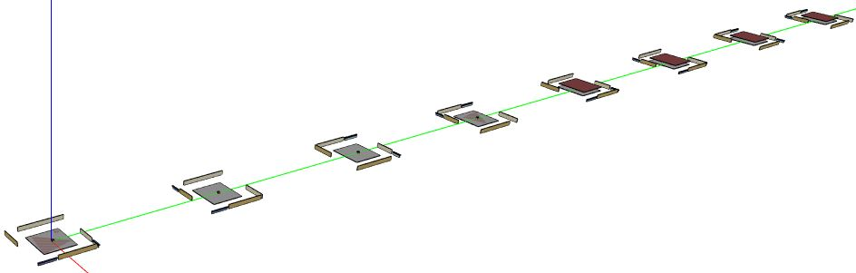

## Low-Rise Multifamily

Consider the highlighted "Low-Rise Multifamily" building footprint with the following high-level URBANopt<sup>&trade;</sup> GeoJSON inputs:

* 2 stories above ground
* slab foundation
* flat roof
* 8 living units
* double exterior corridor


The number of living units and stories above ground are used to determine the position (i.e., horizontal location and vertical level) of individual living units contained in the building.
By determining the position of individual units relative the whole building, types and boundary conditions of surfaces (e.g., adiabatic) can be stored in the HPXML.

Example 3D renderings for a single unit from the building is shown below.
This unit is designated as having a "Left" horizontal location and a "Top" vertical level (when viewing from the front).
You can see outside boundary conditions of "Outdoors" on the roof and one facade, and "Adiabatic" on the floor and opposite facade.


Note that the footprint of the modeled unit is always rectangular even though the GeoJSON footprint may not be. See [Other Assumptions](residential_workflows#other-assumptions) for more information.

For each unit of the building, an HPXML and OSM model is constructed.
These OSM models are merged into a single OSM model, as shown below.




### Modeling Notes

- "Low-Rise Multifamily" home models may be heated only, cooled only, or both heated and cooled. 
  - Partial Conditioning: heating and cooling may be applied to just a portion of the living space of the home or to the entire living space. Representation of partial conditioning of the living space of a home is accomplished by adding ideal air load system to heat and cool the unconditioned portion of the living area. In this situation, district heating or cooling loads may show up in end uses for the home.
  - Undersized Mechanical System: District heating or cooling loads may also show up in end uses when a designed mechanical system cannot meet the load required to maintain thermostat temperatures. An example would be an evaporative cooling system in a hot humid climate. 
  - For both the partially conditioned and undersized examples, it is possible for reporting or post processing to filter out these unintended district heating and cooling loads.
- It is important to know, that unlike the commercial models that will result in unmet heating or cooling hours, the residential models will not have any unmet heating or cooling hours. To understand how the HVAC system is conditioning for "Low-Rise Multifamily" home models, users should look at district heating and cooling loads.


### GeoJSON Schema

The [URBANopt GeoJSON schema](https://github.com/urbanopt/urbanopt-geojson-gem/blob/develop/lib/urbanopt/geojson/schema/building_properties.json) differentiates between sets of required and optional fields for "Low-Rise Multifamily" residential buildings:

Required fields:

|             Field             |     Type     |                                                                                             Enums                                                                                                                             |                                    Notes                                    |
| ----------------------------- | ------------ | ----------------------------------------------------------------------------------------------------------------------------------------------------------------------------------------------------------------------------- | --------------------------------------------------------------------------- |
| floor_area                    | number       |                                                                                                                                                                                                                               | Conditioned floor area.                                                     |
| number_of_stories_above_ground| integer      |                                                                                                                                                                                                                               |                                                                             |
| number_of_stories             | integer      |                                                                                                                                                                                                                               | Includes foundations.                                                       |
| number_of_residential_units   | integer      |                                                                                                                                                                                                                               | Divisible by stories.                                                       |
| number_of_bedrooms            | integer      |                                                                                                                                                                                                                               | Must be > 0.                                                                |
| foundation_type               | string       | (1) slab<br>(2) crawlspace - vented<br>(3) crawlspace - unvented<br>(4) basement - unconditioned                                                                                                                              | Invalid:<br>(1) basement - conditioned<br>(2) ambient                       |
| attic_type                    | string       | (1) flat roof                                                                                                                                                                                                                 |                                                                             |

Optional fields:

|             Field             |     Type     |                                                                                             Enums                                                                                                                                 |                                    Notes                                    |
| ----------------------------- | ------------ | --------------------------------------------------------------------------------------------------------------------------------------------------------------------------------------------------------------------------------- | --------------------------------------------------------------------------- |
| system_type                   | string       | (1) electric resistance<br>(2) furnace<br>(3) boiler<br>(4) central air conditioner<br>(5) room air conditioner<br>(6) evaporative cooler<br>(7) air-to-air heat pump<br>(8) mini-split heat pump<br>(9) ground-to-air-heat-pump  |                                                                             |
| heating_system_fuel_type      | string       | (1) electricity<br>(2) natural gas<br>(3) fuel oil<br>(4) propane<br>(5) wood                                                                                                                                                     |                                                                             |
| template                      | string       |                                                                                                                                                                                                                                   | See [Customizable Template](residential_workflows#customizable-template) |

An example "Low-Rise Multifamily" building feature snippet is shown below.

  ```json
  {
    "type": "Feature",
    "properties": {
      "id": "18",
      "name": "Residential 5",
      "type": "Building",
      "building_type": "Multifamily",
      "floor_area": 28636,
      "footprint_area": 14318,
      "number_of_stories_above_ground": 2,
      "number_of_stories": 2,
      "number_of_bedrooms": 16,
      "foundation_type": "slab",
      "attic_type": "flat roof",
      "system_type": "Residential - furnace and room air conditioner",
      "heating_system_fuel_type": "wood",
      "number_of_residential_units": 8,
      "template": "Residential IECC 2015 - Customizable Template Sep 2020"
    }
  ```
