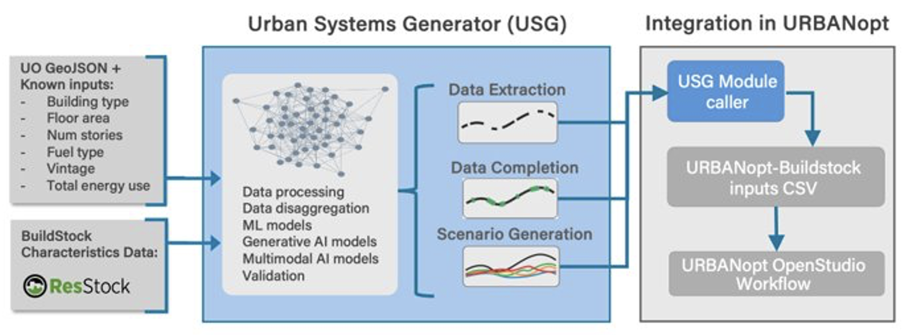

# URBANopt&trade; - Urban Systems Generator (USG) Integration

**Alpha Version** - This documentation covers the initial test capability for URBANopt-USG integration. The current implementation provides basic data gap filling for URBANopt residential modeling workflows using a single generalized machine learning (ML) model. Future versions may also address URBANopt commercial building workflows and may include localized models, generative artificial intelligence (AI) for scenario generation, and advanced multi-modal capabilities.  

## Overview

The Urban Systems Generator (USG) integration streamlines district-scale energy modeling in URBANopt by addressing the core challenge of data-intensive bottom-up model setup. USG uses ML and AI models to fill data gaps in building characteristics by predicting missing URBANopt-BuildStock parameters required for simulation. 

This integration leverages NLR’s BuildStock dataset to train data-driven models that learn the relationships between building characteristics and their direct mappings. This model is utilized here to infer missing characteristics from a set of known characteristics to characterize a baseline URBANopt model. 

 

## How It Works 

The USG integration provides a **two-step workflow** that gives users control over their building data: 


| Step | Command | Description | 
|------|---------|-------------| 
| 1 | `uo usg_preprocess` | Extract known characteristics from GeoJSON to CSV format | 
| 2 | `uo usg_complete` | Fill missing characteristics using ML and post-process for URBANopt | 

This separation allows users to review and manually add any known building characteristics before running the completion step. 

### Step 1: Generate CSV from GeoJSON 

#### Command

```bash 
uo usg_preprocess --feature <path-to-geojson> 
``` 
#### What It Does 

This command reads your URBANopt GeoJSON file and extracts known building characteristics into a CSV format compatible with the BuildStock schema. 

#### Input 

Your existing URBANopt GeoJSON file containing building features with known properties such as: 

- Building type 

- Floor area 

- Number of stories 

- Fuel type 

- Vintage/year built 

- Total energy use 

#### Output 

A CSV file (default: `uo_buildstock_input.csv`) with columns following the BuildStock schema (defined in `options_lookup.tsv`). 

#### User Action: Add Known Characteristics (Optional) 

After generating the CSV, you can **manually add any additional known characteristics** for your buildings. Open the CSV in a spreadsheet application and fill in values for any parameters you know. 

**Important:** All values must follow the BuildStock schema. 

Valid options for each parameter are defined in the `options_lookup.tsv` file, located at `<URBANopt_project_directory>/resources/residential-measures/resources`. 

Example characteristics you might add: 

- HVAC system types 
- Insulation levels   
- Window types 
- Water heater specifications 
- Specific vintage details 

### Step 2: Complete Missing Characteristics 

#### Command 

```bash 
uo usg_complete --input <path-to-csv> --output <output-path> 
``` 

#### What It Does 

This command performs two operations: 

1. **ML Inference** - Uses a pretrained model trained on the complete BuildStock dataset to predict missing building characteristics based on known inputs 

2. **Post-Processing** - Validates and corrects cross-field dependencies to ensure the output is compatible with URBANopt-BuildStock simulations 

#### Input 

1. The CSV file from Step 1 (with any manual additions you made).  
2. The name of the output file that will be generated. This is optional; if no filename is provided, the input file + '_complete' will be used.
3. The existing URBANopt GeoJSON file.

#### Output 

A complete `uo_buildstock_mapping.csv` file ready for URBANopt simulation, containing all required BuildStock parameters for each building. 

#### About the ML Model 

The current alpha version uses a **single generalized neural network** trained on the entire ResStock dataset. This model: 

- Learns relationships between building characteristics from the ResStock dataset 
- Handles arbitrary combinations of known/unknown inputs 
- Predicts the most likely values for missing characteristics 

**Potential Future Versions:** Upcoming releases may incorporate: 

- Localized models trained on regional building data 
- State-specific and climate-zone-specific models 
- Generative AI models for "what-if" scenario generation 
- Multi-modal models combining multiple data sources 
- Target-driven scenario generation (conditional generation, e.g., conditioned on target energy use and fixed building characteristics while flexing building systems/properties that users intend to upgrade) 

This is an alpha release. We encourage users who are testing these alpha capabilities to provide feedback and suggestions regarding the capabilities, as well as feedback regarding which of the potential future capabilities described above may be most useful for your projects and use cases. Please report issues and/or submit feedback via [GitHub issues](https://github.com/urbanopt/urbanopt-cli/issues).

### Step 3: Run URBANopt Simulation 

After completing the USG workflow, configure your URBANopt project to use the generated building characteristics. 

#### Configure GeoJSON 

Add the following keys to your GeoJSON file under the `"project"` section, replacing "uo_buildstock_mapping_csv_path" with the path to the BUILDSTOCK generated  

```json 
{ 
  "project": { 

    "characterize_residential_buildings_from_buildstock_csv": true, 

    "uo_buildstock_mapping_csv_path": "uo_buildstock_mapping_csv_path" 
  } 
} 
``` 

#### Key Configuration 

| Key | Value | Description | 
|-----|-------|-------------| 
| `characterize_residential_buildings_from_buildstock_csv` | `true` | Enables BuildStock characterization from CSV | 
| `uo_buildstock_mapping_csv_path` | Path to CSV | Relative path to your USG-generated mapping file | 

#### Run Simulation 

With the configuration in place, run your URBANopt workflow as usual: 

```bash 
uo run --feature <uo_geojson_file> --scenario <scenario_csv> 
``` 

URBANopt will automatically use the building characteristics from your USG-generated CSV to configure the residential building models. 

## Complete Workflow Example 

```bash 
# Step 1: Generate CSV from your GeoJSON 
uo usg_preprocess --feature <uo_geojson_feature_file>

# (Optional) Edit uo_buildstock_input.csv to add known characteristics 

# Step 2: Complete missing characteristics 
uo usg_complete --input uo_buildstock_input.csv --output resources/uo_buildstock_mapping.csv --feature <uo_geojson_feature_file>

# Step 3: Update your GeoJSON project configuration with the output filename (see Step 3 above) 

# Step 4: Run URBANopt simulation 
uo run --feature <uo_geojson_file> --scenario <scenario_csv> 
``` 

## File Reference 

| File | Description | 
|------|-------------| 
| `uo_buildstock_input.csv` | Intermediate CSV with known characteristics (output of Step 1) | 
| `uo_buildstock_mapping.csv` | Complete CSV ready for simulation (output of Step 2) | 
| `options_lookup.tsv` | BuildStock schema reference - valid options for all parameters | 
| `consistency_rules.json` | Cross-field validation rules utilized for post-processing | 

## Validation and Quality Assurance 

The USG post-processor automatically: 

- **Validates schema compliance** - Ensures all values match allowed BuildStock options 

- **Enforces cross-field consistency** - Corrects logical dependencies between related parameters 

While the alpha URBANopt-USG workflows can be used to help predict unknown input values, it is important for the users to always review such inputs and consider their potential inaccuracies given the users’ understanding of the project-specific buildings and technologies being analyzed,  local context/constraints, etc. Simulation outputs should also be reviewed, as usual, to help identify potential issues and refine results. 

## Troubleshooting 

### Common Issues 

**Invalid option values in CSV** 

- Ensure all manually-entered values exactly match options in `options_lookup.tsv` 

- Check for typos and case sensitivity 

**Simulation errors after USG completion** 

- Verify the post-processor ran successfully 

- Check that GeoJSON configuration points to the correct CSV path 

**Missing characteristics not filled** 

- Ensure input CSV has at least some known characteristics (building type, floor area, etc.) 

- The model performs better with more known inputs 

## Additional Resources 

- [USG Presentation](https://www.nlr.gov/docs/fy26osti/95402.pdf) 

- [USG Repository](https://github.com/NatLabRockies/urban-system-generator) 