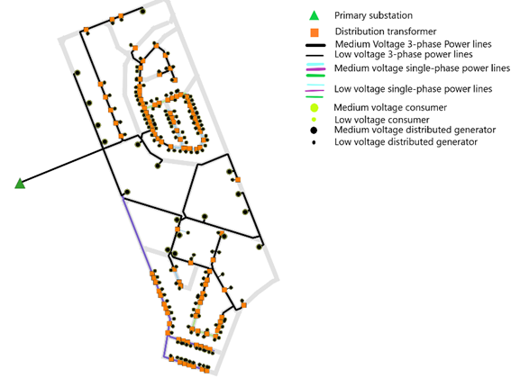
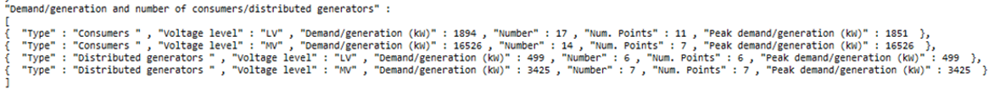
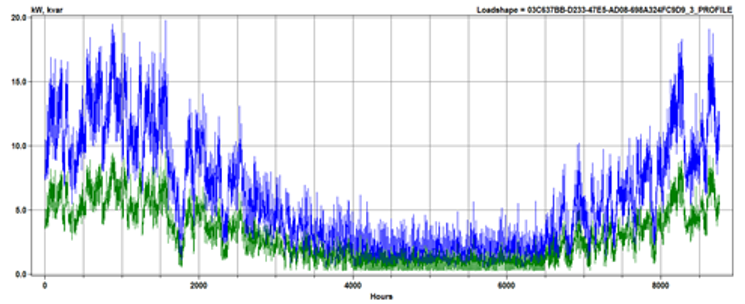

# RNM Analysis

RNM (Reference Network Model) is an electrical distribution system planning tool. The US-compatible version of RNM, RNM-US, can be used to design a cost-effective synthetic distribution system to serve consumers in a district, considering the connection of distributed energy resources (DERs).

## Usage

The RNM functionality is available via the `rnm` URBANopt CLI command. For in-terminal help:
```bash
uo rnm --help
```

An example:
1. Create an rnm example project by including the `-t` flag (or --streets) to include streets in the FeatureFile:

	```bash
	uo create --project-folder <path/to/new/project> --streets
	```

1. Run the project as you normally would, making sure you use the streets feature file, and a scenario file created from it.

	```bash
	uo run --feature <path/to/streets/FEATUREFILE.json> --scenario <path/to/SCENARIOFILE.csv>
	```
1. Post-process using the default post-processor to generate the feature_reports used by the RNM workflow.

	```bash
	uo process --default --feature <path/to/streets/FEATUREFILE.json> --scenario <path/to/SCENARIOFILE.csv>
	```
	**RNM supports both the basic workflow and the REopt feature optimization functionality.** If you would like to include REopt results, also post-process the project with the `--reopt-feature` option.

	```bash
	uo process --reopt-feature --feature <path/to/streets/FEATUREFILE.json> --scenario <path/to/SCENARIOFILE.csv>
	```

1. Use the `rnm` command to run the RNM analysis.  You can access the list of options and guidance with the following command:

	```bash
	uo rnm -h
	```

	The CLI options are:
	- `--scenario` &mdash; Required, Path to scenario csv file
	- `--feature` &mdash; Required, Path to feature json file
	- `--reopt` &mdash; Optional, Use to specify a run with additional REopt functionality.
	- `--extended-catalog` &mdash; Optional, Use to specific the path to the extended electrical catalog to use in the analysis. Do not include this option if you want to use the default catalog.
	- `--average-peak-catalog` &mdash; Optional, Use to specific the path to the average peak catalog to use in the analysis. Do not include this option if you want to use the default catalog.
	- `--opendss` &mdash; Optional, If specified, an OpenDSS-compatible electrical database will be created for use in future OpenDSS analyses.

	An example rnm usage:

	```bash
	uo rnm --feature <path/to/streets/FEATUREFILE.json> --scenario <path/to/SCENARIOFILE.csv>
	```

Visit the [Getting Started page](../getting_started/getting_started) for detailed usage examples.

** Note:** There is a 2000 building size limit for RNM-US. 

## RNM-US

RNM (Reference Network Model) has primarily been used to build synthetic or representative distribution grids and assess the impact of distributed energy resources in European distribution systems. However, given the unique features that characterize U.S. distribution systems, a version of RNM customized to U.S. characteristic features (namely RNM-US) was developed by Comillas Pontifical University.

RNM-US is a tool capable of designing a cost-effective synthetic distribution system to serve consumers in a district, considering the connection of distributed energy resources (DERs). RNM-US follows a bottom-up approach, starting with the design of the low-voltage (LV) system. First, distribution transformers are sized and placed. The LV network is then built to connect them to the LV loads. The same approach is followed to build the medium-voltage (MV) system: sizing and placing primary substations and then creating the MV network to connect them to distribution transformers and MV loads. The inputs considered by RNM-US to design synthetic distribution network systems are the street map layout, along with the location and power demand / power generation planning profiles of every building, and an electric catalog with the equipment available to the model, as well as techno-economic parameters. In its modeling calculations, RNM-US aims to meet the power requirements of consumers while considering technical, geographical, and reliability constraints and it provides a very detailed design for small- and medium-scale network planning. RNM-US can be used as a benchmark to evaluate the cost of the electricity infrastructure required to supply consumers in a district.

RNM-US generates network results and provides three different types of outputs:

1. 	**Graphical**: It displays the synthetic network layout modeled in GIS (Geographical Information System) files, and respects the layout of streets.
1.	**Technical and Economic**: It provides a summary and breakdown of costs and sizes of the resulting network components.
1.	**Power Flow**: It generates OpenDSS models, which can be used to analyze the correct operation of the resulting distribution systems.

The figure below provides an overview of the workflow in RNM-US.


## URBANopt RNM-US Gem

To interface with the RNM-US tool, URBANopt converts its output results into inputs for RNM-US. The URBANopt RNM-US Gem consists of a module that generates RNM-US input files representing the street map, the location and power demand / power generation planning profiles of every building, and the “electric catalog” required by the RNM-US tool from the URBANopt outputs.

This module can be run either with or without having previously run the URBANopt REopt workflow, which provides the hourly operation of DERs in the district. Therefore, the network generated can either include or exclude DERs.

A figure showing the workflow of the URBANopt RNM-US Gem is presented below, highlighting the connection between the URBANopt modules, the URBANopt RNM-US Gem, and the RNM-US tool.


### Input Files to the URBANopt RNM-US Gem

In order to generate the RNM-US input files, an URBANopt scenario must be setup, run, and post-processed. In cases where DER integration is considered, the scenario would also need to be post-processed with REopt feature optimization to obtain the hourly energy consumption/generation of each building.

As mentioned above, the RNM-US workflow needs as inputs **street map information** of the district where the distribution network is to be designed, **buildings energy consumptions and generations** in the temporal window considered by the URBANopt simulations, and the **extended catalog**.

The street map information, including the buildings and the primary substation locations are provided by the URBANopt GeoJSON Feature File. This file contains all the relevant geographical information of the considered district, which can be parsed by the URBANopt RNM-US Gem to create the electricity distribution network.

Power consumption for all buildings can be found in the URBANopt scenario run directory. A CSV file is generated for each building in the simulated scenario, providing predicted energy consumption information in the considered temporal window (e.g. hourly values for a year), and including the electricity demand expressed as active and apparent power. The buildings' electricity demand is parsed by the URBANopt RNM-US Gem and processed to create the needed parameters.

To include DERs in the analysis, the URBANopt RNM-US Gem parses the DERs information (e.g. PV and battery hourly operation) contained in each building's “feature_optimization.csv” files generated by the URBANopt REopt workflow. It must be mentioned that the current capabilities of the URBANopt RNM-US Gem include only the possibility to parse DER information from the REopt feature optimization (`--reopt-feature`), since RNM-US needs to have the location information of each consumer/generator included in the simulation. Therefore, the "scenario REopt optimization", which aims to size and operate the DER for the whole district and not individually for each building, cannot be supported and connected to the RNM-US Gem, since it does not provide locational information of the DER systems.

Lastly, the URBANopt RNM-US Gem requires as input the “extended_catalog.json” file. This is a JSON file including all the electric equipment and parameters which can be accessed by both the URBANopt RNM-US Gem and URBANopt OpenDSS Gem to plan and model operation of the distribution network. Moreover, each section of this file can be freely modified by the user, according to their specific needs. A [default catalog](https://github.com/urbanopt/urbanopt-rnm-us-gem/blob/develop/catalogs/extended_catalog.json) is included in the RNM-US Gem.

**Additional Simulation Parameters**

Several parameters can be set in the GeoJSON Feature File to modify the RNM simulation. These parameters should be added to the *project* section of the file.

- **underground_cables_ratio**: Ratio of overall cables that are underground vs. overhead in the analysis. Defaults to 0.9.

- **only_lv_consumers**: Set to true to consider only low voltage consumers in the analysis. Defaults to true.

- **max_number_of_lv_nodes_per_building**: Maximum number of low voltage nodes to represent a single building. Defaults to 1.


### URBANopt RNM-US Gem Intermediate Results

The URBANopt outputs discussed above are used by the RNM-US Gem to generate multiple input files in the format that RNM-US can process. In order to create a synthetic distribution network, RNM-US needs as inputs a set of text files representing the street map of the district, the location, voltage connection and consumption/generation power profiles of each consumer/generator, and a CSV file with the electric catalog used by the model to plan the network. In this version of the RNM-US Gem, batteries are modeled as consumer nodes, having positive values when charging and negative when discharging.

The **street map** is represented as a set of nodes, described by their latitude, longitude and altitude, which have been extrapolated from the GeoJSON feature file. The street map includes all needed street information.

The consumers/generators files, consist of 10 input text files, which are generated by the URBANopt RNM-US Gem, as described below:

- **Consumer.txt** file including the geographical location, id, voltage level, peak active and reactive demand used to plan the network, number of phases for the connection to the grid, floor area, height and yearly energy consumption for each consumer/battery

- **Generators.txt** file including the geographical location, id, installed capacity, peak active and reactive generation used to plan the network and number of phases for the connection to the grid for each generator

- **Cust_profile_p.txt (cust_profile_q.txt)** including the id of the consumer considered, the number of hours used to plan the network, and a set of n numbers equal to the number of hours considered, with the hourly active power (reactive power) used to plan the network for each consumer/battery

- **Gen_profile_p.txt (gen_profile_q.txt)** including the id of the generator considered, the number of hours used to plan the network, and a set of n numbers equal to the number of hours considered, with the hourly active power (reactive power) used to plan the network for each consumer

-	**Cust_profile_p_extendido.txt (cust_profile_q_extendido.txt)** including the active (reactive) power profiles of each consumer/battery for all the hours of the year, enabling operational analysis with the load profiles and the network generated

- **Gen_profile_p_extendido.txt (gen_profile_q_extendido.txt)** including the active (reactive) power profiles of each generator, for all the hours of the year, enabling operational analysis with the generator profiles and the network generated

Lastly, the **`electric_catalog`** file is generated from the “extended_catalog.json” provided in the Gem. This generated file includes all the electric components that can be selected by the RNM-US tool when planning the network.

### RNM-US Outputs Files

The URBANopt RNM-US Gem accesses the RNM-US tool via an API to perform the RNM-US calculations and return/post process results. After the execution, the URBANopt RNM-US Gem produces several outputs that provide **geographical**, **techno-economic** and **operational** information of the network that is modeled.

The RNM-US tool generates a **GeoJSON file** to visualize the layout of the synthetic network that is generated. The figure below shows an example of a network generated for a hypothetical medium-scale district located near Buffalo, NY.



Moreover, the RNM-US tool produces a summary of the distribution network, which contains an overview of the main features of the network. The figure below captures one of the sections included in the “Summary.json” file representing the total demand/generation used for planning the network in kW, as well as the number of nodes representing consumers (including batteries) / generators.



Other relevant sections included in the `Summary.json` file provide insights about the total investment and operational costs of the network for each voltage level and for substations, the total length of each network level and the reliability indexes.

Lastly, the RNM-US tool generates a set of **OpenDSS files** which can be directly run using OpenDSS software to validate the correct operation of the network for each hour of the year, evaluating, for instance, voltage deviations, power losses and congestions. The figure below provides an example of a loadshape file generated by the RNM-US tool, which consists of the yearly active (blue) and reactive (green) power demand profile of a consumer. This can be used as input in OpenDSS to verify the hourly operation of the network according to the power loads required.



These output files can be found in an URBANopt project's scenario directory under `rnm-us/results` after running the RNM functionality.

### URBANopt Reporting

RNM results are integrated back into the URBANopt report files as follows:

- Statistics from the RNM-US `Summary.json` file are post-processed into the scenario report.  They can be found in the scenario run directory, in a file called `scenario_report_rnm.json`.  The results are collected in the `rnm_results` section of the report and include:

	- demand generationplanning information such as number of nodes of each type in the network and their peak demand
	- electrical lines length for low and medium voltages
	- distribution transformers capacity
	- investment and maintenance costs
	- reliability indexes


- The distribution system features created by the RNM-US tool are added back to the GeoJSON feature file.  They can be found in the scenario run directory, in a file called `feature_file_rnm.json` and can be visualized on the [geojson.io website](https://geojson.io).
