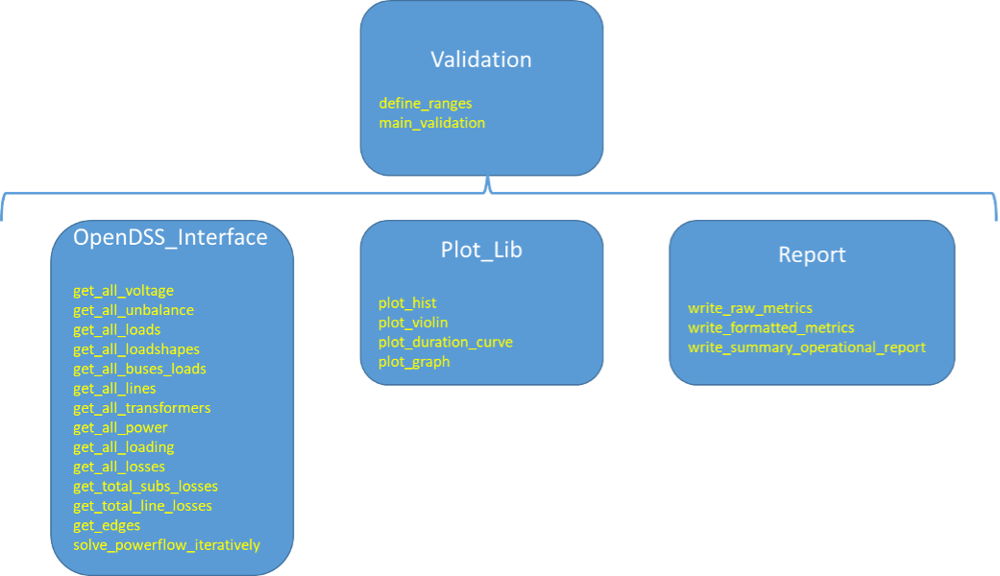

# URBANopt RNM-US Validation Module

A validation module has been created to support the automated inspection of the URBANopt™ RNM-US outputs. This is a beta testing version of the module, which has not yet been integrated into the URBANopt CLI, but is accessible by installing the [urbanopt-rnm-us-gem](https://github.com/urbanopt/urbanopt-rnm-us-gem) and using the run_validation Rake task. While this module allows inspection of certain results and associated outputs, it is up to the users to evaluate the overall appropriateness/validity of their modeling assumptions, approaches, inputs, results, etc. as needed for their specific analyses.

## Validation Module Development

The validation module has been developed in Python to enable interfacing with OpenDSS to check the URBANopt RNM-US results from the point of view of the power flow results. The whole workflow is illustrated in Figure 1. The URBANopt RNM-US Gem is fed from the results of URBANopt to characterize the buildings of the district. With this information and with a catalog of components, it calls the RNM-US API to run RNM-US and obtain a synthetic distribution system model for the district. The RNM-US results are fed into the validation module, which interacts with OpenDSS to run the power flows iteratively at every hour. This is processed by the validation module to generate several power flow CSV files and plots, to visualize the power flow through a hierarchical representation of the network, and to generate statistics and a report (see Figure 1). The URBANopt RNM-US Gem (implemented in Ruby) has also been updated to interact with this new module through the bundle. The validation module is not accessible via the CLI at this time.

Figure 1 - Integration workflow

As shown in Figure 2, the validation module implementation is made up of several classes that deal with the OpenDSS interface, the plotting of figures, and the report.

The core functions of the OpenDSS interface interact with OpenDSS. These functions solve the power flow iteratively and obtain 1) voltages, 2) unbalances, 3) loading of equipment, 4) loads and load shapes, 5) energy losses, and 6) network component parameters. 

The plot library displays histograms, violin plots, and duration curves. It also has a function to obtain a hierarchical representation of the network that displays the number of thermal and voltage violations throughout the year. The Report class calculates metrics related to voltage, unbalance, and thermal violations, as well as the top violations, and outputs the summary operational report.

Figure 2 - Validation Module Classes with their main functions

## Results Categories

The results that are automatically obtained with this module can be classified into the following categories.
- **Technical constraints**. Information is presented in CSV files, complemented with histograms and violin plots showing the monthly variations.
	- **Loading**. Results contain the loading of every network component (power line or transformer) and the thermal limit violations. An overload is considered to exist if the current through a network component (power line or transformer winding) exceeds its rated ampacity. 
	- **Voltage**. Results contain the voltage of every bus in the network and the voltage violations. The voltage limit has been set to +/- 5%, following the ANSI C84.1. 
	- **Unbalance**. Results contain the phase voltage unbalance of every bus in the network, and the unbalance violations. The definition of the Phase Voltage Unbalance Rate (PVUR) in the IEEE has been applied to measure the unbalance, and a 2% limit has been set, following the IEEE standard 141-1993. 
- **Statistics** 
	- **Loads**. The system load duration curve as well as the violin plot of the load peaks and the load along the year are obtained.
	- **Losses**. The system losses along the year as well as the detailed losses in every component and hour are evaluated.
	- **Equipment**. The violin plot of the power line ampacity and the distribution transformer size are obtained.
- **Network**
	- A hierarchical plot of the network is obtained, coloring every branch and bus according to the number of hours when each network component has violations.
- **Summary**
	- Raw metrics and summary operational report of the distribution system.

In the following sections, each of these categories is described in more detail. To illustrate the potential of the validation when there are violations, the allowed ranges have been reduced (just for the purposes of this documentation) to illustrate violations. (Voltage: 0.975 - 1.025p.u; loading 0.3p.u.; unbalance 0.004%. Despite using these thresholds to identify violations, limits in histograms and violin plots are set to the standard values.)

## Technical Constraints

The variables evaluated include the loading of network components (power lines and transformers) as well as voltages and unbalances in buses. The corresponding constraints are the thermal limits as well as the voltage and unbalance limits.

These variables are represented as yearly and monthly histograms, enabling users to visually determine if the variables are within the allowed ranges, or the proportion outside the limits, if applicable. For example, Figure 3.a illustrates the histogram of bus voltages and the limits. The histograms are complemented with violin plots of the relevant variables. For example, Figure 3.b illustrates the violin plot of the voltages, showing on the left side the monthly patterns and on the right side the yearly pattern. 

  

  

Figure 3 Bus voltages (p.u.) a) Histogram, b) Violin plot

These figures are complemented with CSV files containing detailed information about each network component. In particular, the values at each network component and hour are obtained, as shown in Table 1. This enables debugging of power flow in terms of voltages, unbalances, and loading. However, in order to quickly identify the violations, the corresponding violation CSV file (Table 2) is more useful for quickly detecting the network components and hours that have violations.

Table 1. Bus voltage values (p.u.)

	

	

## Statistics

The statistics contain system-level information about loads and energy losses, as well as a summary of the main parameters of the equipment. The information about the loads is summarized with violin plots of the load peaks and with the monthly variations, as shown in Figure 4. Differences between the active (kW) and reactive power (kVAr) are also identified.

  

  

Figure 4 Loads a) peaks, b) monthly variation

In addition, the load and losses duration curves are obtained, as shown in Figure 5. The detailed losses at every network component and hour are also available to the user.

  

	

Figure 5 Duration curve, a) loads, b) energy losses

The main parameters of equipment are also represented, as shown in Figure 6, displaying their discrete values, as well as their distributions.

  

	

Figure 6 Equipment parameters a) power line ampacity and b) distribution transformer size

##	Network

A zoomable, high-resolution hierarchical representation of the network is obtained (Figure 7) graphically displaying the number of hours with voltage or thermal violations. This figure enables verifying in detail the connectivity in the network. The architecture of the distribution system can be observed, with the slack bus (st_mat) and the substation (sub_5840ecc6-7f2b-400c-a683-528d02f140f6_1247) on the top of the figure, and the low voltage side of distribution transformers (e.g., dt2lv) and loads (e.g., 5_0) on the bottom. For this example, the voltage and thermal violations are mainly located near the terminal buses.

Figure 7 Example voltage and thermal limit violations in a hierarchical representation of the network

##	Summary Operational Report

Finally, a summary operational report documenting the violations of the technical constraints is obtained. This report evaluates voltage, unbalance, and thermal limit violations. The voltage violations are broken down into under-voltage and over-voltage, while the thermal limit violations are broken down per type of component (power line or transformer). The total number of buses (or branches) with violations is identified, as well as the total number of hours that have violations. A combined metric, buses x hours (or branches x hours) evaluates the number of buses x hours that have violations with respect the total number of buses x hours. This provides insight as to whether the violations in the buses (or branches) are persistent or sporadic. For voltage and unbalance violations, it also identifies the energy that is delivered to the loads under some constraint violation. Finally, the top violations are identified. For example, in Table 3, dt3lv has over-voltage violations during hour 5371. It is worth noting again that for the sake of illustrating the methodology in this documentation, very stringent constraints have been applied. When applying the standard limits, the report shows no violations in the distribution system for this example.

Table 3. Summary Operational Report

|**Voltage violations**     | 
| Buses:  Total 10(20%) Under 1(2%) Over 10(20%) |
| Hours:  Total 5570(64%) Under 15(0%) Over 5555(63%) |
| (Buses x Hours):  Total 38561(9%) Under 15(0%) Over 38546(9%) |
| Energy_kWh:  Total 450357(1%) Under 4933(0%) Over 445424(1%) |
| **Voltage unbalance violations** |
| Buses:  Total 21(42%) | 
| Hours:  Total 6766(77%) |
| (Buses x Hours):  Total 101837(23%) |
| Energy_kWh:  Total 24318461(28%) |
| **Thermal limit violations** |
| Branches:  Total 17(63%) Lines 13(62%) Transformers 4(67%) |
| Hours:  Total 6423(73%) Lines 6423(73%) Transformers 3031(35%) |
| (Branches x Hours):  Total 65171(28%) Lines 60874(33%) Transformers 4297(8%) |
| **Top Under-Voltage Violations** |
| 4_3(15h) |
| **Top Over-Voltage Violations** |
| dt3lv(5371h) |
| dt2lv(4886h) |
| 6_8(4451h) |
| **Top Unbalance Violations** |
| 4_3(6766h) |
| dt1lv(6753h) |
| dt1(6686h) |
| **Top Power Line Thermal limit Violations** |
| Line.l(r:10_28-dt0)(6380h) |
| Line.l(r:dt0-sub_5840ecc6-7f2b-400c-a683-528d02f140f6_12.47)_s1(5981h) |
| Line.l(r:8_10-sub_5840ecc6-7f2b-400c-a683-528d02f140f6_12.47)_s0(5980h) |
| **Top Transformer Thermal limit Violations** |
| Transformer.tr(r:dt2-dt2lv)(2702h) |
| Transformer.tr(r:dt4-dt4lv)(655h) |
| Transformer.tr(r:dt1-dt1lv)(618h) |
